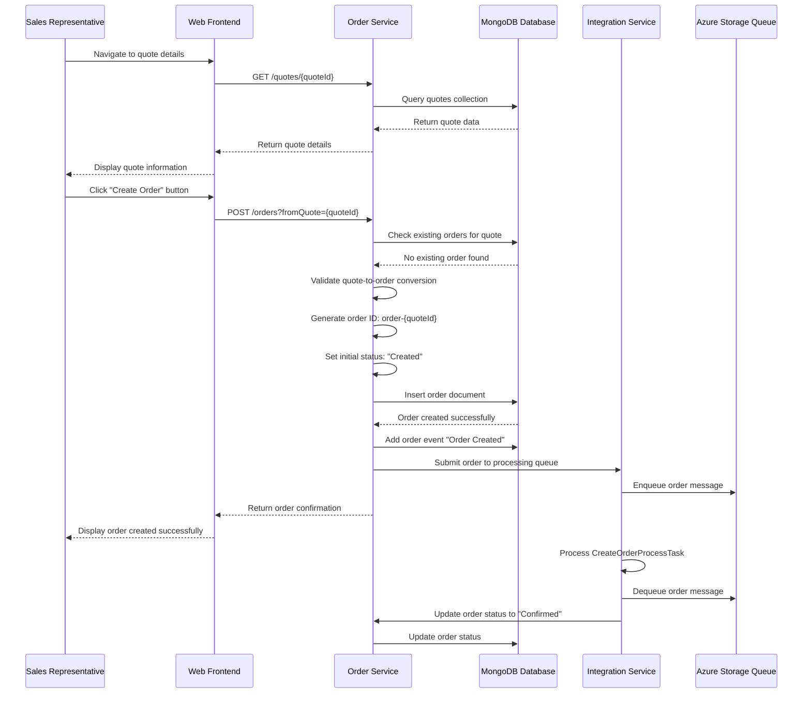
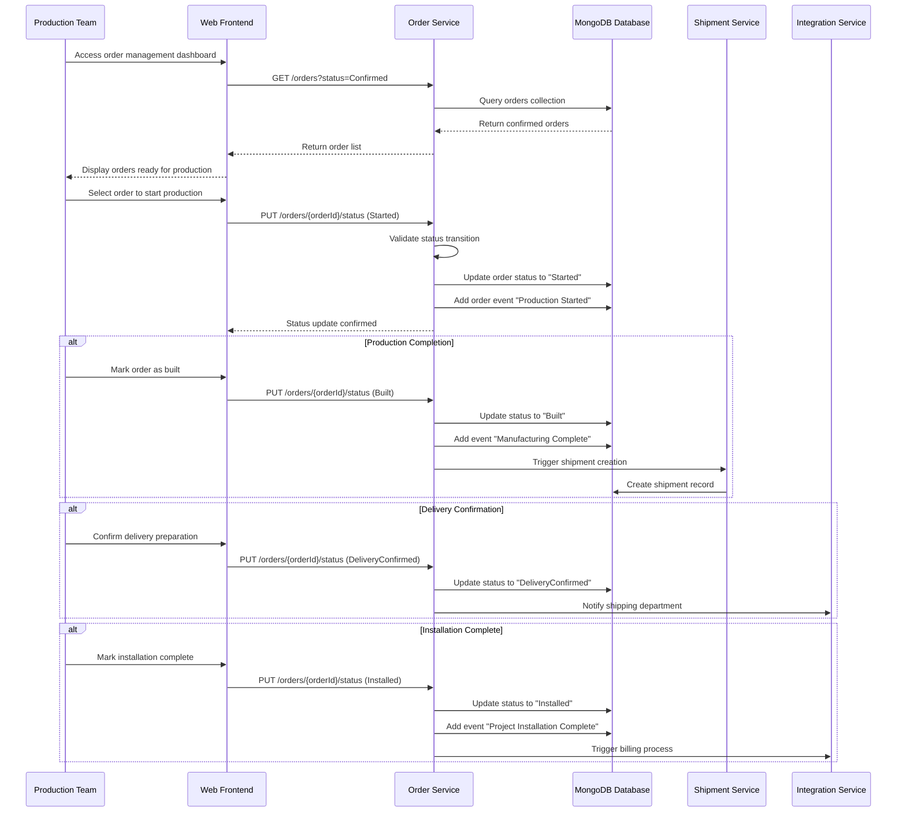
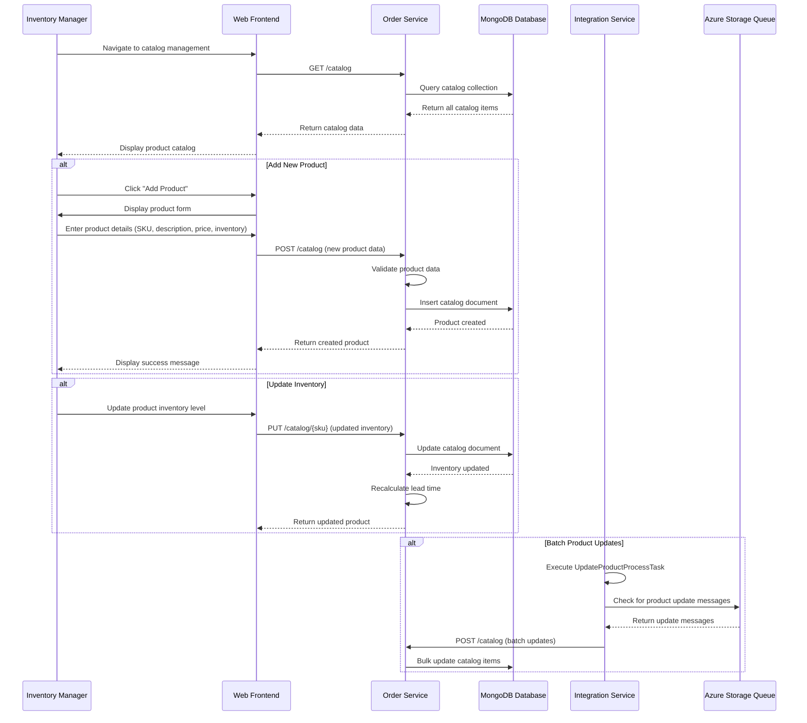
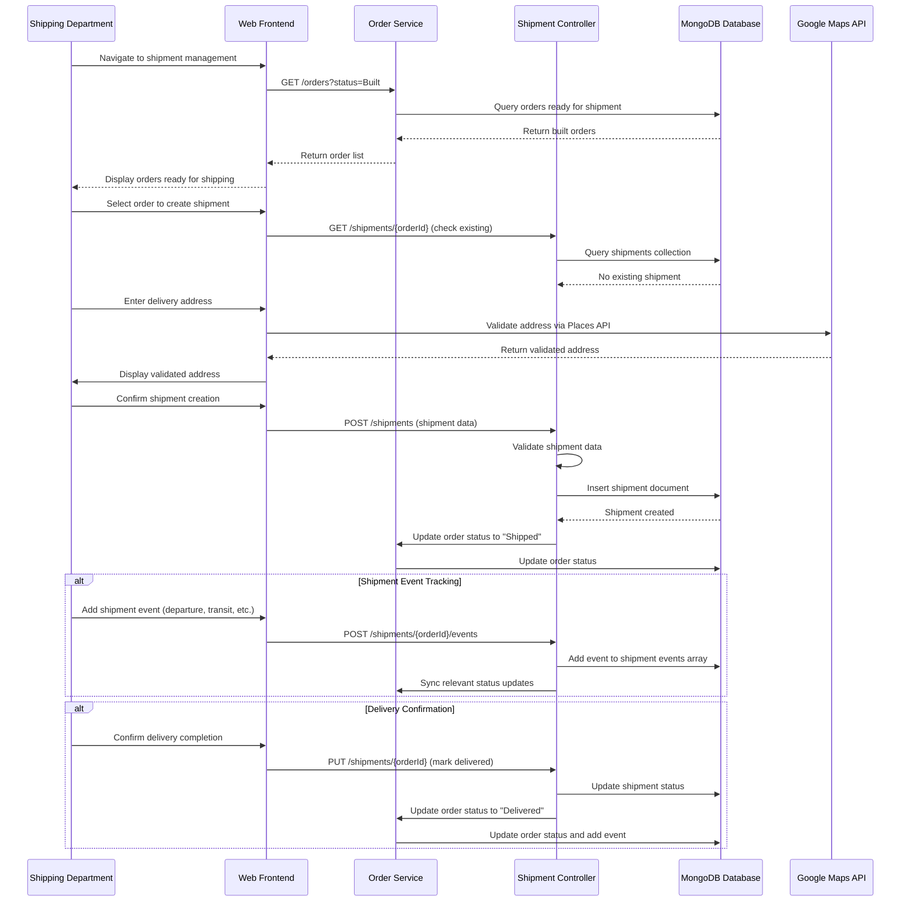
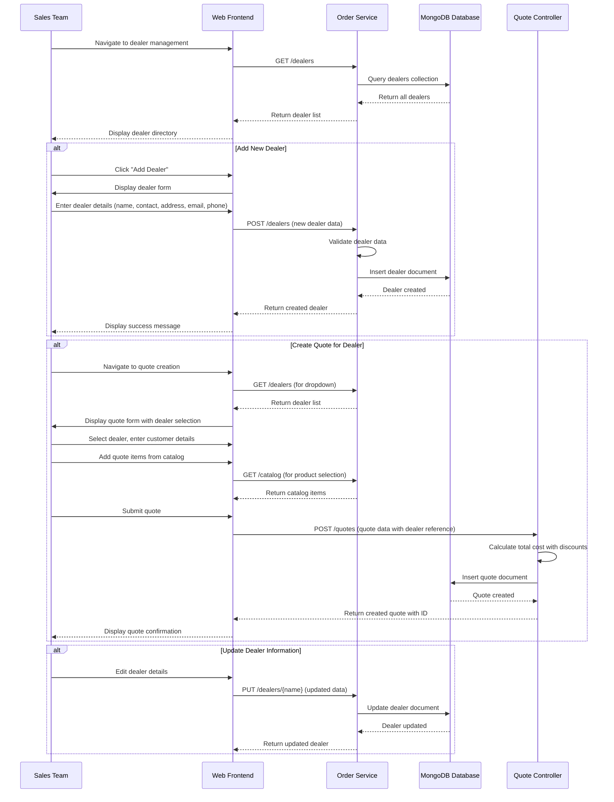
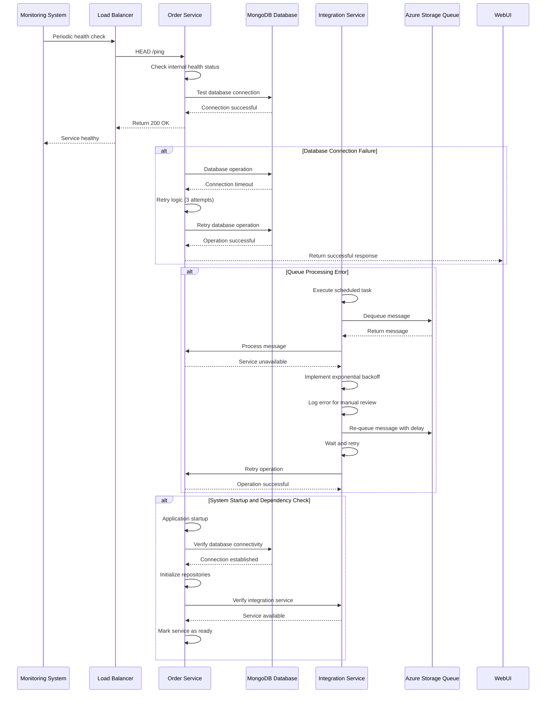
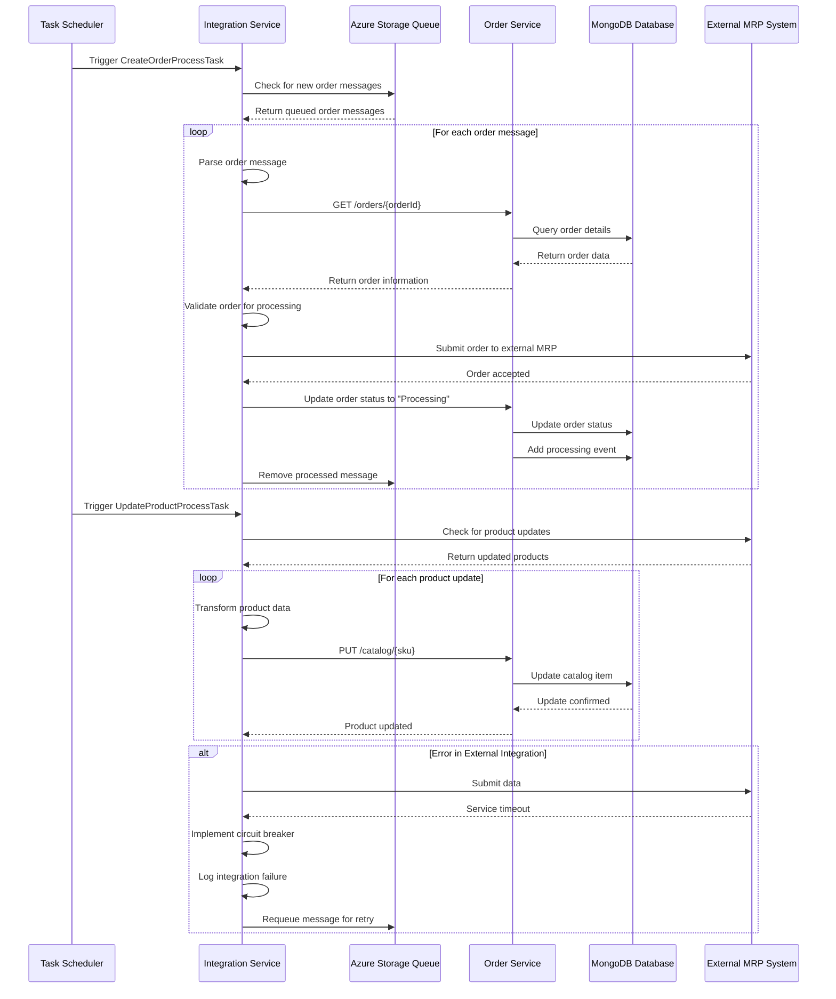

```markdown
# Parts Unlimited MRP System - Dynamic Interaction Flows

## Workflow 1: Quote-to-Order Conversion Process

**Purpose**: Convert a sales quote into a manufacturing order, initiating the production lifecycle.
**Triggers**: Sales representative confirms customer acceptance of quote
**Communication Patterns**: REST API calls, database transactions, event logging



## Workflow 2: Order Lifecycle Management

**Purpose**: Track order progression through manufacturing stages from confirmation to installation
**Triggers**: Production team updates order status at each manufacturing milestone
**Communication Patterns**: REST API status updates, event-driven status changes, database transactions



## Workflow 3: Catalog Management and Inventory Updates

**Purpose**: Manage product catalog items and maintain accurate inventory levels
**Triggers**: Inventory manager adds/updates products or stock levels change
**Communication Patterns**: REST CRUD operations, database transactions, batch updates



## Workflow 4: Shipment Tracking and Delivery Management

**Purpose**: Track order shipments from warehouse to customer site with event logging
**Triggers**: Shipping department creates shipments and updates delivery status
**Communication Patterns**: REST API calls, event logging, status synchronization



## Workflow 5: Dealer and Customer Relationship Management

**Purpose**: Manage dealer information and customer relationships throughout sales process
**Triggers**: Sales team adds new dealers or updates existing dealer information
**Communication Patterns**: REST CRUD operations, data validation, relational data management



## Workflow 6: System Health Monitoring and Error Recovery

**Purpose**: Monitor system health, handle errors, and ensure service availability
**Triggers**: Periodic health checks, system errors, or manual status requests
**Communication Patterns**: Health check endpoints, exception handling, retry mechanisms



## Workflow 7: Asynchronous Order Processing via Integration Service

**Purpose**: Handle background order processing and external system integration
**Triggers**: Scheduled tasks, queue messages, external system updates
**Communication Patterns**: Queue-based messaging, scheduled batch processing, event-driven updates

