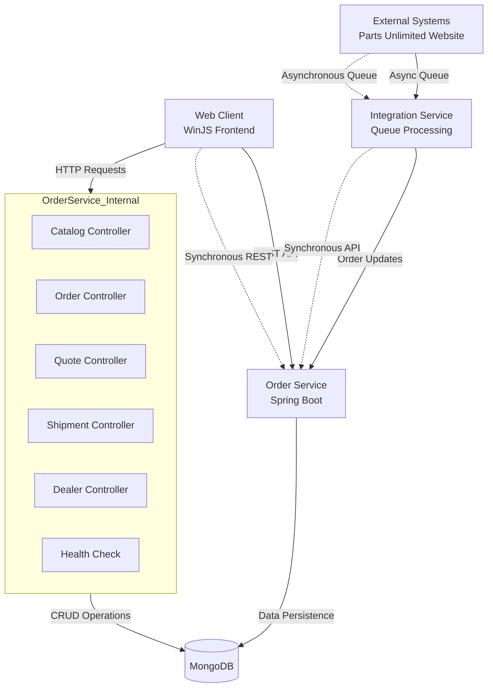

The component boundaries are organized around business domains: Order Service handles core ordering workflows, Integration Service manages external system communication, and Web Client provides the user interface. Communication patterns follow a hybrid approach with synchronous REST APIs for user interactions and asynchronous queue-based messaging for external integrations. The architecture maintains clear separation between presentation, business logic, and data persistence layers.