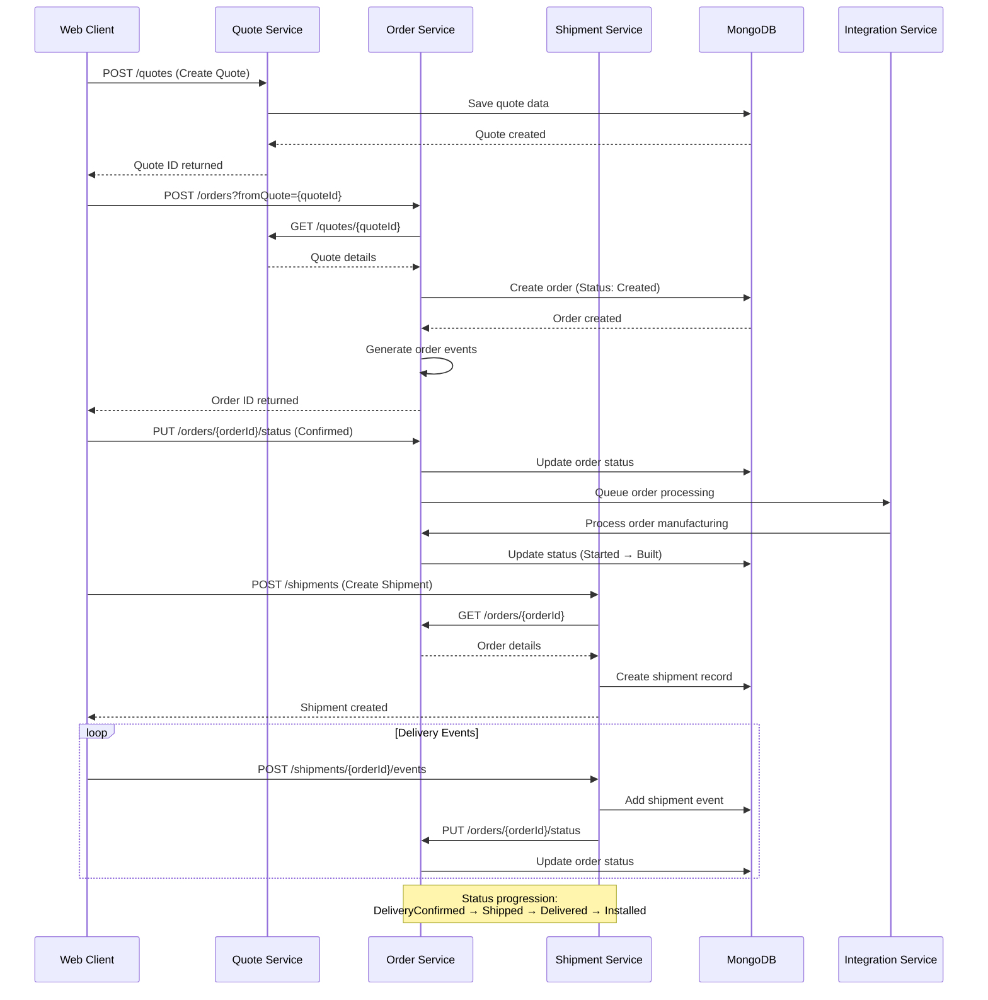
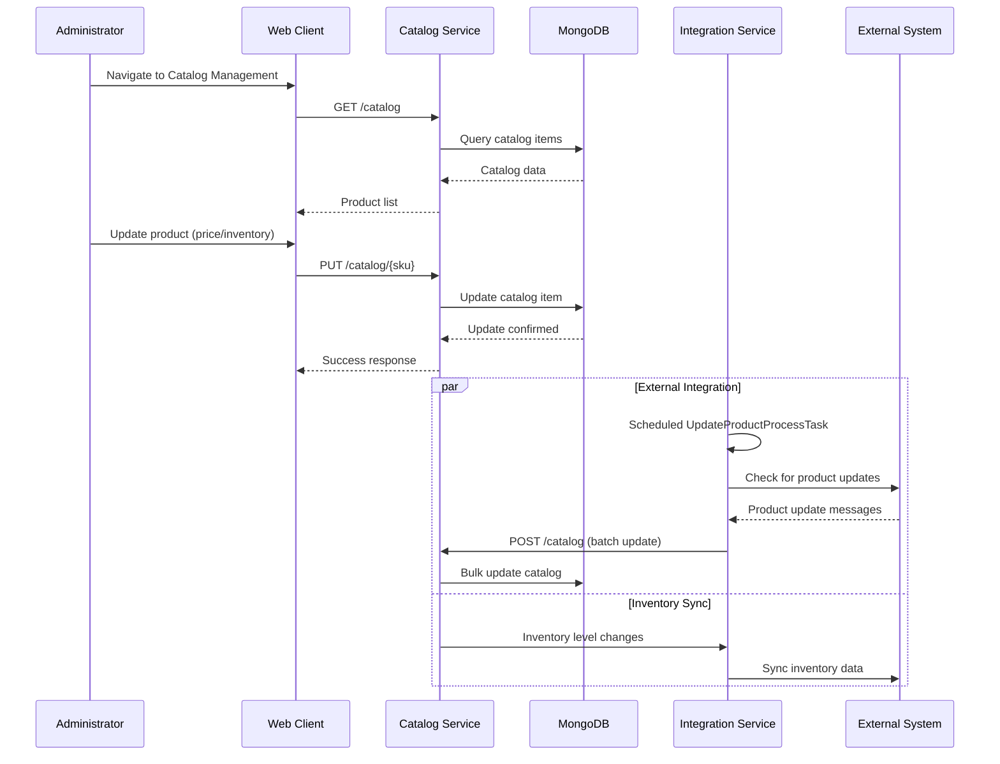
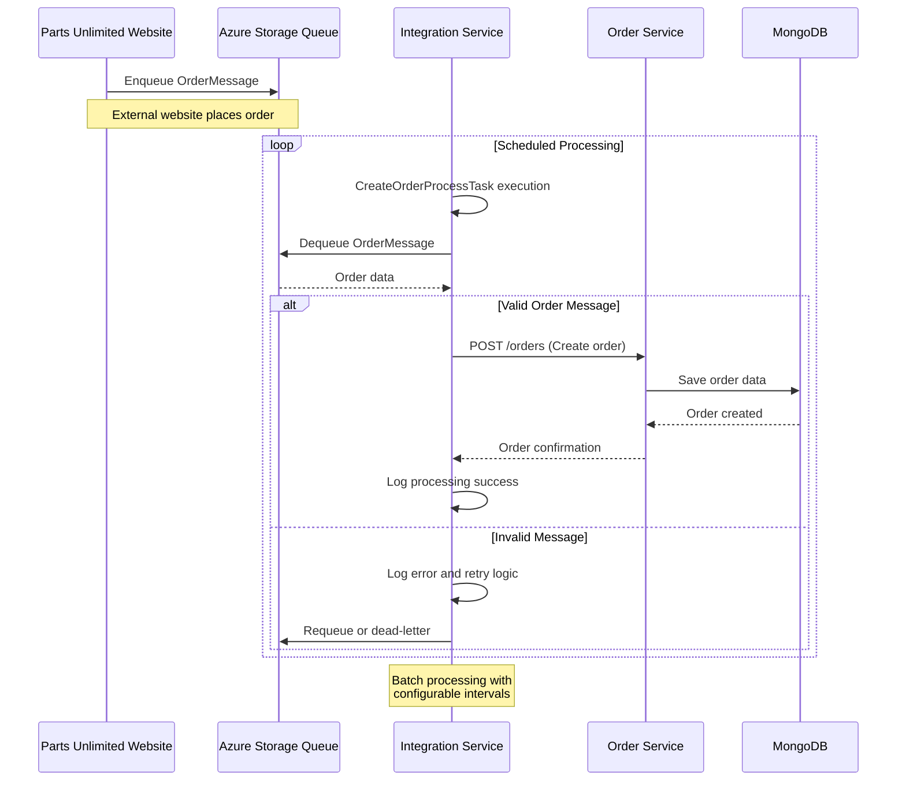
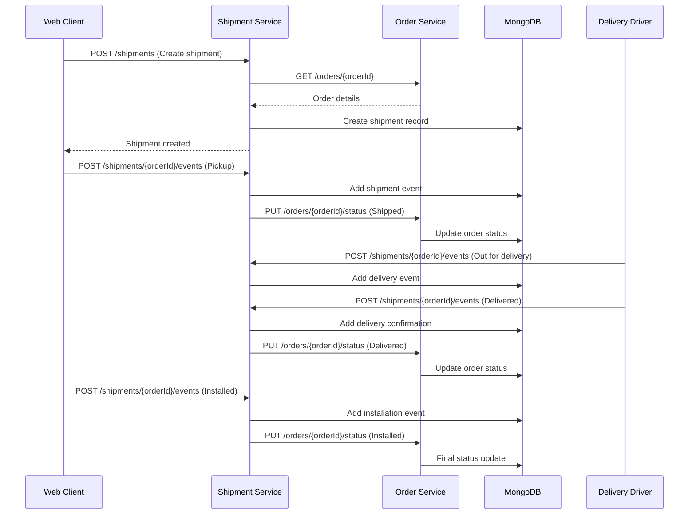
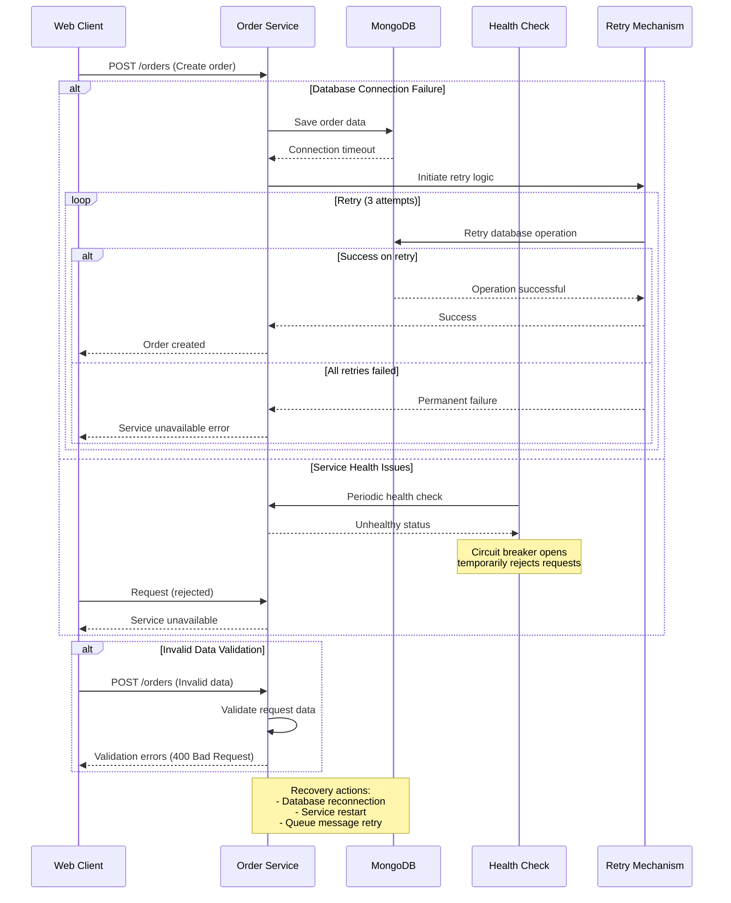
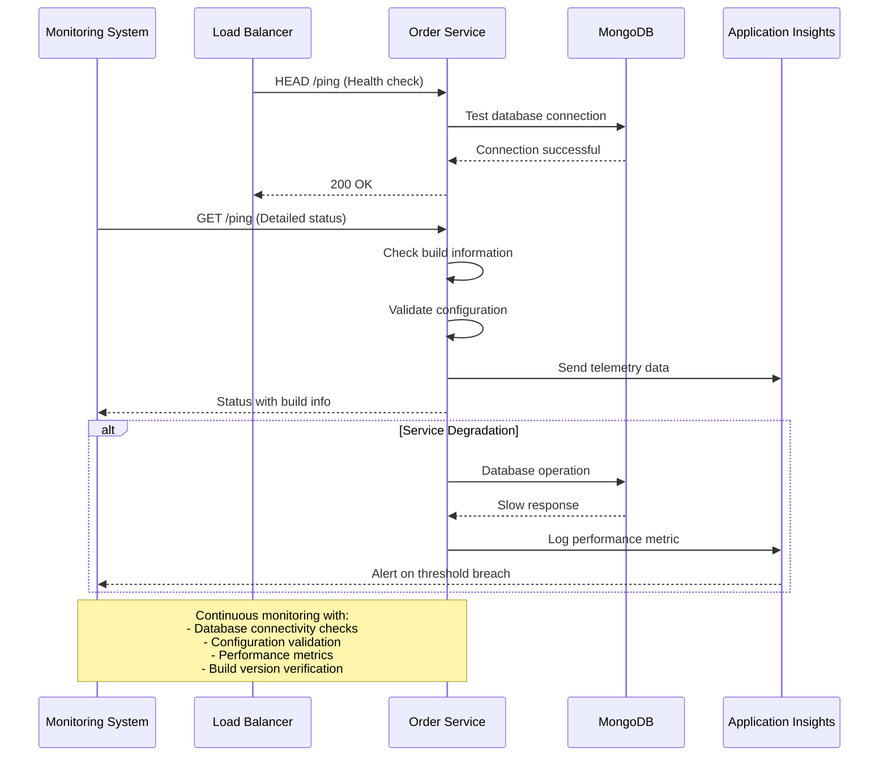

```markdown
# Parts Unlimited MRP - Dynamic Interaction Flows

## 1. Quote-to-Order Processing Workflow

### Workflow Description
This workflow represents the core business process where a customer quote is converted into an order and progresses through manufacturing and delivery stages. It involves multiple services and status transitions from quote creation through final delivery.

**Triggers**: Customer quote creation, quote acceptance, order confirmation
**Communication Patterns**: Synchronous REST calls, database transactions, event logging



## 2. Catalog Management and Inventory Updates

### Workflow Description
This workflow handles product catalog management including inventory updates and pricing changes. It demonstrates synchronous data operations and potential integration with external systems for product synchronization.

**Triggers**: Product updates, inventory changes, pricing adjustments
**Communication Patterns**: REST CRUD operations, scheduled batch processing, queue-based updates



## 3. Asynchronous Order Processing via Integration Service

### Workflow Description
This workflow shows the asynchronous processing of orders through queue-based messaging, demonstrating event-driven architecture patterns for handling external system integration and batch processing.

**Triggers**: New orders from external systems, scheduled batch processing
**Communication Patterns**: Queue-based messaging, scheduled tasks, REST API calls



## 4. Shipment Tracking and Delivery Management

### Workflow Description
This workflow illustrates the complete shipment lifecycle from creation through delivery confirmation, including event tracking and status synchronization with the order system.

**Triggers**: Order ready for shipment, delivery events, status updates
**Communication Patterns**: REST APIs, event logging, status propagation



## 5. Error Handling and Recovery Patterns

### Workflow Description
This workflow demonstrates the system's error handling and recovery mechanisms, including database connectivity issues, service unavailability, and message processing failures.

**Triggers**: Service failures, network timeouts, invalid data
**Communication Patterns**: Retry logic, fallback mechanisms, health checks, circuit breaker patterns



## 6. System Health Monitoring and Deployment Verification

### Workflow Description
This workflow shows the system monitoring and health verification processes, including ping endpoints, build information checks, and deployment validation.

**Triggers**: Health checks, deployment events, monitoring alerts
**Communication Patterns**: REST health endpoints, configuration validation, telemetry data


```