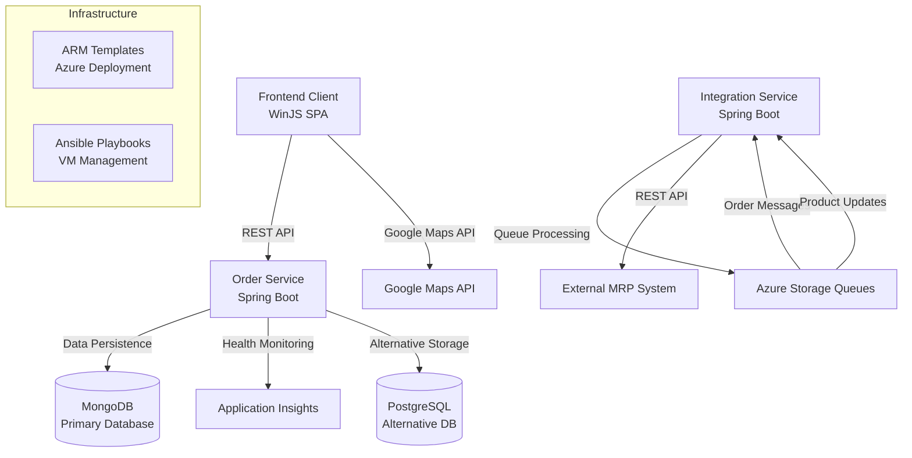

The component boundaries reflect clear separation between the frontend SPA, core business services, and integration layer. The Frontend Client communicates synchronously with OrderService via REST APIs for all business operations, while IntegrationService handles asynchronous queue-based communication with external systems. OrderService maintains data sovereignty over all core business entities, with MongoDB as the primary data store and PostgreSQL as an alternative option.