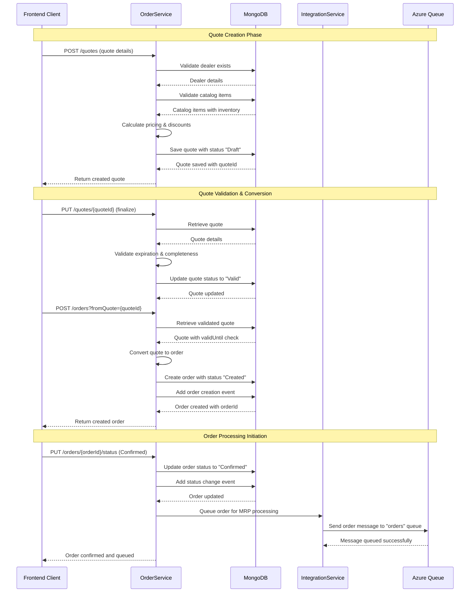
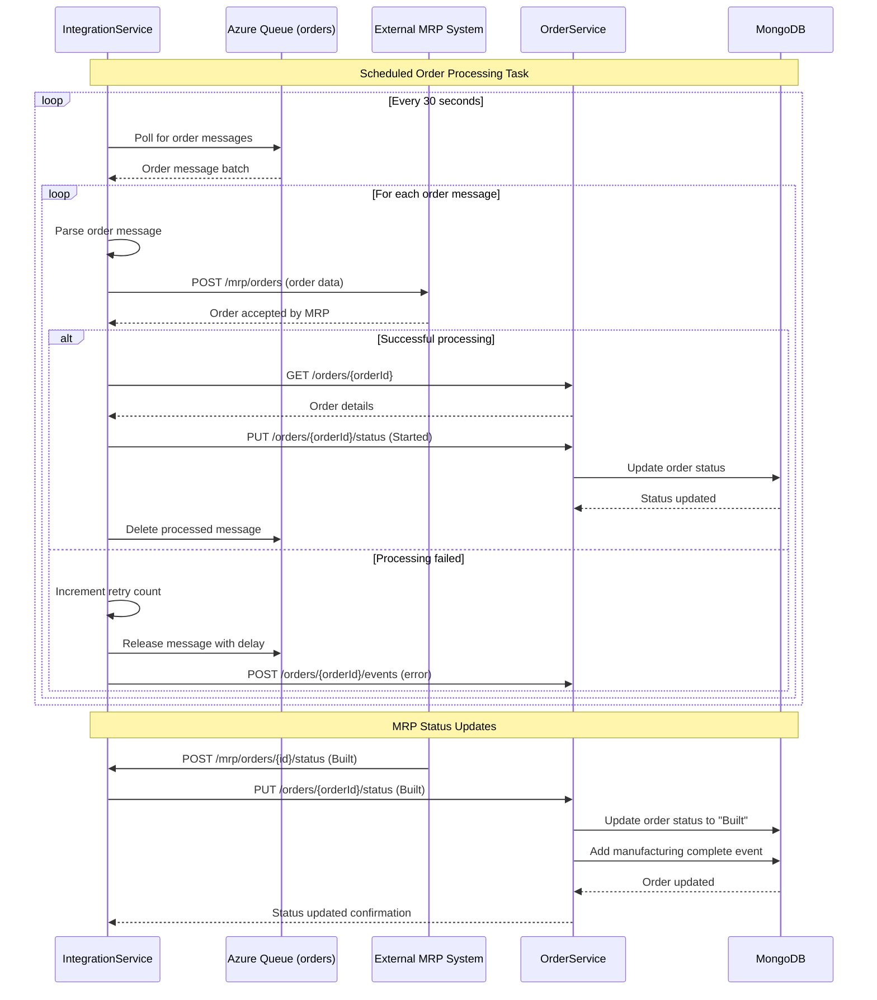
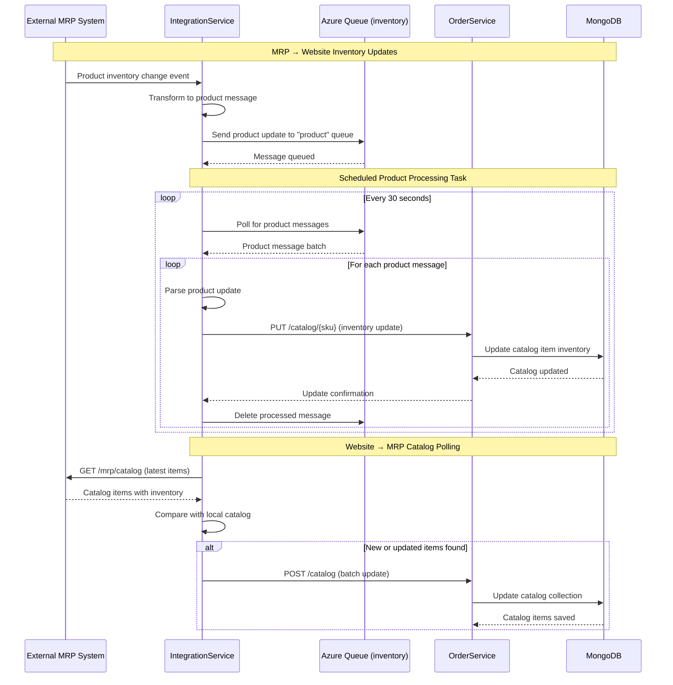
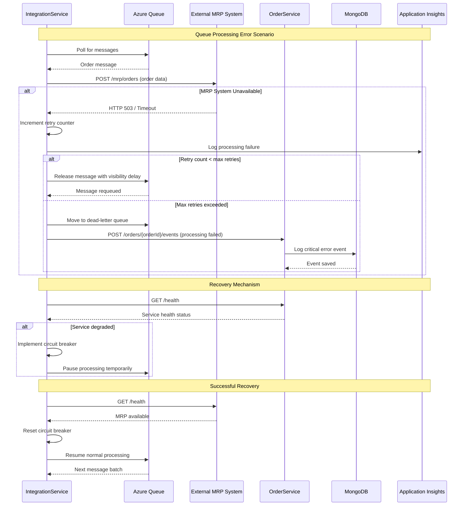
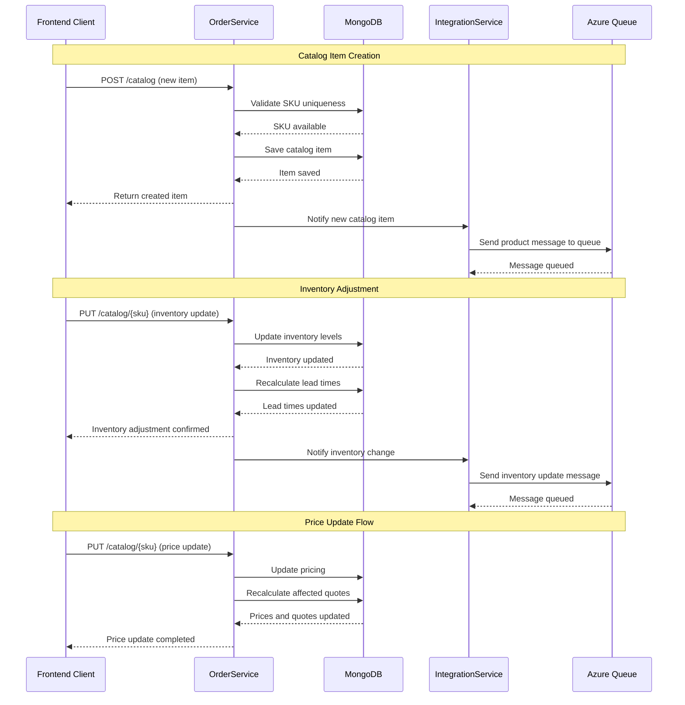

```markdown
# Parts Unlimited MRP System - Dynamic Interaction Flows

## Workflow 1: Quote-to-Order Conversion Flow

### Description
This workflow captures the complete process from creating a customer quote to converting it into a manufacturing order. It involves multiple services and demonstrates the state transition from quote to order with validation and business rule enforcement.

**Triggers**: Dealer creates new quote or converts existing quote to order
**Communication Patterns**: REST API calls, database transactions, synchronous service communication

### Sequence Diagram



## Workflow 2: Asynchronous Order Processing Flow

### Description
This workflow shows the background processing of orders from the website queue to the MRP system. It demonstrates asynchronous message processing, scheduled tasks, and integration with external manufacturing systems.

**Triggers**: Scheduled task execution (30-second intervals), new orders in queue
**Communication Patterns**: Queue-based messaging, scheduled batch processing, REST API calls to external systems

### Sequence Diagram



## Workflow 3: Inventory Synchronization Flow

### Description
This workflow handles the bidirectional synchronization of product inventory between the MRP system and the website. It demonstrates event-driven updates and scheduled polling patterns for maintaining data consistency across systems.

**Triggers**: Inventory changes in MRP system, scheduled synchronization tasks
**Communication Patterns**: Queue-based messaging, scheduled polling, REST API updates

### Sequence Diagram



## Workflow 4: Order Fulfillment and Shipment Tracking

### Description
This workflow covers the complete order fulfillment process from manufacturing completion through shipment creation, tracking, and final delivery. It demonstrates status state machine transitions and event-driven notifications.

**Triggers**: Order status changes, shipment creation, delivery events
**Communication Patterns**: REST API calls, database transactions, event logging

### Sequence Diagram



```mermaid
sequenceDiagram
    participant F as Frontend Client
    participant OS as OrderService
    participant DB as MongoDB
    participant IS as IntegrationService
    participant MRP as External MRP System

    Note over F,MRP: Shipment Creation
    F->>OS: POST /shipments (for orderId)
    OS->>DB: Validate order exists and is "Built"
    DB-->>OS: Order details
    OS->>DB: Create shipment record
    OS->>DB: Add shipment creation event
    DB-->>OS: Shipment created
    OS-->>F: Return shipment details

    Note over F,MRP: Shipping Preparation
    F->>OS: PUT /orders/{orderId}/status (Shipped)
    OS->>DB: Update order status to "Shipped"
    OS->>DB: Add shipping event
    DB-->>OS: Order updated
    
    OS->>IS: Notify shipment ready
    IS->>MRP: Update shipment status in MRP
    MRP-->>IS: MRP updated
    OS-->>F: Order shipped confirmation

    Note over F,MRP: Delivery Tracking
    F->>OS: POST /shipments/{id}/events (In Transit)
    OS->>DB: Add shipment tracking event
    DB-->>OS: Event logged
    
    F->>OS: POST /shipments/{id}/events (Out for Delivery)
    OS->>DB: Add delivery event
    DB-->>OS: Event logged
    
    F->>OS: PUT /orders/{orderId}/status (Delivered)
    OS->>DB: Update order status to "Delivered"
    OS->>DB: Add delivery completion event
    DB-->>OS: Order fulfillment completed
    OS-->>F: Delivery confirmed
```

## Workflow 5: Error Handling and Recovery Patterns

### Description
This workflow demonstrates the system's resilience patterns including queue message retry logic, error event logging, and recovery mechanisms for failed operations.

**Triggers**: Failed API calls, queue processing errors, timeout scenarios
**Communication Patterns**: Retry patterns, error logging, dead letter queues, health monitoring

### Sequence Diagram



## Workflow 6: Catalog Management and Inventory Updates

### Description
This workflow shows the complete lifecycle of catalog item management including creation, updates, inventory adjustments, and synchronization with external systems.

**Triggers**: New product creation, inventory adjustments, price changes
**Communication Patterns**: REST API calls, database transactions, event-driven synchronization

### Sequence Diagram



## Communication Patterns Summary

### Synchronous Communication
- **Frontend ↔ OrderService**: REST API calls for immediate operations
- **IntegrationService ↔ MRP System**: Direct REST calls for order processing
- **Health Checks**: Service monitoring and readiness verification

### Asynchronous Communication  
- **Queue-based Messaging**: Order and product updates via Azure Storage Queues
- **Scheduled Processing**: 30-second intervals for batch operations
- **Event-driven Updates**: Inventory and status change notifications

### Data Flow Patterns
- **Request-Response**: Immediate operations requiring confirmation
- **Fire-and-Forget**: Non-critical updates and notifications
- **Polling**: Regular synchronization and health monitoring
- **Event Sourcing**: Audit trail through event logging

### Error Handling Patterns
- **Retry with Exponential Backoff**: Queue message processing
- **Circuit Breaker**: Service dependency failure protection
- **Dead Letter Queues**: Failed message handling
- **Health Monitoring**: Proactive system status tracking
```