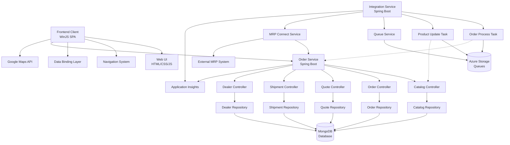

**Rationale:** The component boundaries follow domain-driven design principles with clear separation between frontend presentation, business logic services, and integration layers. Communication patterns include synchronous REST APIs for frontend-backend interactions, asynchronous queue-based messaging for external system integration, and repository-based data access patterns for database operations.