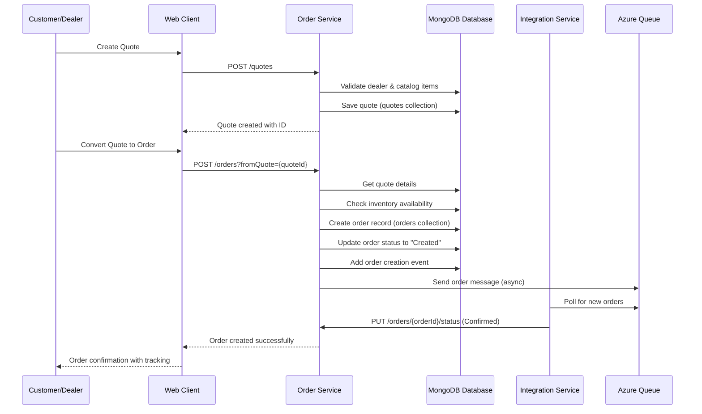
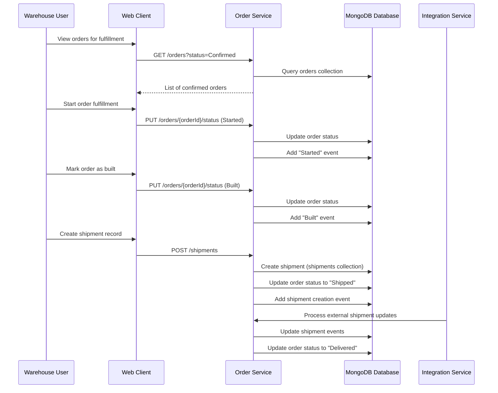
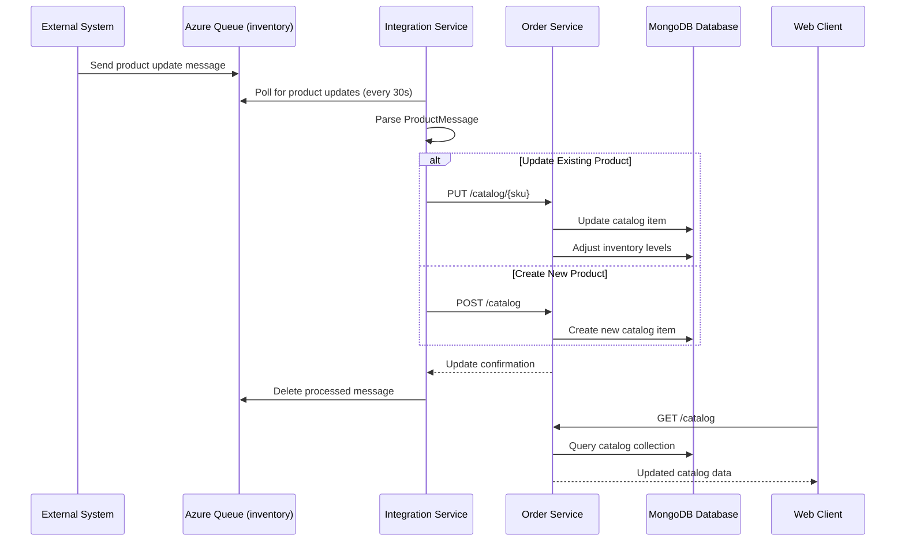
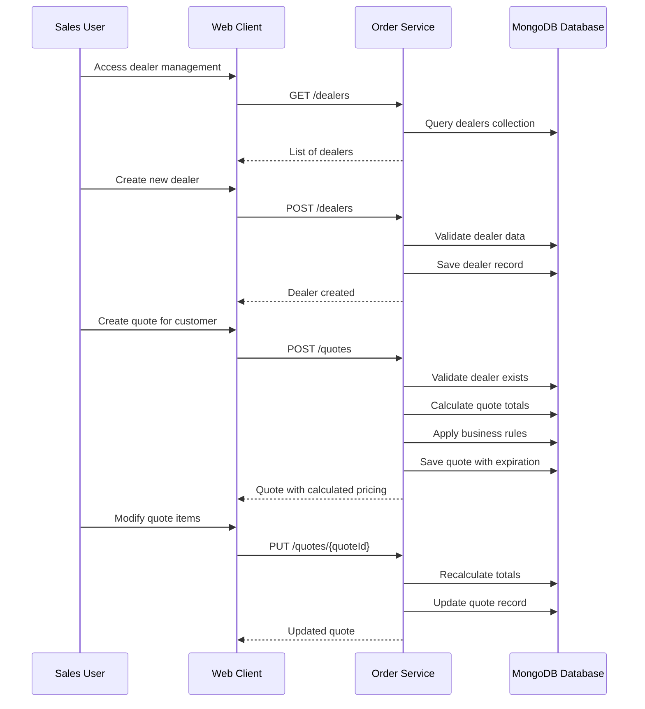
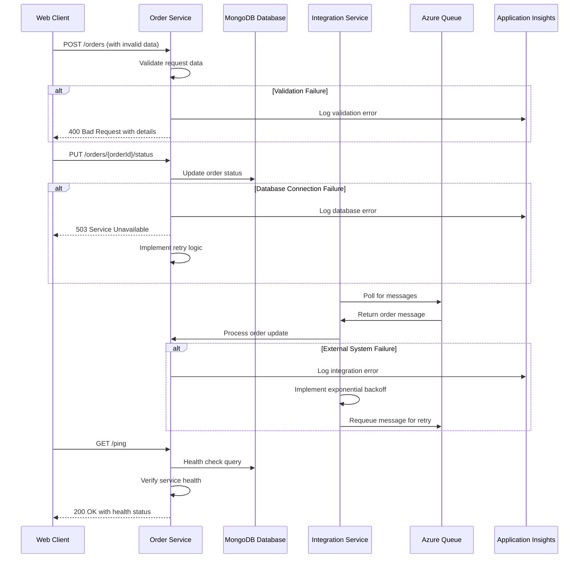
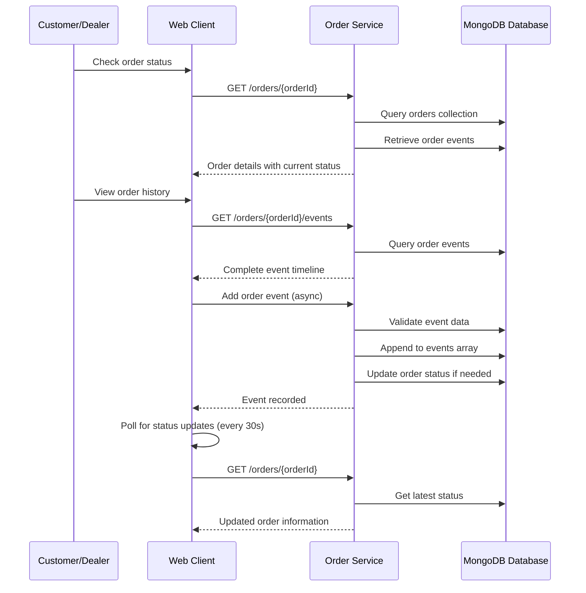
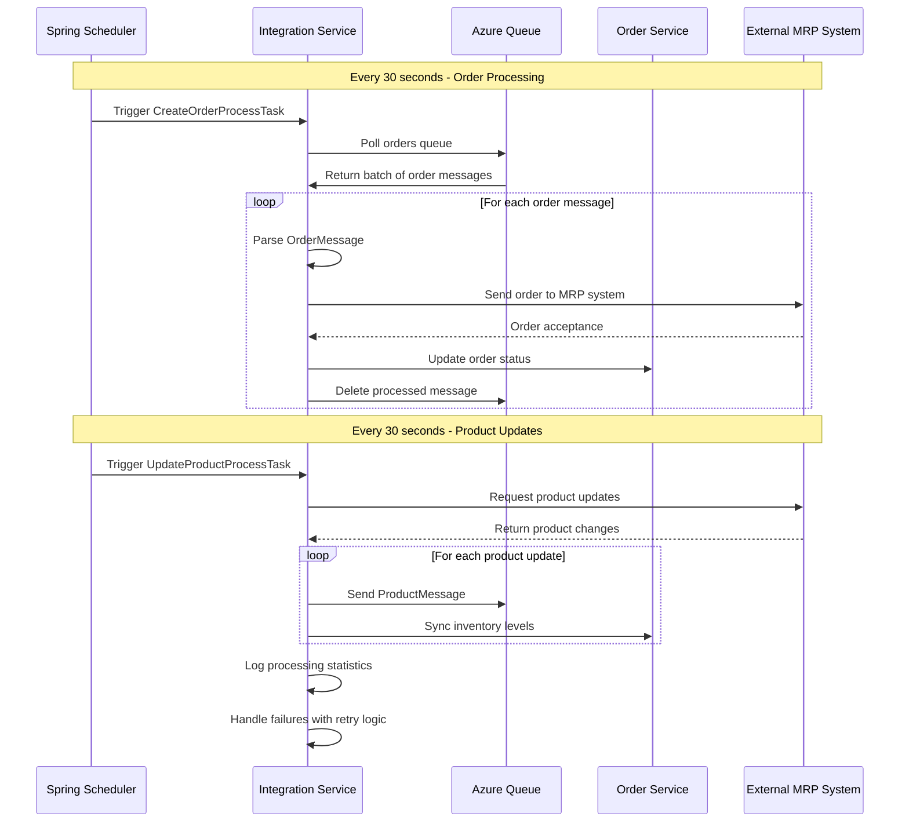

```markdown
# Parts Unlimited MRP - Dynamic Interaction Flows

## Workflow 1: Quote-to-Order Conversion

### Description
This workflow handles the conversion of a customer quote into a formal order, including validation, inventory checks, and status transitions.

### Communication Patterns
- **Synchronous REST**: Frontend to OrderService communication
- **Database Transactions**: Order creation and inventory updates
- **Event-driven**: Order status updates and event logging



## Workflow 2: Order Fulfillment and Shipment Processing

### Description
Manages the complete order lifecycle from confirmation through shipment and delivery, including status tracking and event logging.

### Communication Patterns
- **Synchronous REST**: Status updates and event logging
- **Asynchronous Queue**: Integration with external systems
- **Database Transactions**: Multi-document updates



## Workflow 3: Catalog and Inventory Synchronization

### Description
Handles product catalog updates and inventory synchronization between the MRP system and external systems via queue-based messaging.

### Communication Patterns
- **Asynchronous Queue**: Product update messages
- **Scheduled Tasks**: Periodic inventory synchronization
- **REST APIs**: External system communication



## Workflow 4: Dealer Management and Quote Generation

### Description
Manages dealer information and facilitates the quote generation process with validation and pricing calculations.

### Communication Patterns
- **Synchronous REST**: CRUD operations for dealers and quotes
- **Database Transactions**: Complex quote calculations
- **Data Validation**: Multi-field validation



## Workflow 5: Error Handling and Recovery Patterns

### Description
Demonstrates the system's error handling and recovery mechanisms across different failure scenarios.

### Communication Patterns
- **Exception Handling**: Structured error responses
- **Retry Mechanisms**: Queue message processing
- **Health Checks**: Service monitoring



## Workflow 6: Order Status Tracking and Event Management

### Description
Provides comprehensive order status tracking with event history and real-time updates for stakeholders.

### Communication Patterns
- **Event Sourcing**: Order event history
- **REST APIs**: Status queries and updates
- **Real-time Updates**: Web client polling



## Workflow 7: Integration Service Batch Processing

### Description
Shows the scheduled batch processing performed by the Integration Service for order and product synchronization.

### Communication Patterns
- **Scheduled Tasks**: Cron-based processing
- **Batch Operations**: Bulk data processing
- **Queue Management**: Message lifecycle

