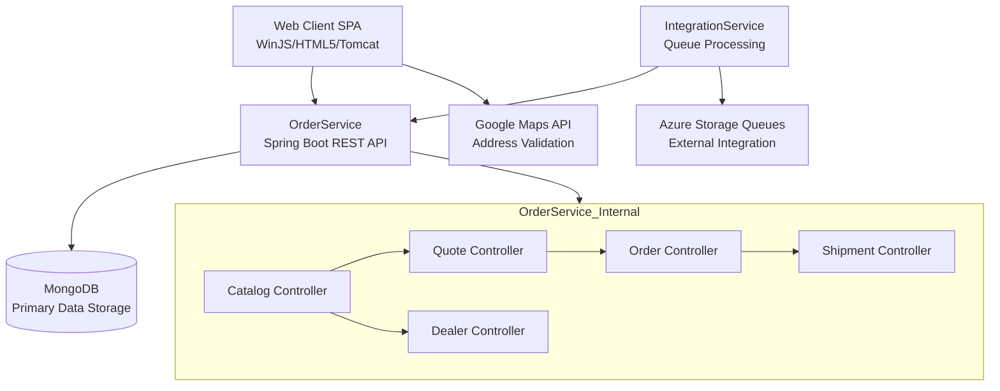

The component boundaries are organized around functional domains with OrderService serving as the central business logic hub containing all core business operations. Communication follows synchronous REST patterns between frontend and backend, while IntegrationService uses asynchronous queue-based processing for external system integration. The Web Client maintains a clear separation as a presentation layer, delegating all data operations to OrderService through a centralized data service layer.