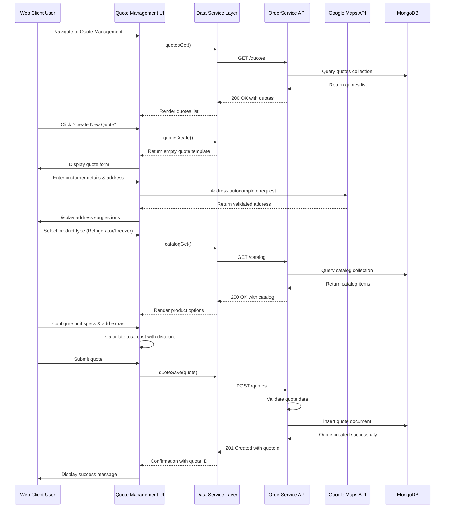
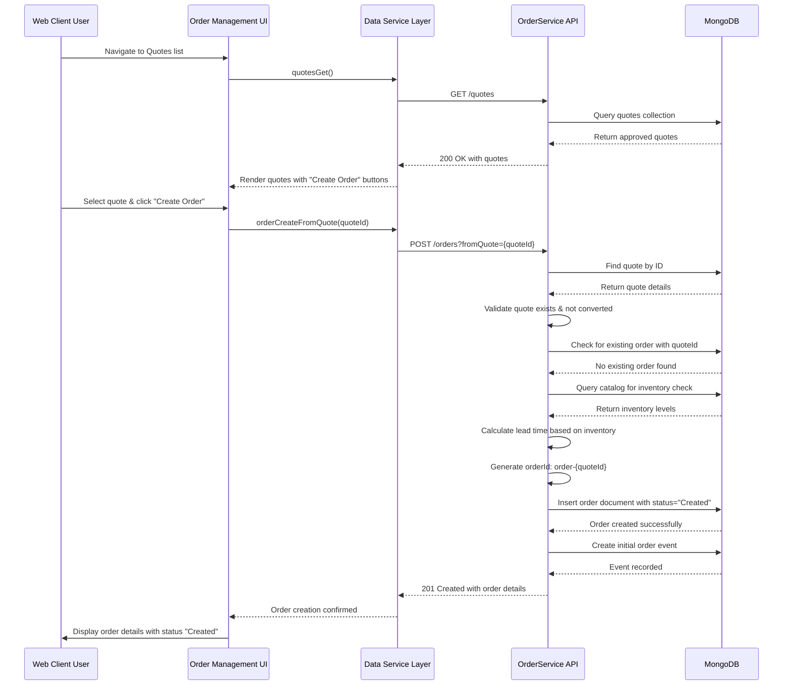
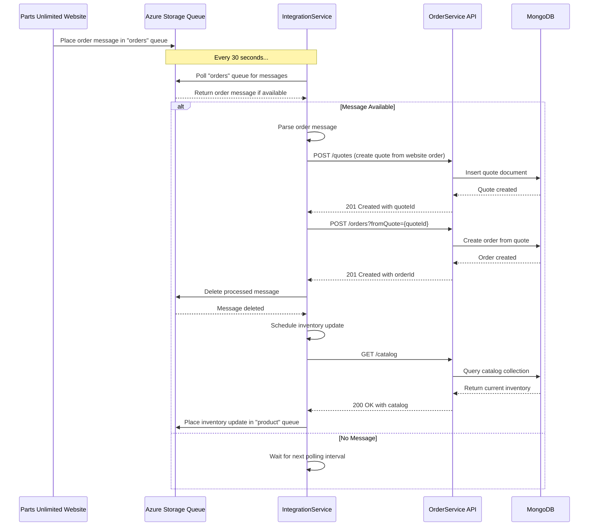
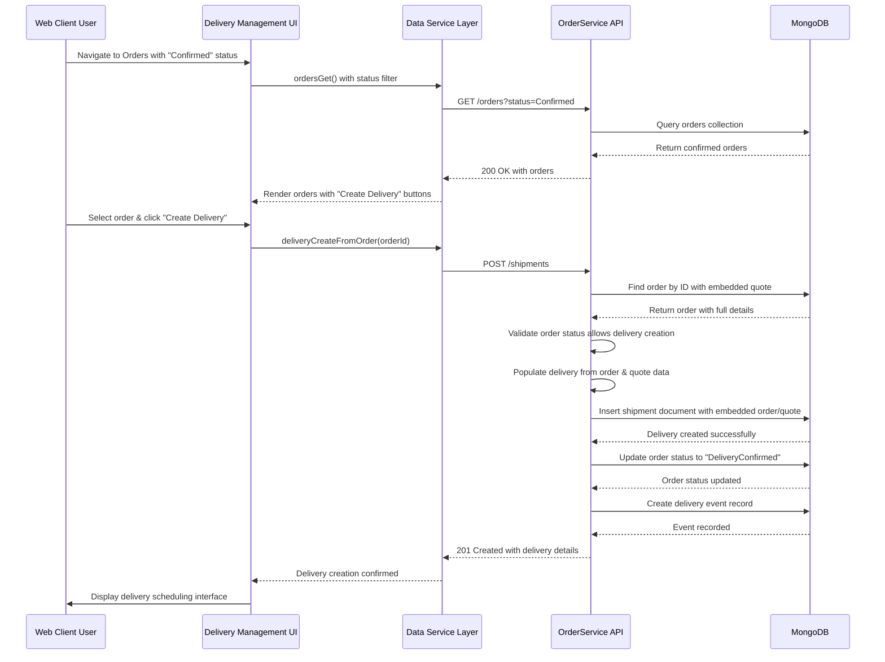
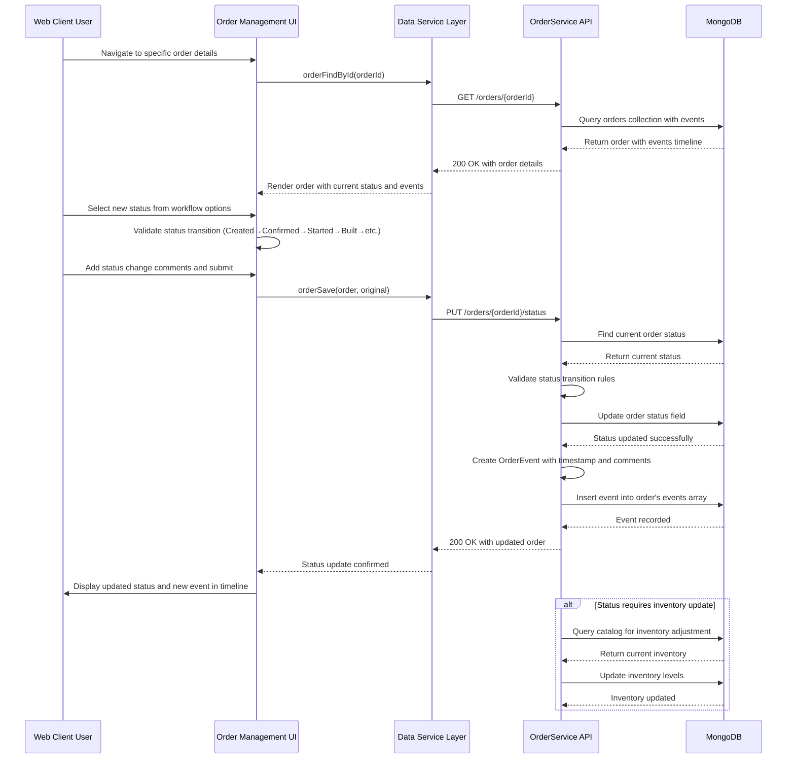
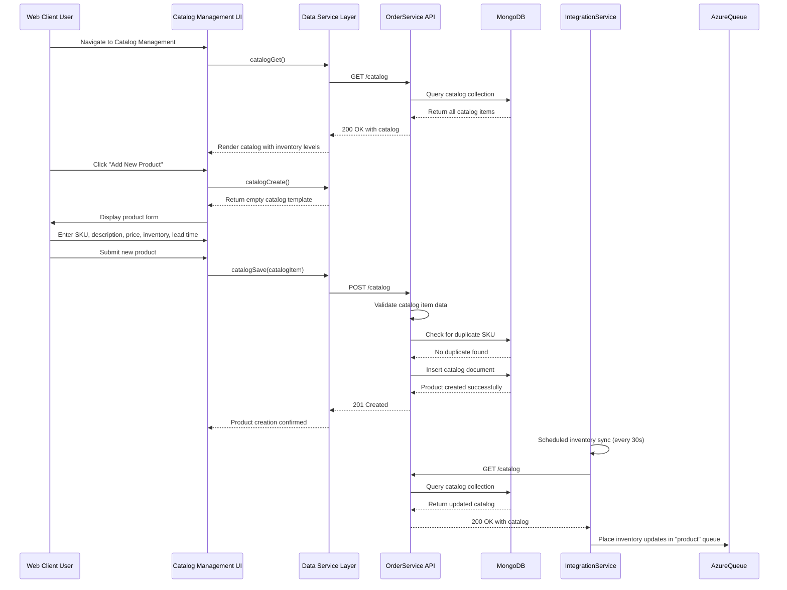
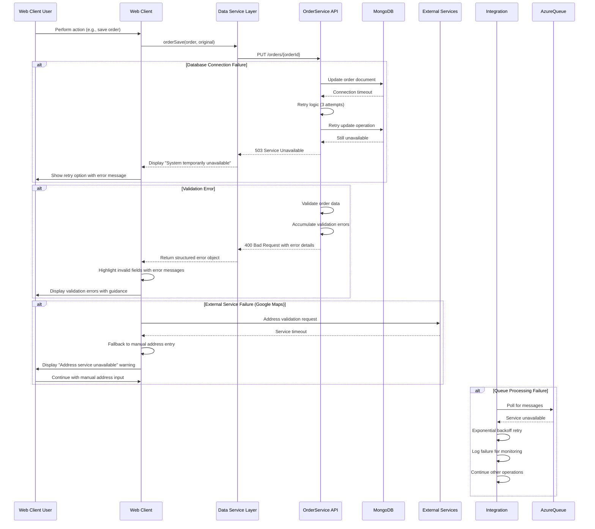

```markdown
# Parts Unlimited MRP - Dynamic Interaction Flows

## 1. Quote Creation and Management Workflow

### Workflow Description
**Purpose**: Create and manage customer quotes for refrigeration/freezer units with pricing calculations and validation.
**Triggers**: User initiates quote creation from web client, enters customer and product details.
**Communication Patterns**: Synchronous REST calls, Google Maps API integration, database transactions.



## 2. Order Creation from Quote Workflow

### Workflow Description
**Purpose**: Convert an approved quote into a formal order with status tracking and inventory validation.
**Triggers**: User selects quote and initiates order creation, system validates inventory availability.
**Communication Patterns**: Synchronous REST calls, database transactions with validation, inventory checks.



## 3. External Order Processing via Integration Service

### Workflow Description
**Purpose**: Process orders from Parts Unlimited website through Azure queues with background processing.
**Triggers**: Website places order in Azure queue, IntegrationService polls queue every 30 seconds.
**Communication Patterns**: Asynchronous queue processing, scheduled tasks, REST API calls between services.



## 4. Order to Delivery Conversion Workflow

### Workflow Description
**Purpose**: Convert confirmed orders into scheduled deliveries with contact coordination and address management.
**Triggers**: Order reaches "Confirmed" status, user initiates delivery creation for order fulfillment.
**Communication Patterns**: Synchronous REST calls, embedded data relationships, status workflow enforcement.



## 5. Order Status Update and Event Tracking Workflow

### Workflow Description
**Purpose**: Update order status through workflow progression and maintain audit trail of all order events.
**Triggers**: User actions (status updates), system events (automatic transitions), delivery milestones.
**Communication Patterns**: Synchronous REST calls, event logging, status validation, workflow enforcement.



## 6. Catalog Inventory Management Workflow

### Workflow Description
**Purpose**: Manage product catalog including SKU maintenance, pricing updates, and inventory tracking.
**Triggers**: Product changes, inventory adjustments, price updates, new product introductions.
**Communication Patterns**: Synchronous REST CRUD operations, inventory validation, lead time calculation.



## 7. Error Handling and Recovery Patterns

### Workflow Description
**Purpose**: Handle system failures, validation errors, and recovery scenarios across all workflows.
**Triggers**: Network failures, validation errors, database constraints, external service unavailability.
**Communication Patterns**: Structured error responses, retry mechanisms, graceful degradation.



## Communication Patterns Summary

### Synchronous Patterns
- **REST API Calls**: All client-server communication via HTTP REST endpoints
- **Database Transactions**: MongoDB operations with immediate consistency requirements
- **External API Integration**: Google Maps Places API for address validation

### Asynchronous Patterns
- **Queue Processing**: Azure Storage Queues for website order integration
- **Scheduled Tasks**: Background processing at 30-second intervals
- **Event Logging**: Non-blocking event recording for audit trails

### Data Flow Patterns
- **Request-Response**: Standard RESTful communication between components
- **Embedded Data**: Quotes embedded in orders, orders embedded in deliveries
- **Workflow Chaining**: Sequential quote→order→delivery conversion process
- **Status Propagation**: Order status changes triggering downstream actions
```