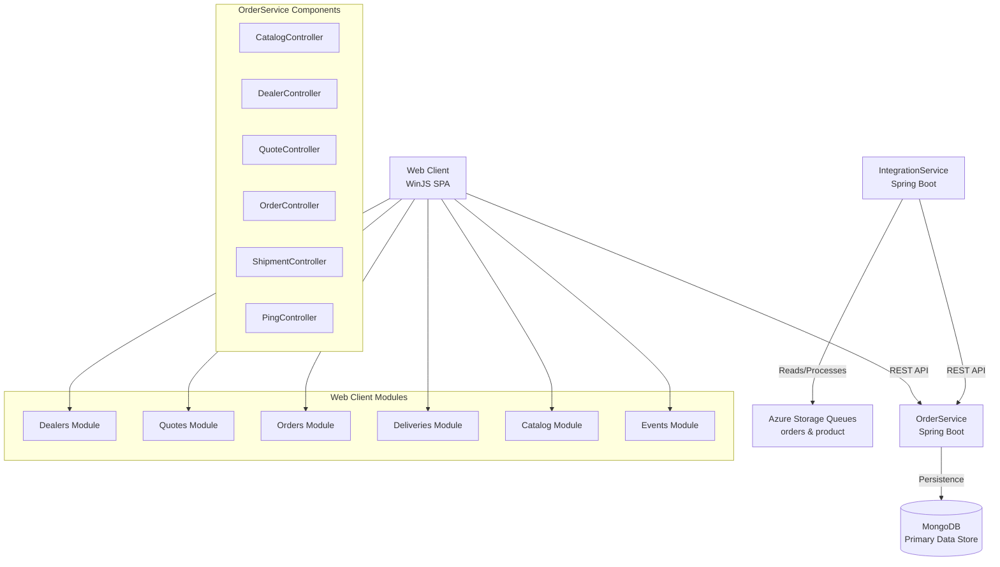

The system follows a layered client-server architecture with clear separation between presentation, business logic, and data persistence layers. Component boundaries are defined by business domains (catalog, dealers, quotes, orders, shipments) with the OrderService acting as the centralized backend API gateway. Communication primarily uses synchronous REST patterns between frontend and backend, while IntegrationService employs asynchronous queue-based processing for external system integration, creating a hybrid request-response and event-driven architecture.