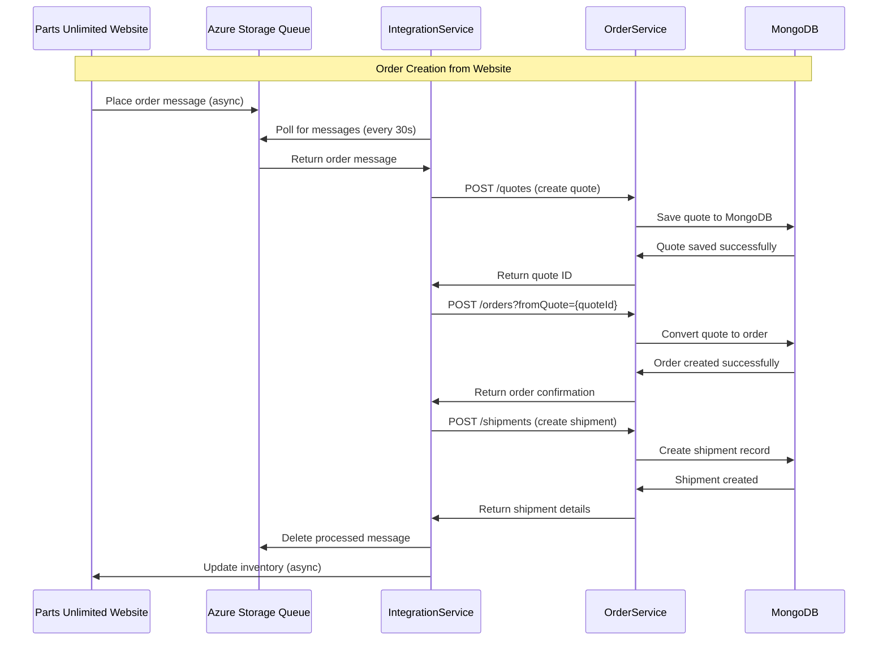
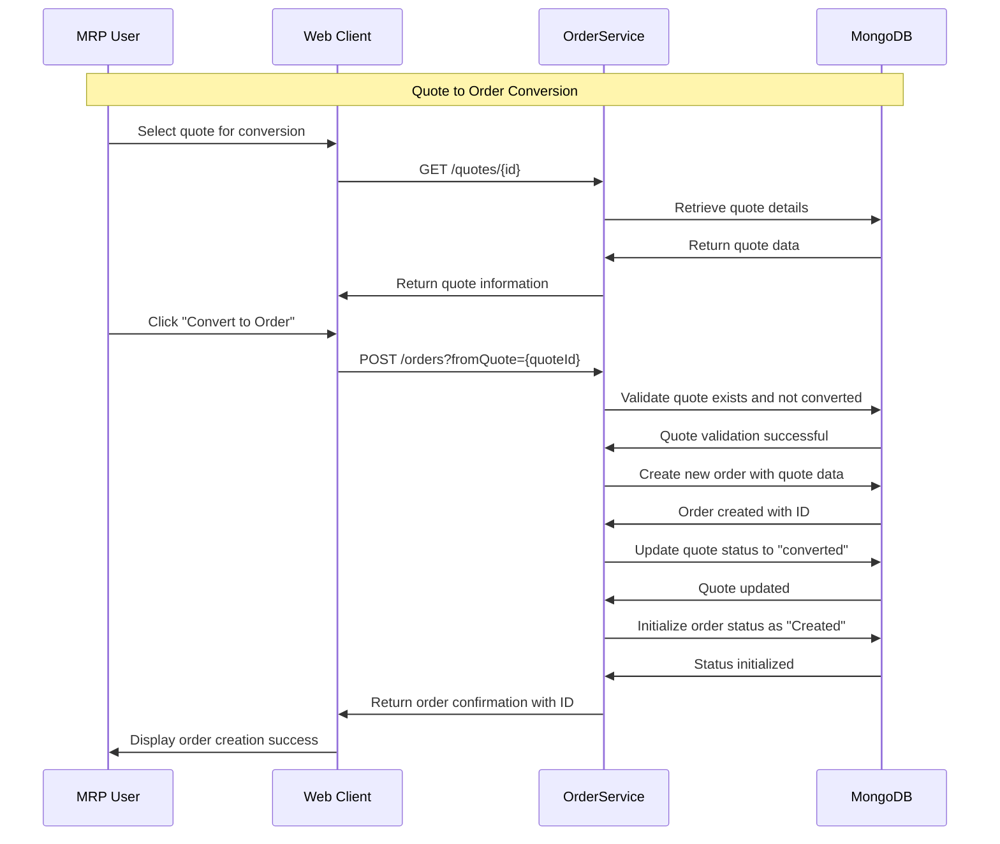
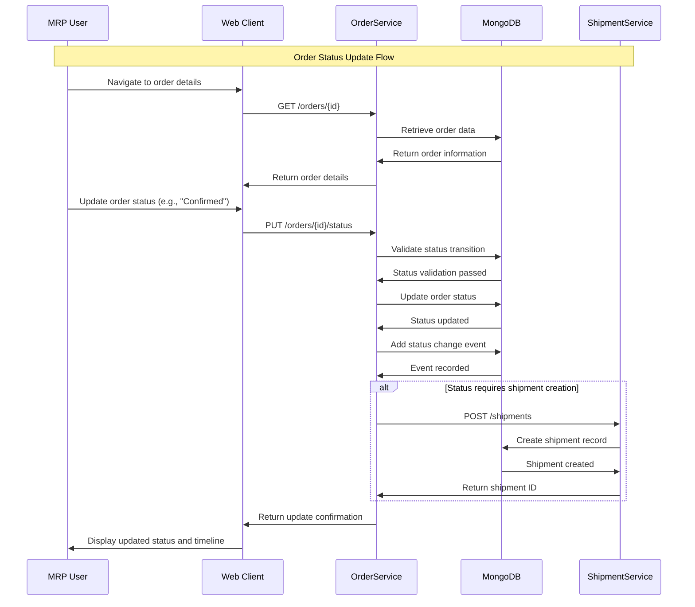
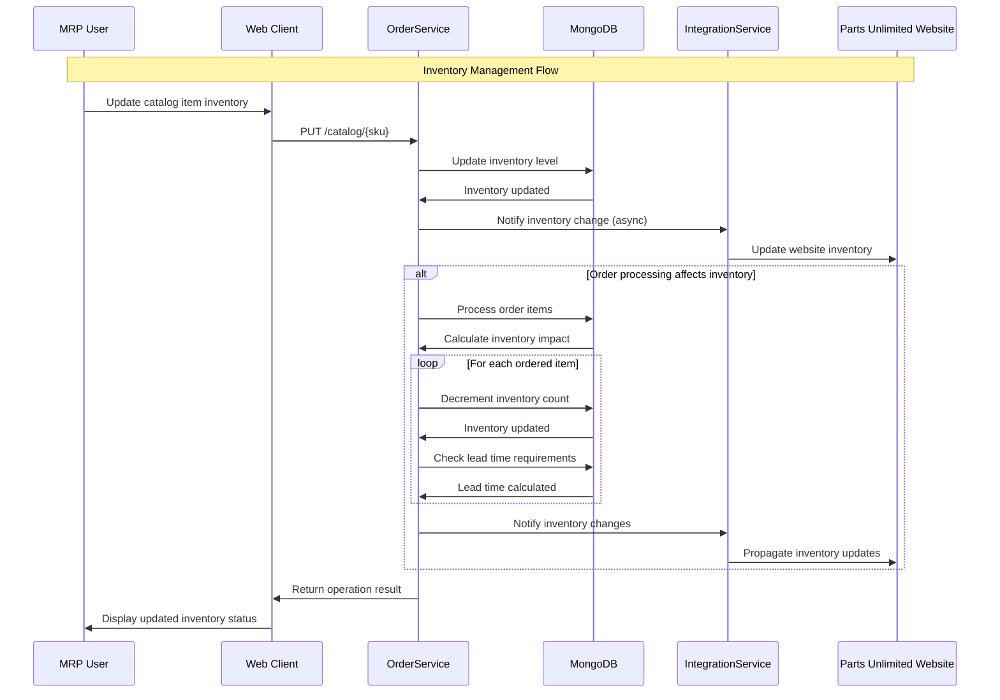
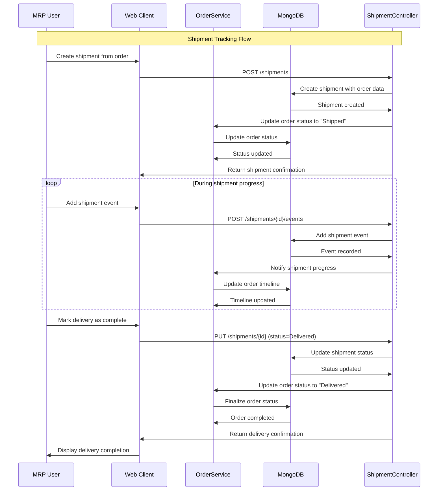
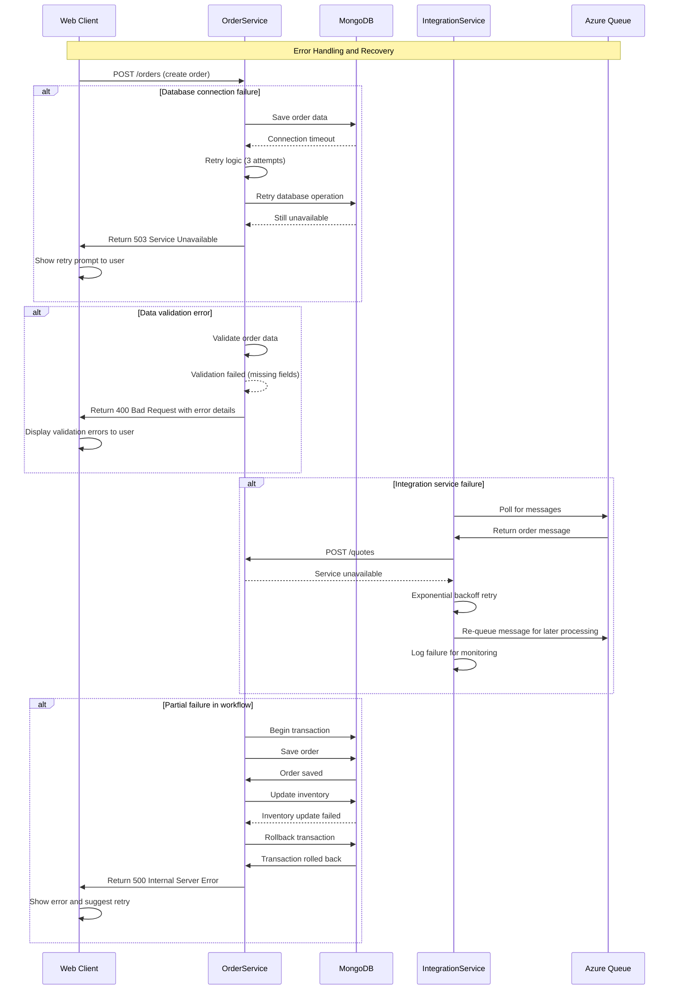

# Parts Unlimited MRP - Dynamic Interaction Flows

## 1. Order Creation from Website Integration

### Workflow Description
This workflow handles the asynchronous processing of orders received from the Parts Unlimited website via Azure Storage Queues. The IntegrationService polls for new orders and processes them through the MRP system.

**Triggers**: New order message in Azure Queue
**Communication Patterns**: Asynchronous queue processing, REST API calls, database transactions

## 2. Quote-to-Order Conversion Workflow

### Workflow Description
This workflow captures the user-driven process of converting a customer quote into a formal order within the MRP system. It involves data validation, order creation, and status initialization.

**Triggers**: User action in web client to convert quote to order
**Communication Patterns**: Synchronous REST API, database transactions, client-server communication

## 3. Order Status Update Workflow

### Workflow Description
This workflow manages the progression of an order through its lifecycle statuses, from creation to installation. Each status change triggers events and may involve multiple system components.

**Triggers**: User status updates, automated system events
**Communication Patterns**: REST API, database transactions, event logging

## 4. Inventory Management and Catalog Update

### Workflow Description
This workflow handles inventory updates triggered by order processing and manual catalog management. It ensures inventory levels are maintained and propagated to external systems.

**Triggers**: Order processing, manual catalog updates, scheduled tasks
**Communication Patterns**: REST API, database transactions, asynchronous messaging

## 5. Shipment Tracking and Delivery Management

### Workflow Description
This workflow manages the complete shipment lifecycle from creation through delivery confirmation. It includes event tracking, status updates, and coordination with order management.

**Triggers**: Order status changes, manual shipment creation, delivery events
**Communication Patterns**: REST API, database transactions, event-driven updates

## 6. Error Handling and Recovery Patterns

### Workflow Description
This workflow demonstrates the system's error handling and recovery mechanisms across different failure scenarios, including database failures, service unavailability, and data validation errors.

**Triggers**: System failures, validation errors, timeout scenarios
**Communication Patterns**: Retry patterns, fallback mechanisms, error propagation

## Communication Patterns Summary

### Synchronous Communication
- **REST API Calls**: Web Client ↔ OrderService, IntegrationService ↔ OrderService
- **Database Operations**: All services ↔ MongoDB
- **Health Checks**: Ping endpoints for service monitoring

### Asynchronous Communication
- **Queue Processing**: Website → Azure Queue → IntegrationService
- **Event Propagation**: Order status changes → Shipment updates
- **Background Tasks**: Scheduled inventory synchronization

### Data Flow Patterns
- **Request-Response**: Client-initiated operations with immediate feedback
- **Event Sourcing**: Order and shipment event timelines
- **Batch Processing**: Scheduled queue polling and inventory updates

### Error Handling Patterns
- **Retry Logic**: Database operations and external service calls
- **Circuit Breaker**: Service-to-service communication
- **Compensation**: Transaction rollback for partial failures
- **Dead Letter Queues**: Failed message handling in async workflows