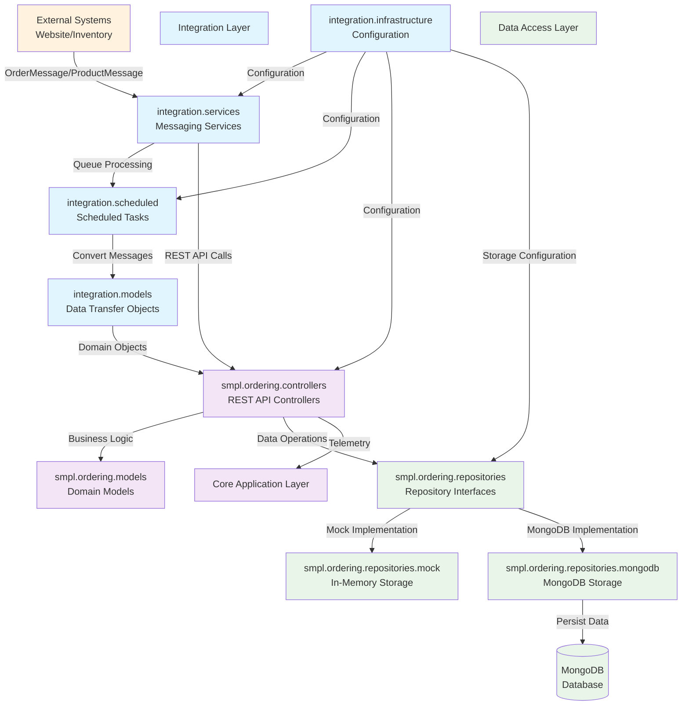

```markdown
1. **Mermaid Diagram:**



2. **Rationale:**

The component boundaries follow a layered microservices architecture with clear separation between integration, application, and data access concerns. The integration layer handles external system communication through scheduled tasks and message queues, while the core application layer manages business logic via RESTful controllers and domain models. Communication patterns primarily use asynchronous messaging for external integration and synchronous repository patterns for data access, with configuration centralized to support flexible deployment across different environments.
```