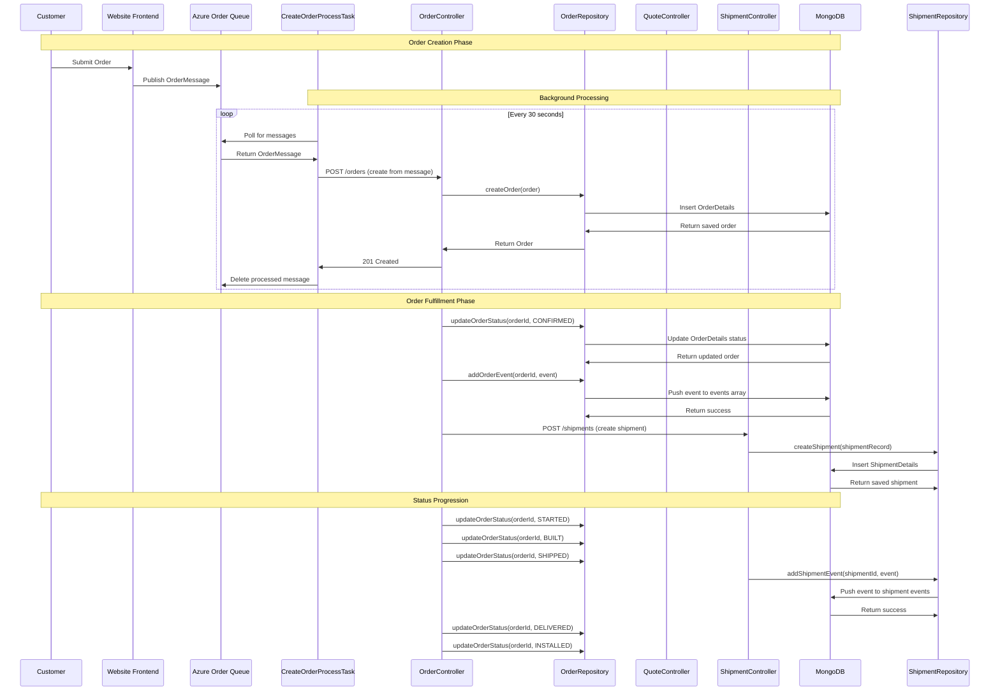
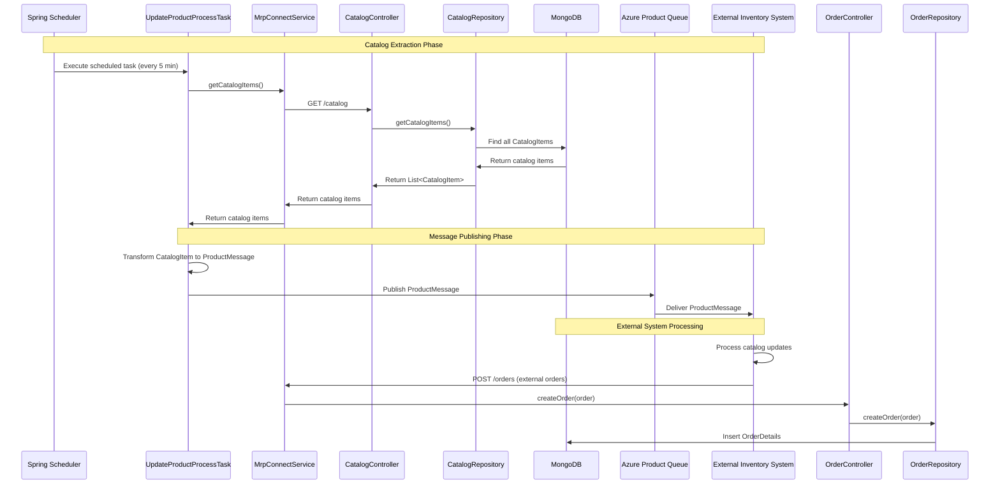
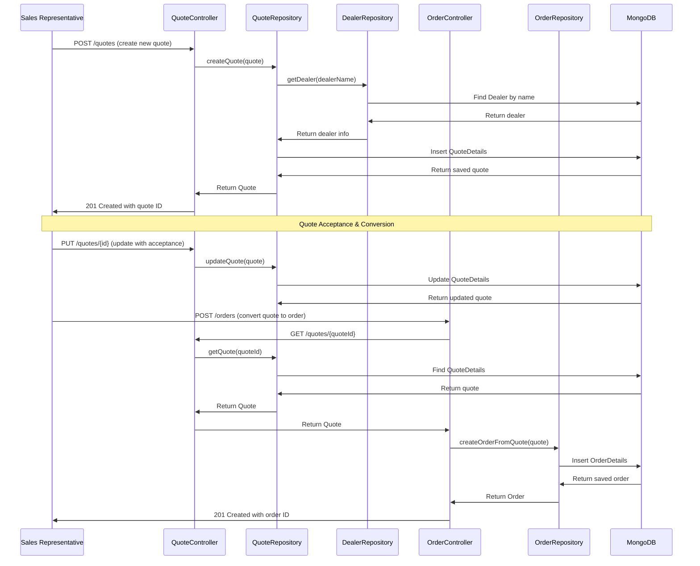
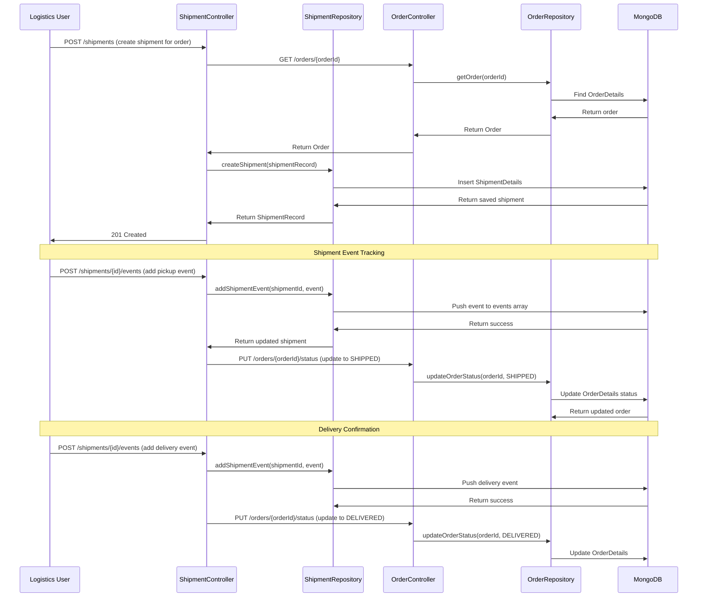
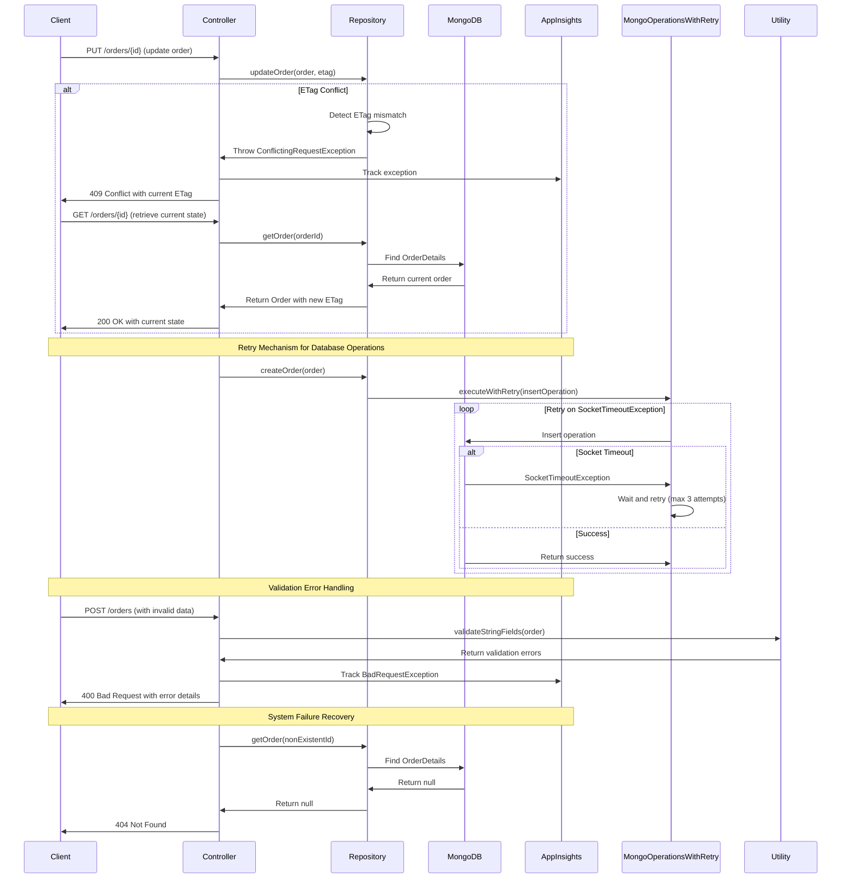
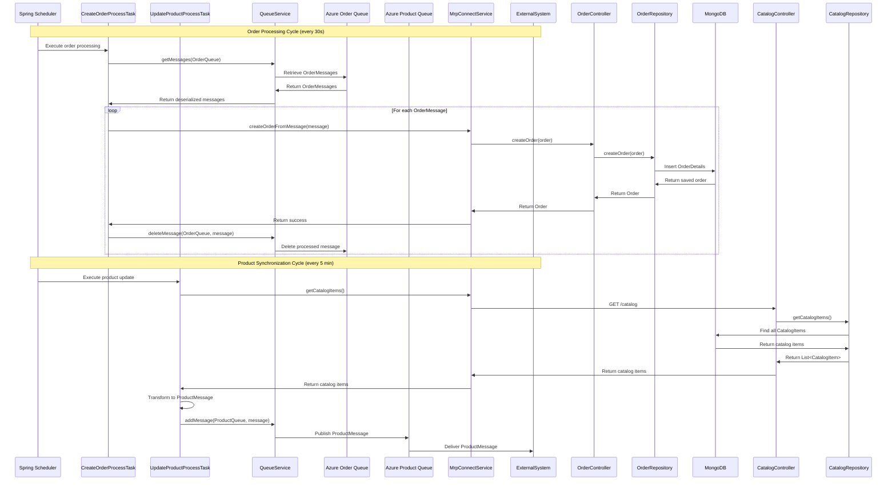

```markdown
# Dynamic Interaction Flows for PartsUnlimitedMRP

## 1. Order Processing Workflow

### Workflow Description
**Purpose**: Complete order lifecycle management from quote creation through final shipment and installation
**Triggers**: Customer places order through website or external system
**Communication Patterns**: REST APIs, Azure Queue messaging, synchronous database transactions, event-driven status updates



## 2. Catalog Synchronization Workflow

### Workflow Description
**Purpose**: Real-time synchronization of product catalog data between MRP system and external inventory systems
**Triggers**: Scheduled task execution or manual catalog updates
**Communication Patterns**: Scheduled background tasks, Azure Queue messaging, REST API calls



## 3. Quote-to-Order Conversion Workflow

### Workflow Description
**Purpose**: Convert customer quotes into formal orders with pricing validation and dealer coordination
**Triggers**: Customer accepts quote or sales representative converts quote
**Communication Patterns**: REST APIs, synchronous database transactions, dealer validation



## 4. Shipment Tracking Workflow

### Workflow Description
**Purpose**: Coordinate and track physical shipments from warehouse to customer installation
**Triggers**: Order status changes to "Built" or manual shipment creation
**Communication Patterns**: REST APIs, event-driven updates, status coordination between orders and shipments



## 5. Error Handling and Recovery Workflow

### Workflow Description
**Purpose**: Handle system failures, data conflicts, and ensure data consistency across distributed operations
**Triggers**: Database conflicts, network failures, invalid requests
**Communication Patterns**: Exception handling, retry mechanisms, optimistic concurrency control



## 6. Integration Service Background Processing

### Workflow Description
**Purpose**: Automated background synchronization between external systems and MRP core services
**Triggers**: Scheduled task execution at fixed intervals
**Communication Patterns**: Scheduled tasks, Azure Queue consumption, batch processing

