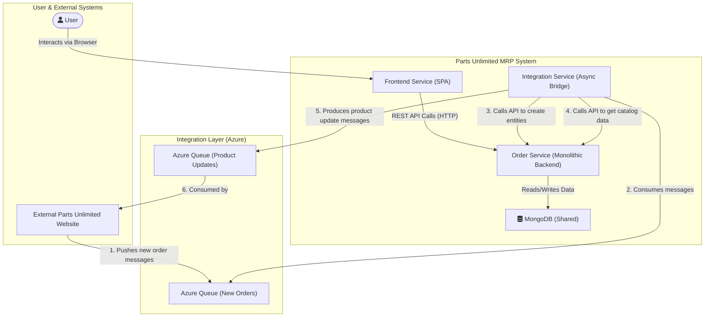

```markdown


The architecture is a three-tier system composed of a `Frontend SPA`, a monolithic `Order Service` backend, and a shared `MongoDB` database. Communication between the frontend and backend is synchronous via REST APIs, while an `Integration Service` handles asynchronous communication with an external system through message queues, acting as a resilient anti-corruption layer.
```