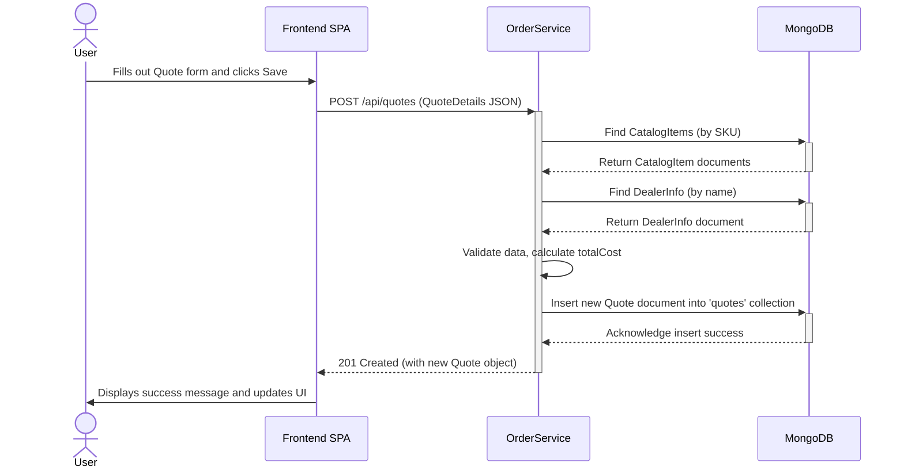
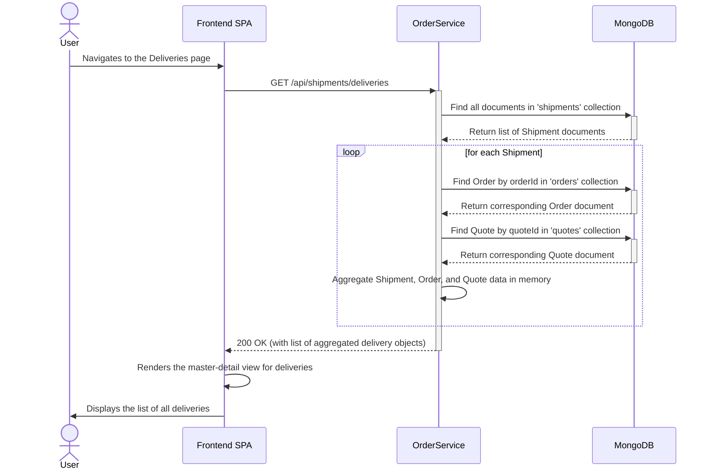
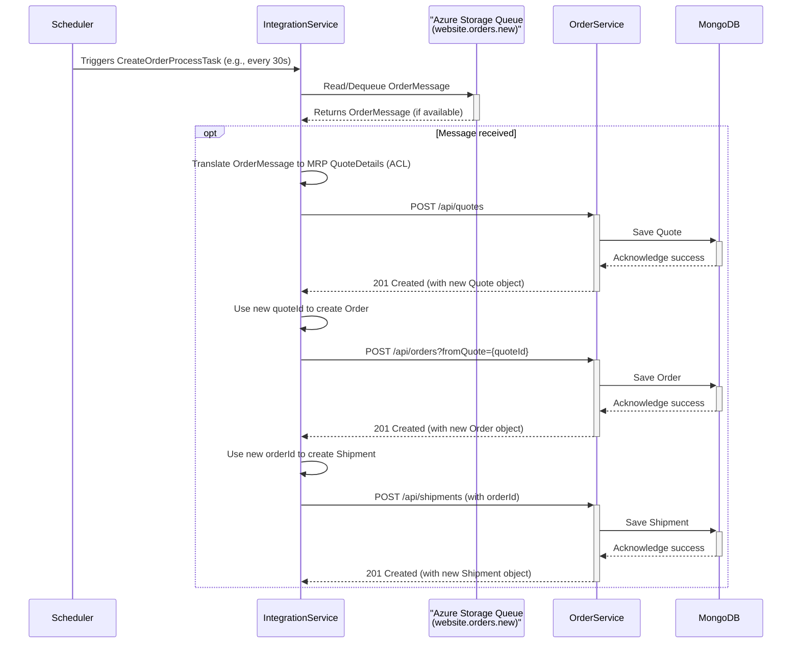
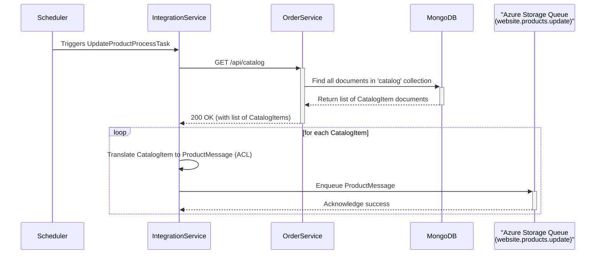

### 1. User Creates a New Quote

-   **Workflow Purpose and Triggers**: This workflow is triggered when a user, interacting with the Frontend SPA, fills out a form with quote details (customer, dealer, catalog items, quantities) and clicks "Save". It represents the first step in the core sales process.
-   **Communication Patterns**:
    -   **Synchronous REST**: The Frontend SPA makes a synchronous `POST` request to the Order Service's REST API.
    -   **Database Transactions**: The Order Service performs read (catalog, dealers) and write (quotes) operations against the MongoDB database.



### 2. User Converts a Quote to an Order

-   **Workflow Purpose and Triggers**: Triggered when a user views an existing quote in the UI and clicks the "Create Order" button. This workflow transitions a quote into a committed order, a critical state change in the business process.
-   **Communication Patterns**:
    -   **Synchronous REST**: The Frontend SPA makes a synchronous `POST` request to the Order Service, passing the source quote ID as a query parameter.
    -   **Coupled Database Logic**: The Order Service's business logic involves cross-collection validation, checking the `quotes` collection before writing to the `orders` collection, demonstrating tight coupling between the domains.

```mermaid
sequenceDiagram
    actor User
    participant Frontend SPA
    participant OrderService
    participant MongoDB

    User->>Frontend SPA: Selects a Quote and clicks "Create Order"
    Frontend SPA->>+OrderService: POST /api/orders?fromQuote={quoteId}
    OrderService->>OrderService: Parse quoteId from request
    
    Note right of OrderService: The MongoOrderRepository depends on<br/>the QuoteRepository for this validation.
    OrderService->>+MongoDB: Find Quote by quoteId in 'quotes' collection
    MongoDB-->>-OrderService: Return Quote document
    
    alt Quote is valid and not yet converted
        OrderService->>OrderService: Create new OrderDetails from Quote
        OrderService->>OrderService: Add "Order Created" event to history
        OrderService->>+MongoDB: Insert new Order document into 'orders' collection
        MongoDB-->>-OrderService: Acknowledge insert success
        OrderService-->>-Frontend SPA: 201 Created (with new Order object)
        Frontend SPA->>User: Displays success and navigates to Order view
    else Quote is invalid or already converted
        OrderService-->>-Frontend SPA: 400 Bad Request (or similar error)
        Frontend SPA->>User: Displays error message
    end
```

### 3. User Views Aggregated Delivery Information

-   **Workflow Purpose and Triggers**: This workflow is triggered when a user navigates to the "Deliveries" page in the SPA. It aims to provide a consolidated view of each delivery, including details from the original quote and order.
-   **Communication Patterns**:
    -   **Synchronous REST**: A single `GET` request from the client to a dedicated aggregation endpoint.
    -   **Application-Layer Join (Anti-Pattern)**: The Order Service performs multiple, sequential database queries across three different collections (`shipments`, `orders`, `quotes`) and joins the data in memory. This is a significant performance smell and highlights tight data coupling.



### 4. Asynchronous Order Ingestion from External System

-   **Workflow Purpose and Triggers**: This is a background process, triggered by a scheduled task in the Integration Service. It polls an Azure Storage Queue for new orders from an external "Parts Unlimited Website" and integrates them into the MRP system.
-   **Communication Patterns**:
    -   **Asynchronous (Queue Polling)**: The Integration Service is decoupled from the external website via a message queue, providing resilience.
    -   **Anti-Corruption Layer (ACL)**: The service translates the external `OrderMessage` format into the internal MRP domain models.
    -   **Synchronous Choreography**: The Integration Service makes a sequence of synchronous REST calls to the Order Service to create the Quote, Order, and Shipment, effectively choreographing the business process over HTTP.



### 5. Asynchronous Product Inventory Update to External System

-   **Workflow Purpose and Triggers**: A background process, triggered by a scheduled task in the Integration Service, to synchronize product inventory levels from the MRP system to the external website.
-   **Communication Patterns**:
    -   **Scheduled Trigger**: The process is initiated by a scheduler within the Integration Service.
    -   **Synchronous REST**: It begins by synchronously fetching all catalog data from the Order Service.
    -   **Asynchronous (Queue Publishing)**: It publishes updates as messages to an Azure Storage Queue, decoupling itself from the availability of the external website.



### 6. Database Operation with Retry and Telemetry

-   **Workflow Purpose and Triggers**: This flow illustrates the system's resilience pattern for database interactions. It is triggered by any database operation within the Order Service, such as fetching data for an API call.
-   **Communication Patterns**:
    -   **Decorator Pattern**: The `MongoOperationsWithRetry` class wraps the standard `MongoTemplate` to add retry and telemetry logic without altering the core database code.
    -   **Retry Logic**: Handles transient database failures by automatically retrying the operation.
    -   **Telemetry**: Emits monitoring data to Application Insights, providing observability into database performance and failures.

```mermaid
sequenceDiagram
    participant OrderServiceController
    participant MongoOperationsWithRetry
    participant MongoTemplate
    participant MongoDB
    participant AppInsights as "Application Insights"

    OrderServiceController->>+MongoOperationsWithRetry: executeQuery(query)
    
    Note right of MongoOperationsWithRetry: Attempt 1
    MongoOperationsWithRetry->>+MongoTemplate: executeQuery(query)
    MongoTemplate->>+MongoDB: DB Query
    
    alt Transient Network Error
        MongoDB-->>-MongoTemplate: Fails (e.g., Timeout)
        MongoTemplate-->>-MongoOperationsWithRetry: Throws DataAccessException
        MongoOperationsWithRetry->>MongoOperationsWithRetry: Catches exception, logs it
        MongoOperationsWithRetry->>+AppInsights: TrackException(DataAccessException)
        AppInsights-->>-MongoOperationsWithRetry: OK
        MongoOperationsWithRetry->>MongoOperationsWithRetry: Waits for retry interval

        Note right of MongoOperationsWithRetry: Attempt 2 (Retry)
        MongoOperationsWithRetry->>+MongoTemplate: executeQuery(query)
        MongoTemplate->>+MongoDB: DB Query
        MongoDB-->>-MongoTemplate: Returns query results
        MongoTemplate-->>-MongoOperationsWithRetry: Returns results
        MongoOperationsWithRetry-->>-OrderServiceController: Returns results
    else Success on First Attempt
        MongoDB-->>-MongoTemplate: Returns query results
        MongoTemplate-->>-MongoOperationsWithRetry: Returns results
        MongoOperationsWithRetry-->>-OrderServiceController: Returns results
    end

```