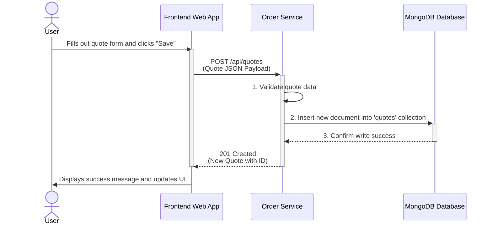
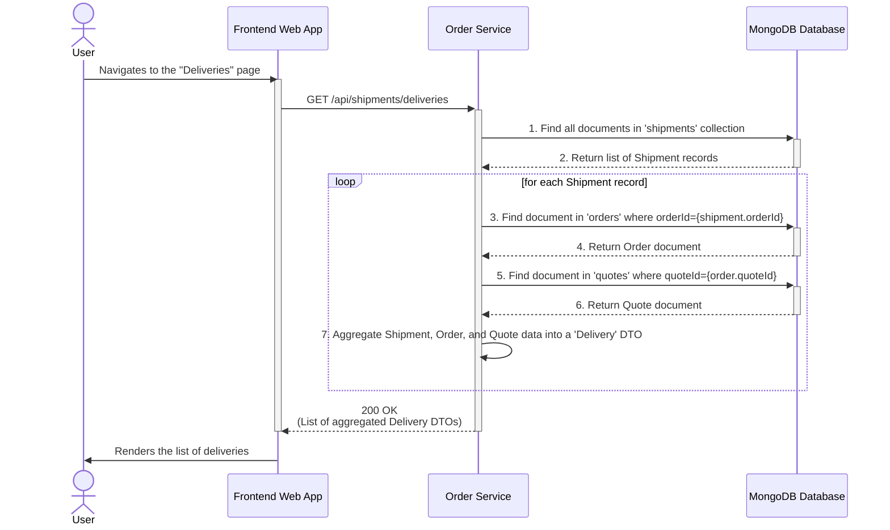
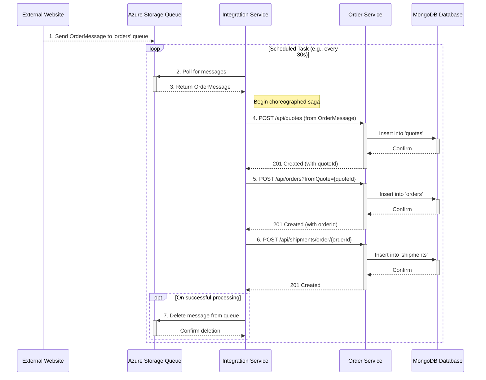

### 1. User Creates a New Quote

-   **Workflow Description**: This workflow is triggered when a user fills out the quote creation form in the web frontend and submits it. The frontend sends the new quote data to the `OrderService`, which validates it and persists it to the MongoDB database. This is a standard synchronous CRUD operation.
-   **Communication Patterns**:
    -   Synchronous REST API call (`POST /api/quotes`) from the client to the backend.
    -   Synchronous database write operation within a single transaction scope.



### 2. User Converts a Quote to an Order

-   **Workflow Description**: This flow begins when a user decides to proceed with an existing quote and converts it into a formal order. The frontend initiates this business process by calling a specific `OrderService` endpoint. The service performs an internal lookup to validate the quote's existence before creating and persisting the new order, demonstrating a tight coupling between the Quote and Order domains.
-   **Communication Patterns**:
    -   Synchronous REST API call (`POST /api/orders`).
    -   Multiple synchronous database read and write operations (`find quote`, `insert order`) performed by the backend service to fulfill a single client request.

```mermaid
sequenceDiagram
    actor User
    participant FrontendWebApp as Frontend Web App
    participant OrderService as Order Service
    participant MongoDB as MongoDB Database

    User->>FrontendWebApp: Selects a quote and clicks "Create Order"
    activate FrontendWebApp

    FrontendWebApp->>+OrderService: POST /api/orders?fromQuote={quoteId}
    OrderService->>OrderService: 1. Begin order creation process
    
    note right of OrderService: Internal check: Service first validates the quote exists.
    OrderService->>+MongoDB: 2. Find document in 'quotes' collection where quoteId={quoteId}
    MongoDB-->>-OrderService: 3. Return quote document
    
    alt Quote is valid and not yet used
        OrderService->>OrderService: 4. Create new Order object from Quote data
        OrderService->>+MongoDB: 5. Insert new document into 'orders' collection
        MongoDB-->>-OrderService: 6. Confirm write success
        OrderService-->>-FrontendWebApp: 201 Created <br> (New Order with ID)
    else Quote is invalid or already has an order
        OrderService-->>-FrontendWebApp: 409 Conflict or 404 Not Found
    end
    
    deactivate FrontendWebApp
    FrontendWebApp->>User: Navigates to Orders page or shows error
```

### 3. User Views Aggregated Delivery Information

-   **Workflow Description**: This workflow is triggered when a user navigates to the "Deliveries" view. To build the required response, the `OrderService` performs an application-level "join" by fetching data sequentially from three different database collections (`shipments`, `orders`, `quotes`). This highlights significant data coupling and a potential performance bottleneck (N+1 query problem).
-   **Communication Patterns**:
    -   Synchronous REST API call (`GET /api/shipments/deliveries`).
    -   Multiple sequential, synchronous database read operations.



### 4. External System Creates an Order Asynchronously

-   **Workflow Description**: This is an asynchronous, system-driven workflow initiated by an external website. The `IntegrationService` acts as an Anti-Corruption Layer, consuming messages from a queue, translating them, and orchestrating a series of REST calls to the `OrderService` to create a quote, an order, and a shipment. This represents a choreographed saga pattern for processing orders without direct coupling to the external system.
-   **Communication Patterns**:
    -   Asynchronous message passing via Azure Storage Queue (Inbound).
    -   Scheduled Polling by the `IntegrationService`.
    -   Synchronous REST API calls between `IntegrationService` and `OrderService`.
    -   Synchronous database writes by `OrderService`.



### 5. Database Operation with Retry Logic

-   **Workflow Description**: This diagram details the internal error handling and recovery pattern within the `OrderService`. When a repository performs a database operation, it goes through a decorator (`MongoOperationsWithRetry`) that adds retry logic for transient network errors (like a `SocketException`) and emits telemetry to Application Insights for observability.
-   **Communication Patterns**:
    -   Decorator Pattern for wrapping database operations.
    -   Internal synchronous method calls.
    -   Telemetry/Monitoring event emission.

```mermaid
sequenceDiagram
    participant Controller as OrderService Controller
    participant Repository as Mongo Repository
    participant RetryDecorator as MongoOperationsWithRetry
    participant MongoTemplate as Spring MongoTemplate
    participant MongoDB as MongoDB Database
    participant AppInsights as Application Insights

    Controller->>Repository: save(object)
    activate Repository
    Repository->>RetryDecorator: mongoOperations.save(object)
    activate RetryDecorator
    
    RetryDecorator->>AppInsights: 1. Start dependency timer
    RetryDecorator->>MongoTemplate: 2. save(object)
    activate MongoTemplate
    
    alt Transient Error (e.g., SocketException)
        MongoTemplate-->>MongoDB: Attempt write
        MongoDB--xRetryDecorator: Throws SocketException
        deactivate MongoTemplate
        
        RetryDecorator->>RetryDecorator: 3. Catch exception, wait
        
        RetryDecorator->>MongoTemplate: 4. Retry: save(object)
        activate MongoTemplate
        MongoTemplate-->>MongoDB: Attempt write
        MongoDB-->>MongoTemplate: Success
        MongoTemplate-->>RetryDecorator: Return success
        deactivate MongoTemplate
        
        RetryDecorator->>+AppInsights: 5. Stop timer, send SUCCESS telemetry
        AppInsights-->>-RetryDecorator: OK
        
        RetryDecorator-->>Repository: Return result
    else No Error
        MongoTemplate-->>MongoDB: Attempt write
        MongoDB-->>MongoTemplate: Success
        MongoTemplate-->>RetryDecorator: Return success
        deactivate MongoTemplate
        
        RetryDecorator->>+AppInsights: Stop timer, send SUCCESS telemetry
        AppInsights-->>-RetryDecorator: OK
        
        RetryDecorator-->>Repository: Return result
    else Persistent Error
        MongoTemplate-->>MongoDB: Attempt write
        MongoDB--xRetryDecorator: Throws Exception
        deactivate MongoTemplate
        
        RetryDecorator->>RetryDecorator: Retry logic fails...
        
        RetryDecorator->>+AppInsights: Stop timer, send FAILED telemetry
        AppInsights-->>-RetryDecorator: OK
        
        RetryDecorator--xRepository: Re-throws Exception
    end
    
    deactivate RetryDecorator
    Repository-->>Controller: Return result or exception
    deactivate Repository
```