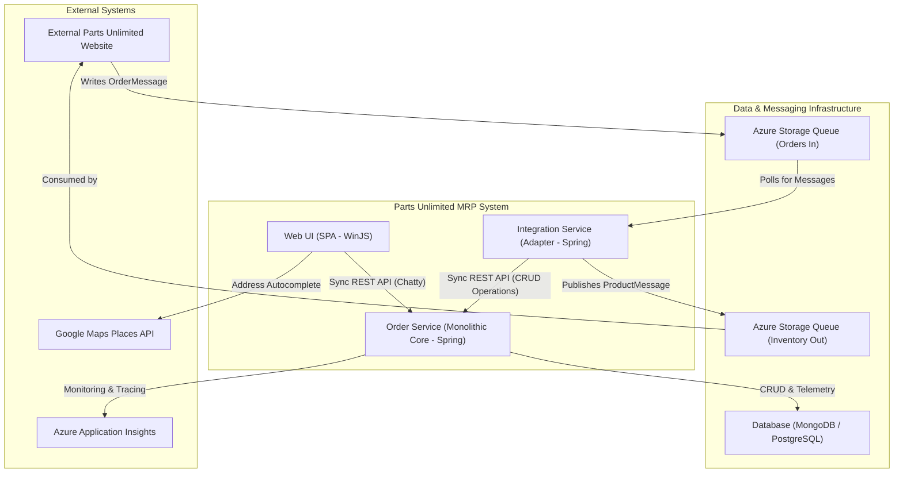

The architecture is a logically-decomposed monolith centered around the `Order Service`, which holds all core business logic and state. The `Web UI` and `Integration Service` act as distinct clients, communicating with the core via synchronous REST APIs. Asynchronous integration with external systems is achieved through the `Integration Service` acting as an adapter, which polls and publishes messages to Azure Storage Queues, decoupling the core system from external data formats and availability.