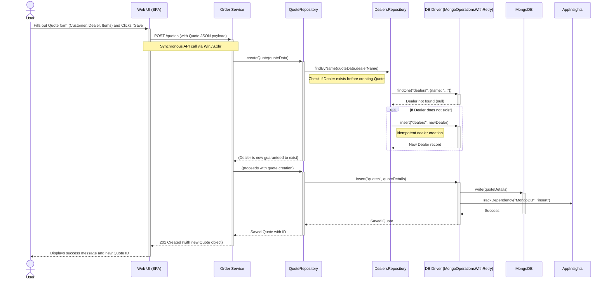
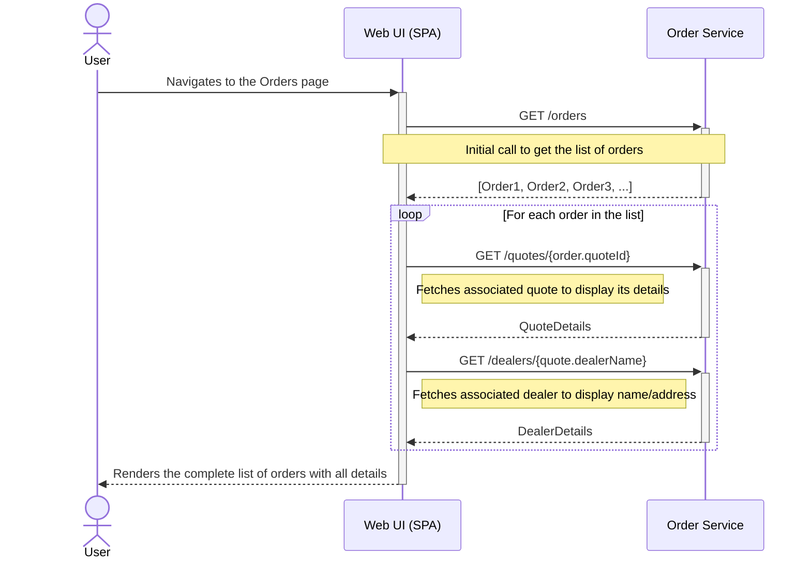
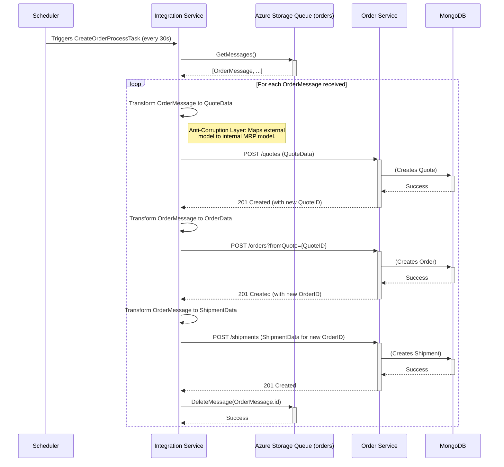
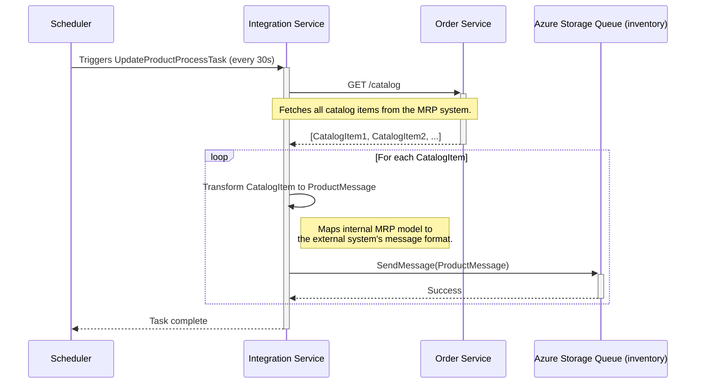
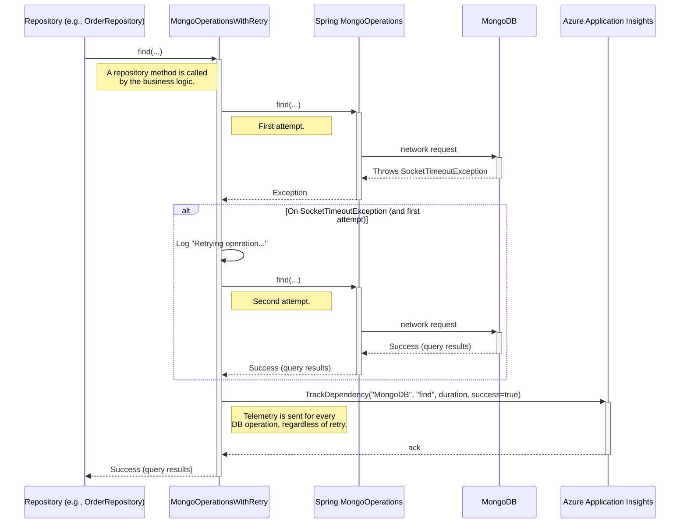

### **1. User Creates a New Sales Quote**

-   **Workflow Purpose & Trigger:** A user, likely a sales representative, creates a new sales quote for a customer. The process is initiated by filling out a form in the Web UI and saving it. A key behavior is the idempotent creation of a new dealer if the one specified in the quote does not already exist.
-   **Communication Patterns:**
    -   **Web UI to Order Service:** Synchronous REST call (`POST /quotes`) using `WinJS.xhr`.
    -   **Order Service to Database:** Synchronous database writes using the Repository pattern. This involves an "application-side join" where the `QuoteRepository` first queries the `DealersRepository`.



### **2. User Converts a Quote to an Order**

-   **Workflow Purpose & Trigger:** After a quote is accepted, a user converts it into a firm order. This is a critical business transaction initiated from the quote details page in the Web UI. The system must ensure that a single quote can only be converted into an order once.
-   **Communication Patterns:**
    -   **Web UI to Order Service:** Synchronous REST call (`POST /orders`).
    -   **Order Service to Database:** Synchronous database reads and writes. This workflow demonstrates internal data coupling, where the `OrderRepository` must validate data with the `QuoteRepository`.
    -   **Error Handling:** A specific business exception (`ConflictingRequestException`) is thrown for rule violations.

```mermaid
sequenceDiagram
    actor User
    participant WebUI as Web UI (SPA)
    participant OrderSvc as Order Service
    participant OrderRepo as OrderRepository
    participant QuoteRepo as QuoteRepository
    participant DBLayer as DB Driver (MongoOperationsWithRetry)
    participant MongoDB

    User->>+WebUI: Opens existing Quote and Clicks "Create Order"
    WebUI->>+OrderSvc: POST /orders?fromQuote={quoteId}
    Note over WebUI,OrderSvc: Synchronous API call

    OrderSvc->>+OrderRepo: createOrderFromQuote(quoteId)

    OrderRepo->>+QuoteRepo: findById(quoteId)
    QuoteRepo->>+DBLayer: findOne("quotes", {quoteId: "..."})
    DBLayer-->>-QuoteRepo: Quote Details
    QuoteRepo-->>-OrderRepo: Returns valid Quote

    OrderRepo->>+DBLayer: findOne("orders", {quoteId: "..."})
    Note right of OrderRepo: Validate that quote has not been used before.
    DBLayer-->>-OrderRepo: Query result (order found or not)

    alt Quote already used to create an Order
        OrderRepo-->>-OrderSvc: Throws ConflictingRequestException
        OrderSvc-->>-WebUI: 409 Conflict
        WebUI-->>-User: Displays "Quote already used" error message
    else Quote is valid and unused
        OrderRepo->>+DBLayer: insert("orders", newOrderDetails)
        DBLayer->>+MongoDB: write(newOrderDetails)
        MongoDB-->>-DBLayer: Success
        DBLayer-->>-OrderRepo: Saved Order
        OrderRepo-->>-OrderSvc: Saved Order with ID
        OrderSvc-->>-WebUI: 201 Created (with new Order object)
        WebUI-->>-User: Displays success and navigates to the new Order
    end
```

### **3. Chatty UI Data Loading for Order List**

-   **Workflow Purpose & Trigger:** This diagram illustrates a potential performance issue where the UI makes multiple, sequential API calls to render a single list of items. It is triggered when a user navigates to the "Orders" page. This "N+1" query pattern is common in systems that haven't been optimized for list views.
-   **Communication Patterns:**
    -   **Web UI to Order Service:** Multiple synchronous REST calls (`GET /orders`, `GET /quotes/{id}`, `GET /dealers/{name}`).



### **4. Asynchronous Order Ingestion via Integration Service**

-   **Workflow Purpose & Trigger:** The system automatically ingests new orders from an external system (e.g., a public website) without user intervention. The `IntegrationService` polls an Azure Storage Queue for new order messages on a fixed schedule.
-   **Communication Patterns:**
    -   **External System to Queue:** Asynchronous message publishing (not shown, but implied).
    -   **Integration Service to Queue:** Asynchronous message polling.
    -   **Integration Service to Order Service:** A series of synchronous REST calls to create the corresponding entities (Quote, Order, Shipment) in the MRP system.



### **5. Asynchronous Inventory Synchronization to External System**

-   **Workflow Purpose & Trigger:** The system periodically sends inventory updates to an external system. The `IntegrationService` polls the `OrderService` for all catalog items and pushes transformed messages to an outbound Azure Storage Queue.
-   **Communication Patterns:**
    -   **Integration Service to Order Service:** Synchronous REST call (`GET /catalog`).
    -   **Integration Service to Queue:** Asynchronous message publishing.



### **6. Database Operation with Retry and Telemetry**

-   **Workflow Purpose & Trigger:** This diagram shows the internal resilience and observability pattern for database interactions within the `OrderService`. Any repository operation triggers this flow, which uses a Decorator pattern (`MongoOperationsWithRetry`) to handle transient network errors.
-   **Communication Patterns:**
    -   **Repository to DB Driver:** Internal Java method call.
    -   **DB Driver to Application Insights:** Out-of-band telemetry call.

