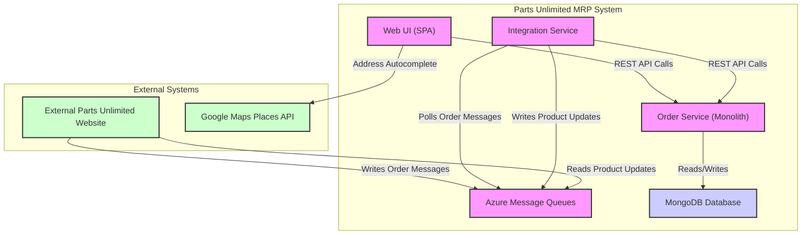

```markdown


The architecture consists of a static Web UI, a monolithic backend `Order Service`, and a background `Integration Service`. The UI communicates directly with the `Order Service` via synchronous REST API calls for all data, while the `Integration Service` uses message queues for asynchronous, decoupled communication with an external website before interacting with the same core REST API.
```