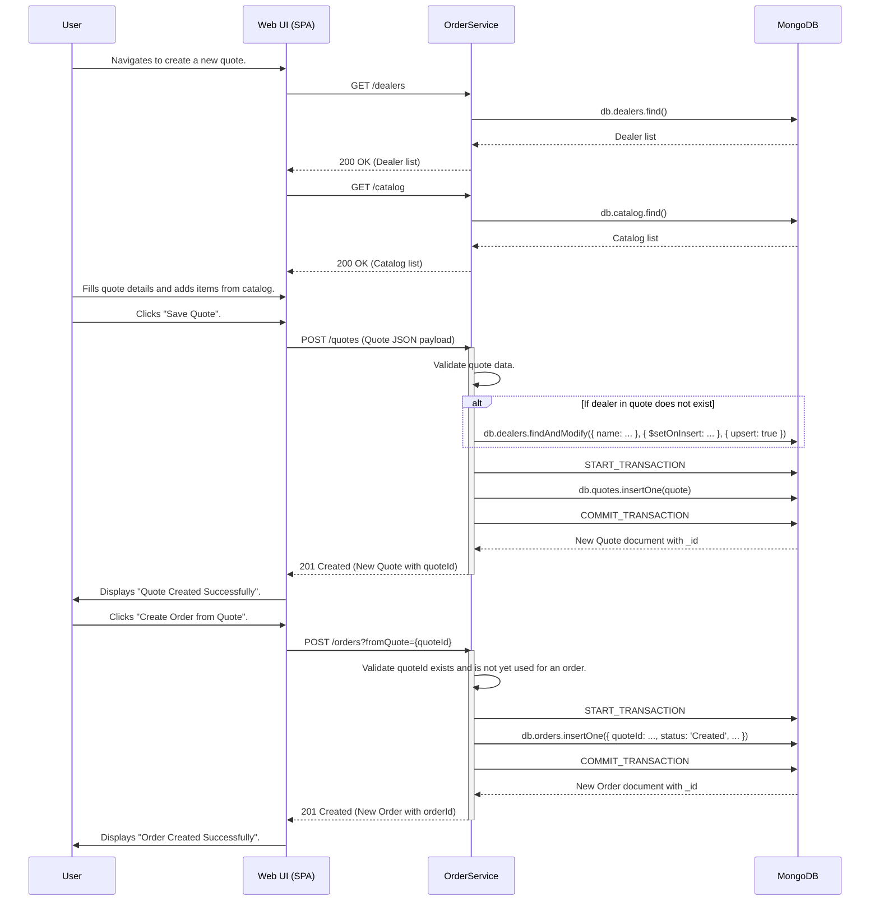
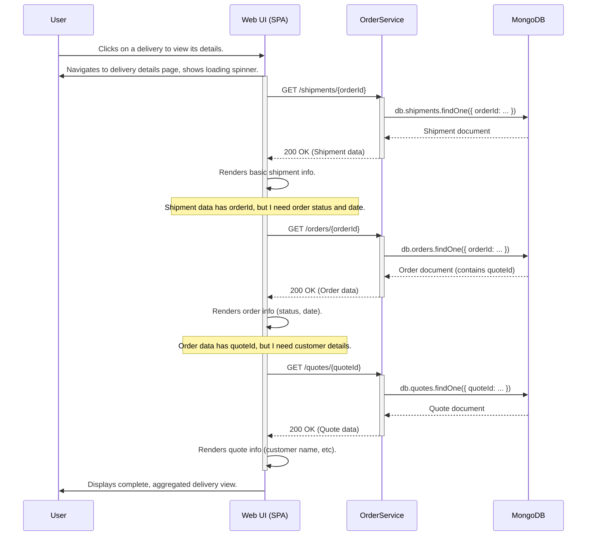
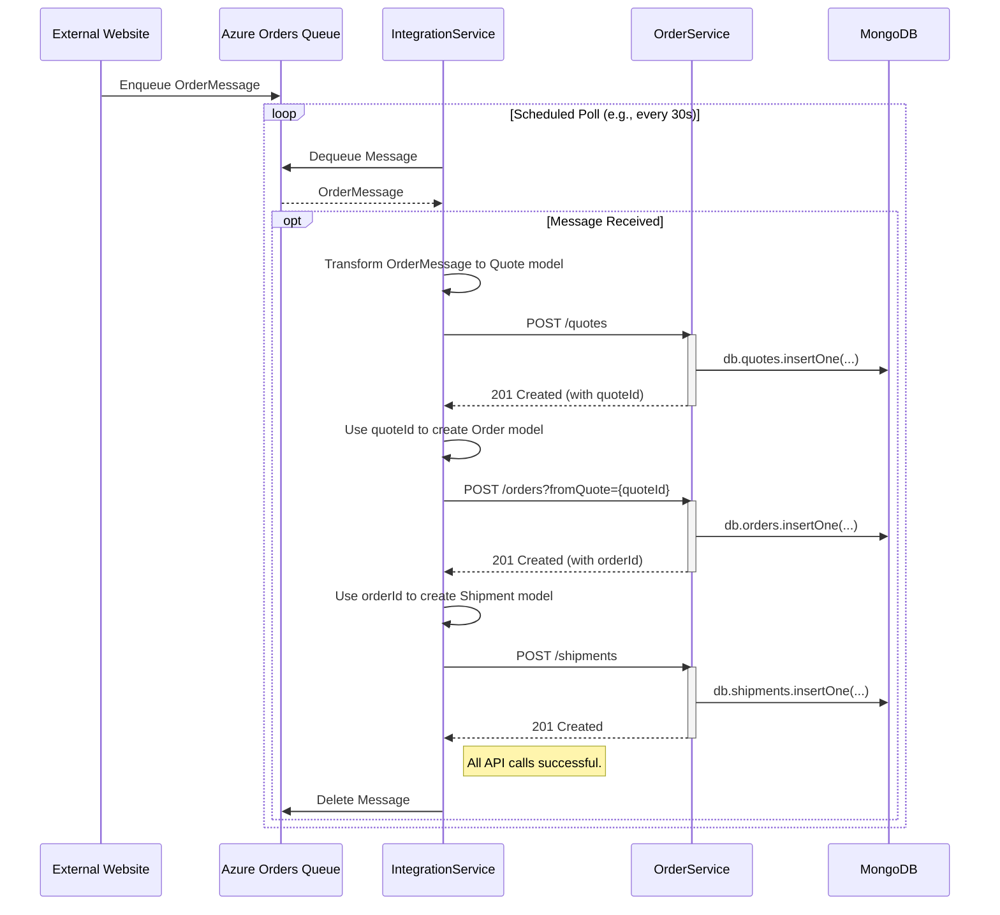
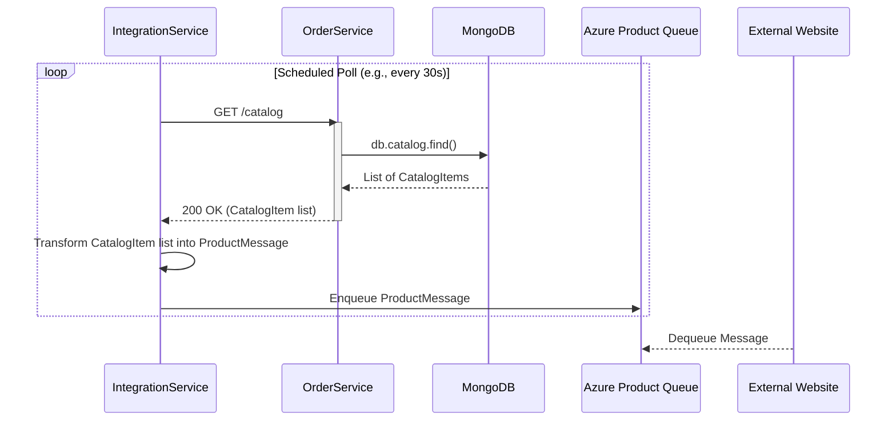

### 1. User Workflow: Create Quote and Convert to Order

This workflow describes the primary business process where a user, likely a sales representative, creates a price quote for a customer and then converts that approved quote into a formal order.

-   **Trigger:** User action in the Web UI.
-   **Communication Patterns:**
    -   Synchronous RESTful API calls (HTTP GET, POST) from the `Web UI` to the `OrderService`.
    -   Internal database transactions within the `OrderService` to ensure atomicity when writing to `MongoDB`.



### 2. User Workflow: View Aggregated Delivery Details

This workflow illustrates how the user views detailed information for a single delivery. It highlights a "chatty" communication pattern where the frontend makes multiple, sequential API calls to aggregate data that is logically linked but stored in separate collections/domains.

-   **Trigger:** User clicks on a delivery record in a list.
-   **Communication Patterns:**
    -   Multiple sequential, synchronous RESTful API calls (HTTP GET) from the `Web UI` to the `OrderService`. This is a classic N+1 query problem at the API layer.



### 3. System Workflow: Process External Order via Message Queue

This workflow describes the asynchronous, backend process for creating an order that originates from an external system (e.g., a public website). The `IntegrationService` acts as an adapter, consuming messages from a queue and using the `OrderService` API to persist the data.

-   **Trigger:** A scheduled task in the `IntegrationService` polls a message queue.
-   **Communication Patterns:**
    -   Asynchronous message queue (polling consumer pattern) between `External System` and `IntegrationService`.
    -   Synchronous RESTful API calls (HTTP POST) from `IntegrationService` to `OrderService`.



### 4. System Workflow: Synchronize Product Catalog to External System

This workflow shows the `IntegrationService` acting in the reverse direction. It periodically polls the `OrderService` for the current product catalog and pushes updates to a queue for an external system to consume.

-   **Trigger:** A scheduled task in the `IntegrationService`.
-   **Communication Patterns:**
    -   Synchronous RESTful API call (HTTP GET) from `IntegrationService` to `OrderService`.
    -   Asynchronous message queue (producer pattern) from `IntegrationService` to the `External System`.



### 5. Error Handling: Database Operation with Retry

This sequence diagram details the internal error handling and recovery pattern implemented by the `MongoOperationsWithRetry` decorator within the `OrderService`. It adds resilience to database interactions by automatically retrying on transient network errors.

-   **Trigger:** An internal call to a repository method that performs a database operation.
-   **Communication Patterns:**
    -   Internal method calls within the `OrderService`.
    -   Decorator Pattern wrapping the standard MongoDB client.
    -   Telemetry calls to Application Insights (not shown for brevity).

```mermaid
sequenceDiagram
    participant Controller
    participant Repository
    participant MongoOperationsWithRetry
    participant MongoTemplate
    participant MongoDB

    Controller->>Repository: createOrder(order)
    activate Repository
    Repository->>MongoOperationsWithRetry: save(orderDetails)
    activate MongoOperationsWithRetry

    note over MongoOperationsWithRetry: Start telemetry timer.

    MongoOperationsWithRetry->>MongoTemplate: save(orderDetails)
    activate MongoTemplate
    MongoTemplate->>MongoDB: db.orders.insertOne(...)
    
    %% First attempt fails
    MongoDB-->>MongoTemplate: SocketTimeoutException
    MongoTemplate-->>MongoOperationsWithRetry: throws SocketTimeoutException
    deactivate MongoTemplate
    
    note over MongoOperationsWithRetry: Catch exception, log retry attempt.

    %% Second attempt
    MongoOperationsWithRetry->>MongoTemplate: save(orderDetails)
    activate MongoTemplate
    MongoTemplate->>MongoDB: db.orders.insertOne(...)

    alt Operation Succeeds on Retry
        MongoDB-->>MongoTemplate: Success
        MongoTemplate-->>MongoOperationsWithRetry: return result
        deactivate MongoTemplate
        note over MongoOperationsWithRetry: Stop timer, report success telemetry.
        MongoOperationsWithRetry-->>Repository: return result
        Repository-->>Controller: return orderId
        deactivate Repository
    else Operation Fails Again
        MongoDB-->>MongoTemplate: SocketTimeoutException
        MongoTemplate-->>MongoOperationsWithRetry: throws SocketTimeoutException
        deactivate MongoTemplate
        note over MongoOperationsWithRetry: Stop timer, report failure telemetry.
        MongoOperationsWithRetry-->>Repository: throws DataAccessException
        Repository-->>Controller: throws DataAccessException
        deactivate Repository
        Controller-->>Client: 500 Internal Server Error
    end
    deactivate MongoOperationsWithRetry
```