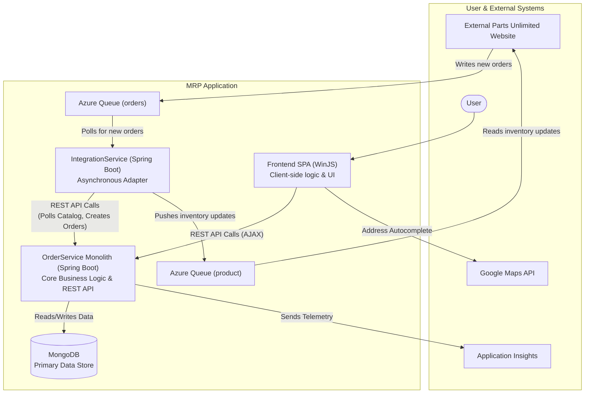

```markdown


The architecture is a hybrid three-tier model centered on the `OrderService` monolith, which encapsulates all core business logic and exposes it via a synchronous REST API. The `Frontend SPA` acts as a rich client, communicating directly with the monolith, while the `IntegrationService` serves as an asynchronous adapter, decoupling the core system from an external website using message queues for communication.
```