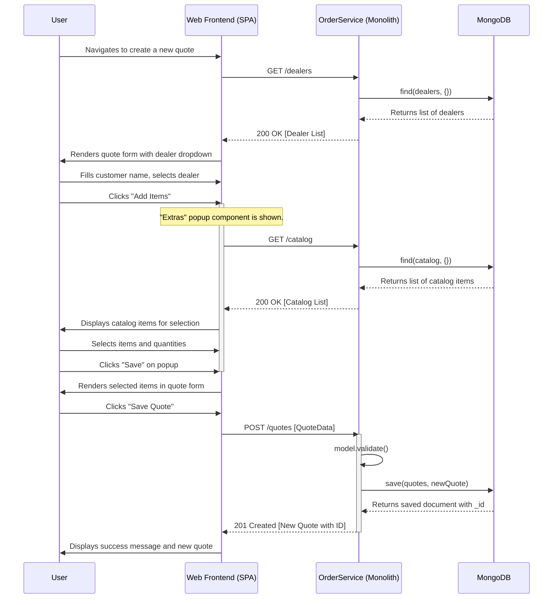
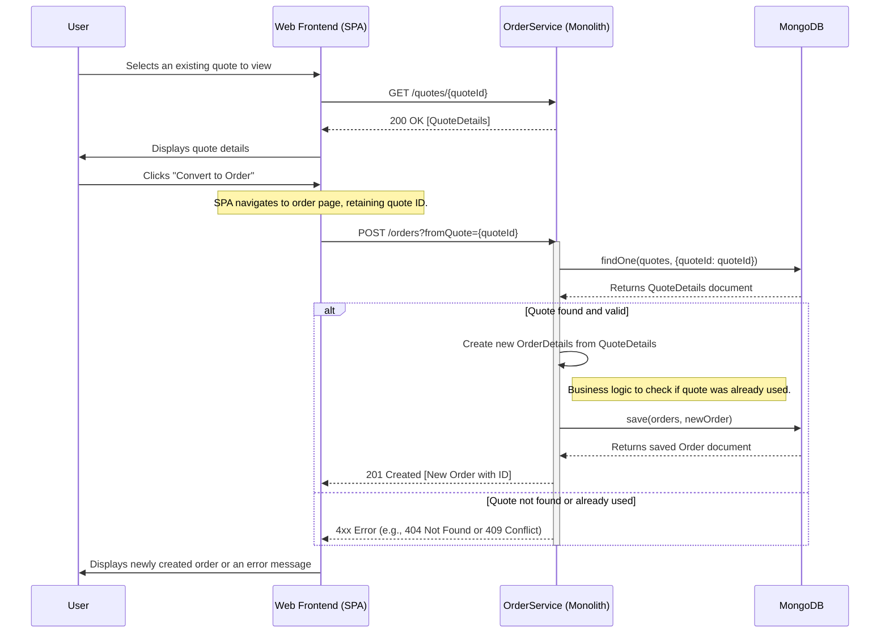
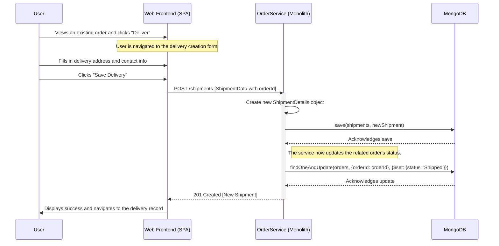
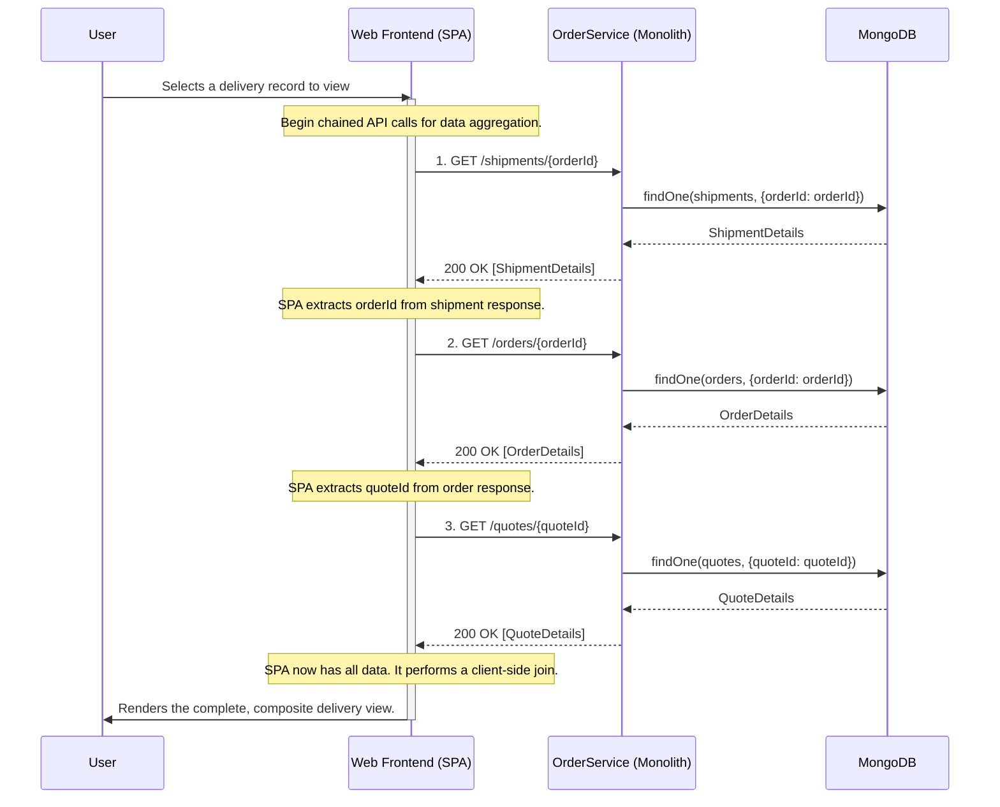
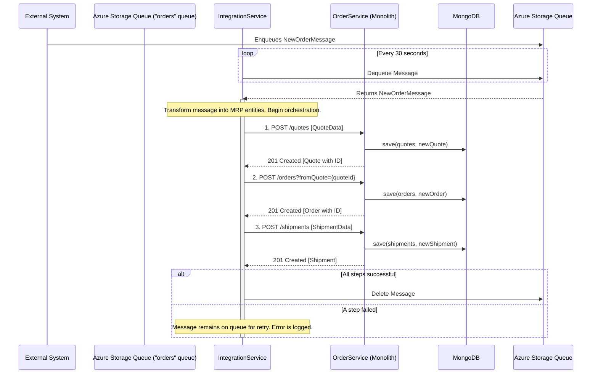
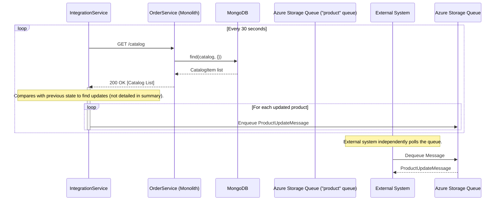

### Workflow 1: User Creates a Sales Quote

This workflow describes a user creating a new sales quote. The process involves selecting a dealer, adding items from the catalog, and saving the quote. This highlights the frontend's role in orchestrating data from multiple API endpoints to build a single user view.

**Communication Patterns:**
*   **Client-Server:** Synchronous REST/HTTP (AJAX) calls.
*   **Data Access:** Direct synchronous reads/writes to MongoDB.
*   **Orchestration:** The Web Frontend acts as an orchestrator, fetching data from `/dealers` and `/catalog` to provide choices for the user before submitting the final quote to `/quotes`.

### Workflow 2: User Converts a Quote to an Order

This workflow shows the critical business transition from a non-binding quote to a committed order. The frontend navigates the user through the process, triggering a specific backend endpoint that encapsulates the creation logic.

**Communication Patterns:**
*   **Client-Server:** Synchronous REST/HTTP calls.
*   **Data Access:** The `OrderService` reads from the `quotes` collection and writes to the `orders` collection in a single business transaction.
*   **State Transition:** A `POST` to `/orders?fromQuote={quoteId}` represents a key state transition in the system's core workflow.

### Workflow 3: User Ships an Order (Creates a Delivery)

This workflow captures the final stage of fulfillment. Creating a shipment not only adds a new record but also implicitly changes the state of the associated order. The backend service should handle this state change atomically.

**Communication Patterns:**
*   **Client-Server:** Synchronous REST/HTTP calls.
*   **Data Access:** Multiple database writes (`shipments` and `orders` collections) that should be treated as a single logical transaction.
*   **Error Handling:** If updating the order status fails after creating the shipment, the system could be left in an inconsistent state, highlighting a weakness of the monolithic, non-transactional approach across operations.

### Workflow 4: Viewing a Composite Delivery Record (Client-Side Join)

This read-only workflow is critical for understanding the system's performance and data coupling characteristics. It demonstrates a "chatty" communication pattern where the client is responsible for making multiple, sequential API calls and joining the data, a common issue in monolithic APIs consumed by SPAs.

**Communication Patterns:**
*   **Client-Server:** Multiple, sequential synchronous REST/HTTP calls. This is an inefficient, "chatty" pattern.
*   **Data Aggregation:** The **Web Frontend (SPA)** performs a "client-side join" of data from three separate entities (Shipment, Order, Quote).
*   **Design Flaw:** This pattern increases latency and couples the client tightly to the backend's data model. A microservices architecture would address this with an API Gateway or BFF.

### Workflow 5: Asynchronous Order Ingestion from External System

This workflow demonstrates the system's asynchronous integration capabilities. The `IntegrationService` acts as an adapter, polling a message queue and orchestrating a series of REST calls to the `OrderService` to create a complete sales record.

**Communication Patterns:**
*   **Asynchronous Polling:** The `IntegrationService` uses a scheduled task to poll an Azure Storage Queue. This decouples it from the message producer.
*   **Adapter/Orchestration:** The `IntegrationService` orchestrates synchronous REST calls (`POST /quotes`, `POST /orders`, `POST /shipments`) to translate the asynchronous event into a transactional workflow within the `OrderService`.
*   **Event-Driven:** The workflow is triggered by an external event (a message appearing on the queue).

### Workflow 6: Asynchronous Catalog Update to External System

This workflow shows the outbound integration path. The `IntegrationService` polls the `OrderService` for data and pushes updates to an external system via a message queue, acting as an event publisher.

**Communication Patterns:**
*   **Asynchronous Publishing:** The `IntegrationService` pushes messages to an Azure Storage Queue, decoupling it from consumers.
*   **Scheduled Polling:** A scheduled task periodically fetches data, turning a state-based system (the catalog in the DB) into an event-based one (messages on a queue). This is a common pattern for integrating with legacy systems.
*   **Data Source:** The `OrderService`'s REST API serves as the single source of truth for the `IntegrationService`.

