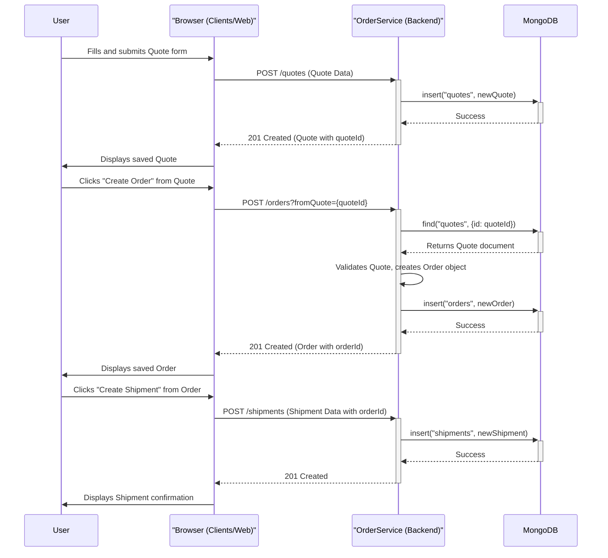
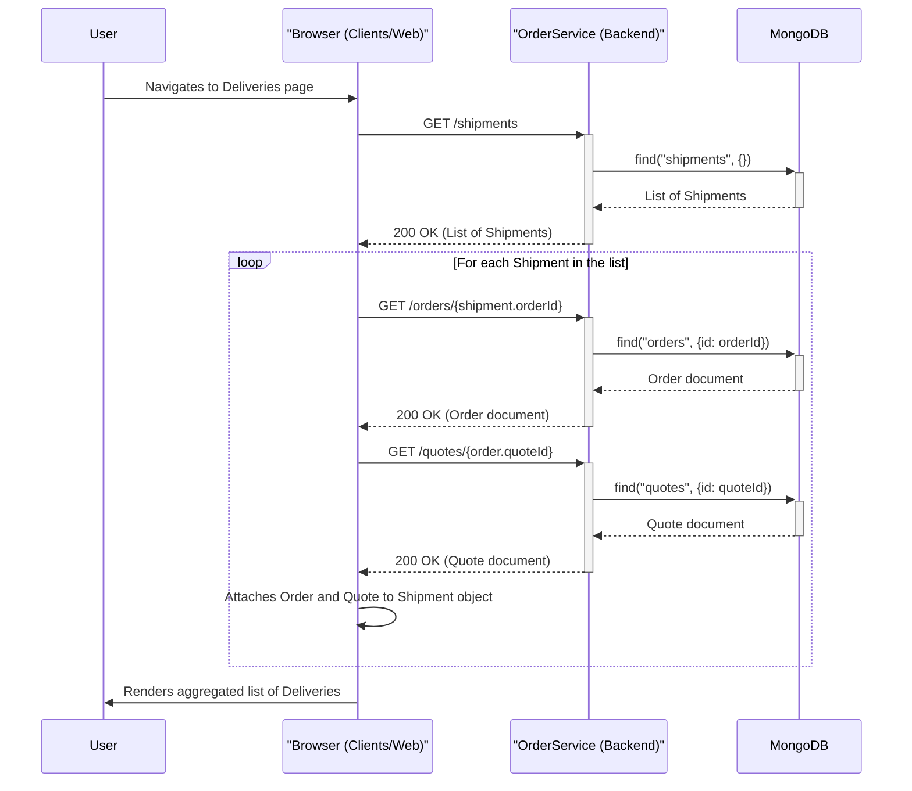
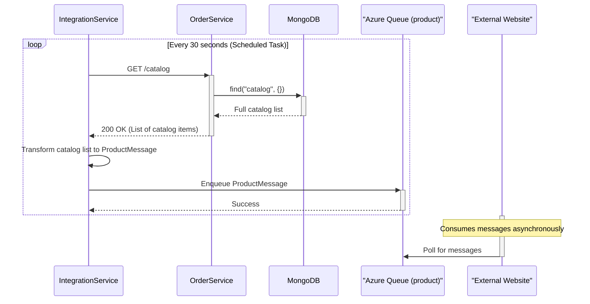

### 1. User Creates a Quote, Order, and Shipment

*   **Workflow Description**: This workflow describes the primary "happy path" for a user interacting with the system. The user first creates a sales Quote, then converts that quote into a formal Order, and finally creates a Shipment record for that order. This is a synchronous process driven entirely by user actions in the web frontend.
*   **Communication Patterns**:
    *   **Synchronous REST**: The Browser makes a series of blocking HTTP REST calls to the `OrderService`.
    *   **Database Transactions**: The `OrderService` performs atomic write operations (Create) against the MongoDB database for each step.



### 2. User Views Aggregated Delivery Details

*   **Workflow Description**: This workflow illustrates how the frontend displays detailed delivery information by aggregating data from three different domains (Shipments, Orders, and Quotes). As noted in the analysis, the frontend performs a "chained client-side join," resulting in multiple, chatty API calls to the backend to assemble the complete view for the user.
*   **Communication Patterns**:
    *   **Synchronous REST**: The Browser makes multiple sequential `GET` requests to the `OrderService`. This is an example of the "N+1 query" problem at the API layer.
    *   **Database Read Operations**: Each API call results in a corresponding read operation on the MongoDB database.



### 3. Processing an External Order from a Message Queue

*   **Workflow Description**: This workflow details the asynchronous process where the `IntegrationService` acts as a system bridge. It polls an Azure Storage Queue for new orders placed on an external website, then orchestrates the creation of the corresponding Quote, Order, and Shipment in the MRP system by making a series of API calls to the `OrderService`.
*   **Communication Patterns**:
    *   **Asynchronous Message Polling**: The `IntegrationService` periodically polls an Azure Storage Queue.
    *   **Synchronous REST**: The `IntegrationService` makes a sequence of REST calls to the `OrderService` to fulfill the order creation process.
    *   **Message Acknowledgement (Delete)**: The message is deleted from the queue only after the entire workflow succeeds, ensuring at-least-once processing.

```mermaid
sequenceDiagram
    participant ExtWebsite as "External Website"
    participant OrdersQueue as "Azure Queue (orders)"
    participant IntegrationService
    participant OrderService
    participant MongoDB

    ExtWebsite->>OrdersQueue: Enqueue OrderMessage

    loop Every 30 seconds (Scheduled Task)
        IntegrationService->>+OrdersQueue: Poll for messages
        OrdersQueue-->>-IntegrationService: Returns OrderMessage
        
        opt Message received
            IntegrationService->>IntegrationService: Transform message to Quote data
            IntegrationService->>+OrderService: POST /quotes
            OrderService->>+MongoDB: insert("quotes", ...)
            MongoDB-->>-OrderService: Success
            OrderService-->>-IntegrationService: 201 Created (Quote with quoteId)

            IntegrationService->>+OrderService: POST /orders?fromQuote={quoteId}
            OrderService->>+MongoDB: insert("orders", ...)
            MongoDB-->>-OrderService: Success
            OrderService-->>-IntegrationService: 201 Created (Order with orderId)

            IntegrationService->>IntegrationService: Transform message to Shipment data
            IntegrationService->>+OrderService: POST /shipments
            OrderService->>+MongoDB: insert("shipments", ...)
            MongoDB-->>-OrderService: Success
            OrderService-->>-IntegrationService: 201 Created

            alt On Full Success
                IntegrationService->>+OrdersQueue: Delete Message
                OrdersQueue-->>-IntegrationService: Success
            else On Failure
                Note over IntegrationService: Do not delete message; will retry on next poll.
            end
        end
    end
```

### 4. Syncing Inventory Updates to an External System

*   **Workflow Description**: This is a second asynchronous workflow managed by the `IntegrationService`. It periodically fetches the entire product catalog from the `OrderService` to get the latest inventory levels. It then transforms this data into a specific message format and pushes it to a different Azure Storage Queue for consumption by the external website.
*   **Communication Patterns**:
    *   **Scheduled Polling (of API)**: The `IntegrationService` uses a scheduled task to trigger the sync process.
    *   **Synchronous REST**: A `GET` call is made to the `OrderService`'s catalog endpoint.
    *   **Asynchronous Message Publishing**: The transformed data is pushed to an Azure Storage Queue as an event/message.



### 5. Database Operation with Retry on Failure

*   **Workflow Description**: This diagram shows a low-level error handling pattern within the `OrderService`. When a database operation fails due to a transient error (e.g., network hiccup), the custom `MongoOperationsWithRetry` wrapper attempts the operation again. This increases the system's resilience without propagating temporary failures to the client.
*   **Communication Patterns**:
    *   **Internal Method Calls**: Shows interaction between the Controller, Repository, and a specific data access wrapper within the `OrderService`.
    *   **Resiliency (Retry Pattern)**: Explicitly models the retry logic for database communication.

```mermaid
sequenceDiagram
    participant Controller
    participant Repository
    participant MongoWrapper as "MongoOperationsWithRetry"
    participant MongoDB

    Controller->>+Repository: save(entity)
    Repository->>+MongoWrapper: insert(entity)
    
    MongoWrapper->>+MongoDB: insert(...)
    MongoDB-->>-MongoWrapper: Fails (Transient Network Error)

    alt Retry Logic
        MongoWrapper->>MongoWrapper: Catch exception, wait
        MongoWrapper->>+MongoDB: insert(...) [Retry Attempt]
        MongoDB-->>-MongoWrapper: Success
        MongoWrapper-->>-Repository: Returns Success
        Repository-->>-Controller: Returns Success
    else Retries Exhausted
        MongoWrapper-->>-Repository: Throws Exception
        Repository-->>-Controller: Throws Exception
        Note over Controller: Exception is caught and a 5xx error is returned to client.
    end
```