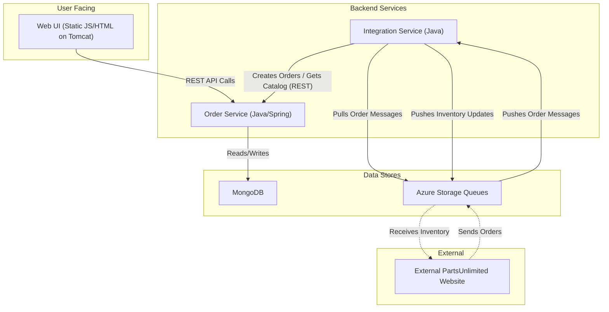

The architecture consists of a client-side Web UI that interacts with a backend Order Service via a REST API for core operations like managing quotes, orders, and catalog items. This Order Service uses MongoDB as its primary data store. A separate Integration Service handles asynchronous communication with an external website, using Azure Storage Queues to decouple the systems for processing incoming orders and sending out inventory updates.