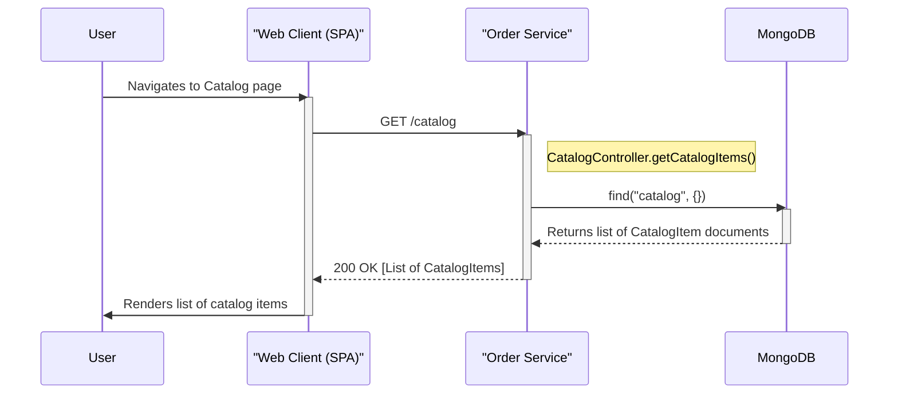
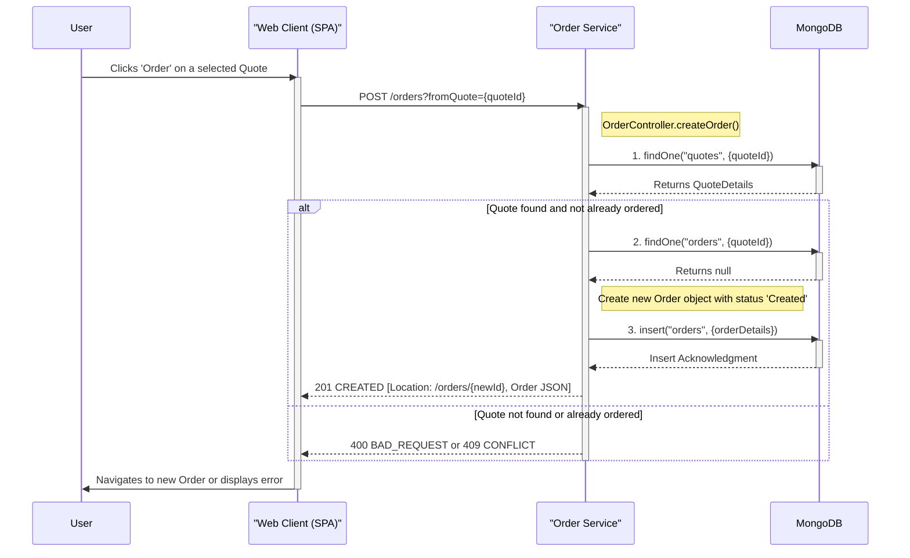
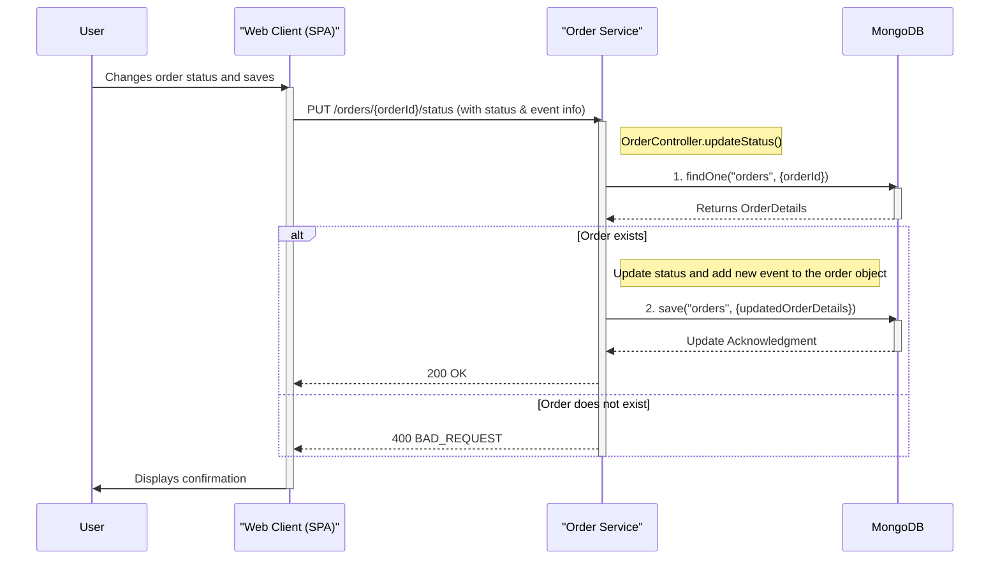
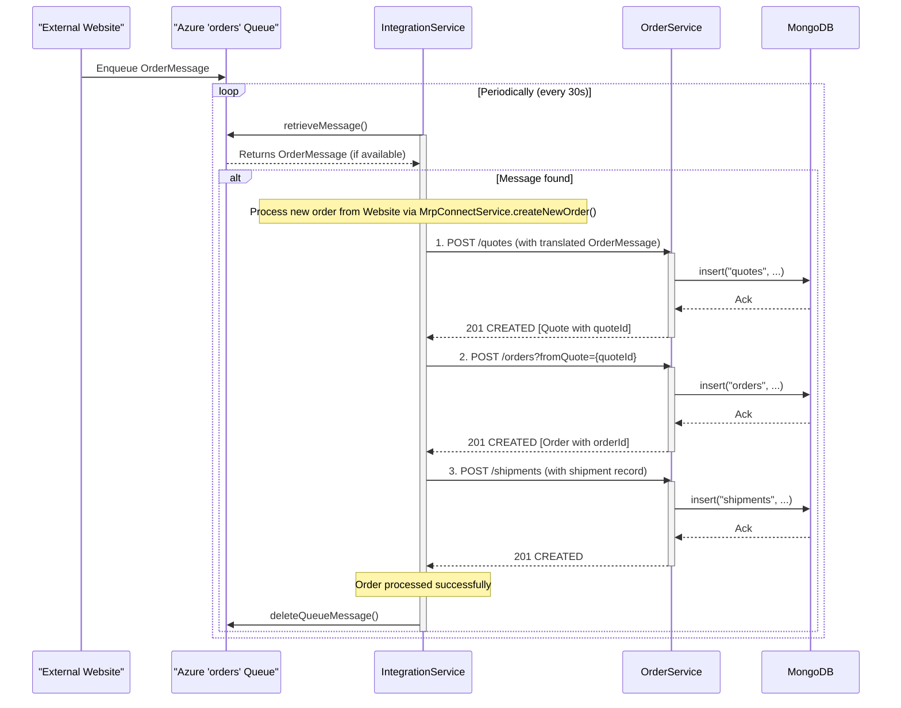
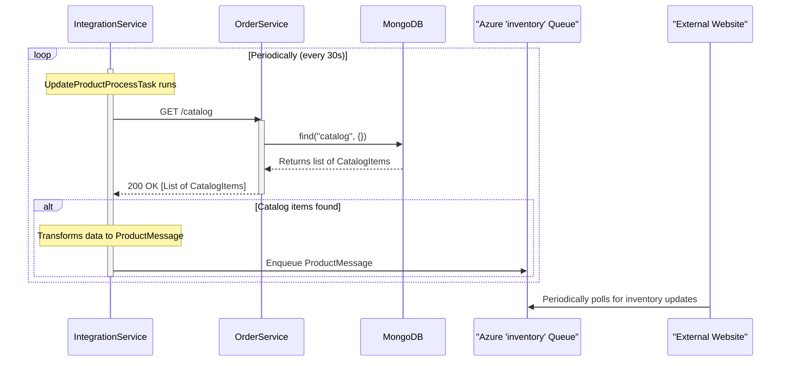

### 1. User Views Catalog Items

-   **Workflow Purpose and Trigger:** This workflow is triggered when a user navigates to the "Catalog" page in the web UI. Its purpose is to fetch and display the list of all available parts from the system.
-   **Communication Patterns:** This is a synchronous read operation.
    -   **Browser -> Order Service:** A synchronous `GET` REST API call.
    -   **Order Service -> MongoDB:** A synchronous database `find` query.



### 2. User Creates an Order from a Quote

-   **Workflow Purpose and Trigger:** This workflow converts an existing sales quote into a confirmed order. It's triggered when a user clicks the "Order" button for a selected quote in the UI.
-   **Communication Patterns:** This is a synchronous write operation involving multiple validation steps.
    -   **Browser -> Order Service:** A synchronous `POST` REST API call.
    -   **Order Service -> MongoDB:** Multiple synchronous database `findOne` and `insert` queries to validate the quote and create the new order record.



### 3. User Updates an Order's Status

-   **Workflow Purpose and Trigger:** To update the status of an existing order and log an event for the change. This is triggered when a user changes the status dropdown in the Order details view and saves.
-   **Communication Patterns:** This is a synchronous update operation.
    -   **Browser -> Order Service:** A synchronous `PUT` REST API call.
    -   **Order Service -> MongoDB:** A synchronous `findOne` and `save` (update) operation.



### 4. Asynchronous Order Creation (External Website Integration)

-   **Workflow Purpose and Trigger:** This workflow processes new orders from an external system (e.g., the main Parts Unlimited website). It is triggered by a periodic, scheduled task in the `IntegrationService` that polls an Azure Storage Queue. This decouples the MRP system from the external website.
-   **Communication Patterns:**
    -   **Integration Service -> Azure Queue:** Asynchronous message polling.
    -   **Integration Service -> Order Service:** A sequence of synchronous `POST` REST API calls to create the quote, order, and shipment.
    -   **Order Service -> MongoDB:** Synchronous database inserts for each REST call.
    -   **Integration Service -> Azure Queue:** Asynchronous message deletion upon success.



### 5. Asynchronous Inventory Update (External Website Integration)

-   **Workflow Purpose and Trigger:** This workflow periodically provides inventory level updates to an external system. It's triggered by a scheduled task in the `IntegrationService` that queries the `OrderService` for the latest catalog data and pushes it to an Azure Storage Queue.
-   **Communication Patterns:**
    -   **Integration Service -> Order Service:** A synchronous `GET` REST API call.
    -   **Order Service -> MongoDB:** A synchronous `find` query.
    -   **Integration Service -> Azure Queue:** An asynchronous message push.



### 6. Error Handling Pattern: Database Operation Retry

-   **Workflow Purpose and Trigger:** To transparently handle transient database connection issues. The `MongoOperationsWithRetry` class wraps database calls from the `OrderService` and implements a retry mechanism specifically for socket timeouts. This enhances system resilience.
-   **Communication Patterns:** Internal synchronous method calls within the `OrderService` and interaction with the database driver.

```mermaid
sequenceDiagram
    participant Repository as "e.g., MongoOrderRepository"
    participant MongoOperationsWithRetry
    participant MongoTemplate
    participant MongoDB

    Repository->>MongoOperationsWithRetry: findOne(query, entity)
    activate MongoOperationsWithRetry

    note right of MongoOperationsWithRetry: First attempt
    MongoOperationsWithRetry->>MongoTemplate: findOne(query, entity)
    activate MongoTemplate
    MongoTemplate->>MongoDB: Execute find query
    
    alt SocketTimeoutException occurs
        MongoDB--xMongoTemplate: Timeout
        MongoTemplate--xMongoOperationsWithRetry: DataAccessResourceFailureException
        deactivate MongoTemplate

        note right of MongoOperationsWithRetry: Catch exception and retry operation
        MongoOperationsWithRetry->>MongoTemplate: findOne(query, entity)
        activate MongoTemplate
        MongoTemplate->>MongoDB: Execute find query (2nd attempt)
        MongoDB-->>MongoTemplate: Returns document
        MongoTemplate-->>MongoOperationsWithRetry: Returns document
        deactivate MongoTemplate
    else Success on first attempt
        MongoDB-->>MongoTemplate: Returns document
        MongoTemplate-->>MongoOperationsWithRetry: Returns document
        deactivate MongoTemplate
    end

    note right of MongoOperationsWithRetry: Track dependency call in Application Insights
    MongoOperationsWithRetry->>MongoOperationsWithRetry: sendTelemetry()

    MongoOperationsWithRetry-->>Repository: Returns document
    deactivate MongoOperationsWithRetry
```