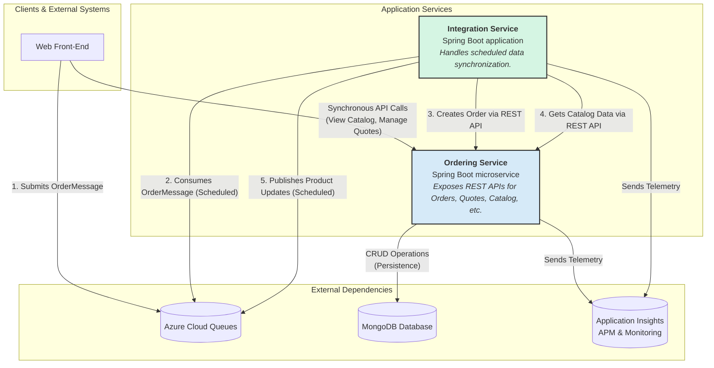

```markdown


The architecture is decomposed into two primary components: the `Ordering Service` and the `Integration Service`, reflecting their distinct responsibilities as separate Spring Boot applications. The `Ordering Service` handles core business logic and synchronous request-response interactions via a REST API, while the `Integration Service` manages asynchronous, scheduled background processing. This hybrid communication model uses REST for immediate transactional operations and Azure Cloud Queues for decoupled, resilient workflows like order ingestion and broadcasting product updates.
```