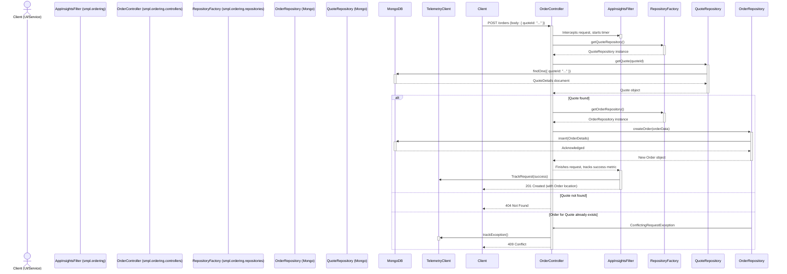

### 1. Asynchronous Order Ingestion via Message Queue

- **Workflow Purpose and Triggers:** This workflow describes how new orders from external systems (like a web frontend) are ingested into the MRP system. It is triggered when an `OrderMessage` is placed onto the Azure Cloud Queue. The process is asynchronous, decoupling the order source from the processing logic, which enhances resilience and scalability.
- **Communication Patterns:**
    - **Asynchronous Messaging:** An `OrderMessage` is consumed from an Azure Cloud Queue.
    - **Synchronous REST Calls:** The `integration` service makes a series of blocking REST API calls to the `smpl.ordering` service to create a Quote, Order, and Shipment record in a transactional manner.
    - **Database Operations:** The Ordering Service performs write operations to the MongoDB database.

```mermaid
sequenceDiagram
    actor Web Frontend
    participant Azure Cloud Queue
    participant CreateOrderProcessTask (integration.scheduled)
    participant MrpConnectService (integration.services)
    participant QueueService (integration.services)
    participant Ordering Service (smpl.ordering)
    participant MongoDB

    Web Frontend ->>+ Azure Cloud Queue: Enqueue OrderMessage
    deactivate Azure Cloud Queue

    loop Scheduled Execution (every 30s)
        CreateOrderProcessTask ->>+ QueueService: getMessage("orders-queue")
        QueueService ->>+ Azure Cloud Queue: Retrieve Message
        Azure Cloud Queue -->>- QueueService: CloudQueueMessage
        QueueService -->>- CreateOrderProcessTask: Return QueueResponse<OrderMessage>

        alt Message Found
            CreateOrderProcessTask ->>+ MrpConnectService: createMrpQuote(orderMessage)
            MrpConnectService ->>+ Ordering Service: POST /quotes (from OrderMessage)
            Ordering Service ->>+ MongoDB: Insert QuoteDetails
            MongoDB -->>- Ordering Service: Acknowledge
            Ordering Service -->>- MrpConnectService: 201 Created (with Quote)
            deactivate Ordering Service

            CreateOrderProcessTask ->>+ MrpConnectService: createMrpOrder(quote)
            MrpConnectService ->>+ Ordering Service: POST /orders (from Quote)
            Ordering Service ->>+ MongoDB: Insert OrderDetails
            MongoDB -->>- Ordering Service: Acknowledge
            Ordering Service -->>- MrpConnectService: 201 Created (with Order)
            deactivate Ordering Service

            CreateOrderProcessTask ->>+ MrpConnectService: createMrpShipment(orderMessage)
            MrpConnectService ->>+ Ordering Service: POST /shipments (from OrderMessage)
            Ordering Service ->>+ MongoDB: Insert ShipmentDetails
            MongoDB -->>- Ordering Service: Acknowledge
            Ordering Service -->>- MrpConnectService: 201 Created (with ShipmentRecord)
            deactivate Ordering Service

            CreateOrderProcessTask ->>+ QueueService: deleteMessage(message)
            QueueService ->>+ Azure Cloud Queue: Delete Processed Message
            deactivate Azure Cloud Queue
        end
    end
```

### 2. Synchronous Order Creation from Quote via REST API

- **Workflow Purpose and Triggers:** This workflow shows a client, such as a web UI, directly creating an order from a previously generated quote. It is triggered by a synchronous HTTP POST request to the Ordering Service's API. This is a common pattern for user-driven actions where immediate feedback is required.
- **Communication Patterns:**
    - **Synchronous REST Call:** The client makes an HTTP POST request to `/orders`.
    - **Database Operations:** The service interacts with repositories that perform read (validating the quote) and write (creating the order) operations against the MongoDB database.
    - **Optimistic Concurrency:** The repository operations use eTags to prevent conflicting updates.



### 3. Asynchronous Product Catalog Synchronization

- **Workflow Purpose and Triggers:** This workflow ensures that downstream systems (like an e-commerce website) have an up-to-date product catalog. It is triggered by a scheduled task (`UpdateProductProcessTask`) that runs periodically.
- **Communication Patterns:**
    - **Synchronous REST Call:** The `integration` service makes a blocking HTTP GET request to the `smpl.ordering` service to fetch all catalog items.
    - **Asynchronous Messaging:** The fetched and transformed product data is published as a `ProductMessage` to an Azure Cloud Queue for consumers.

```mermaid
sequenceDiagram
    participant Scheduler
    participant UpdateProductProcessTask (integration.scheduled)
    participant MrpConnectService (integration.services)
    participant Ordering Service (smpl.ordering)
    participant QueueService (integration.services)
    participant Azure Cloud Queue

    Scheduler ->>+ UpdateProductProcessTask: Trigger scheduled task
    UpdateProductProcessTask ->>+ MrpConnectService: getCatalogItems()
    MrpConnectService ->>+ Ordering Service: GET /catalog
    Ordering Service -->>- MrpConnectService: 200 OK (List<CatalogItem>)
    MrpConnectService -->>- UpdateProductProcessTask: Return List<CatalogItem>
    deactivate MrpConnectService

    UpdateProductProcessTask ->> UpdateProductProcessTask: Transform CatalogItem[] to ProductMessage
    UpdateProductProcessTask ->>+ QueueService: addMessage("inventory-queue", productMessage)
    QueueService ->> QueueService: Serialize ProductMessage to JSON
    QueueService ->>+ Azure Cloud Queue: Enqueue JSON message
    Azure Cloud Queue -->>- QueueService: Acknowledge
    QueueService -->>- UpdateProductProcessTask: Success
    deactivate QueueService
    deactivate UpdateProductProcessTask
```

### 4. Updating a Shipment's Status via API

- **Workflow Purpose and Triggers:** This workflow captures how a shipment's progress is tracked. It's triggered when an external actor (a user or a logistics system) posts a new event (e.g., "Departed Warehouse") to a specific shipment record via the REST API.
- **Communication Patterns:**
    - **Synchronous REST Call:** A client makes an HTTP PUT request to `/shipments/{id}/events`.
    - **Database Operations:** The `ShipmentRepository` finds the corresponding MongoDB document and performs an atomic update to append the new event to its events array.

```mermaid
sequenceDiagram
    actor Logistics System
    participant ShipmentController (smpl.ordering.controllers)
    participant ShipmentRepository (Mongo)
    participant MongoDB

    Logistics System ->>+ ShipmentController: PUT /shipments/{id}/events (body: ShipmentEventInfo)
    ShipmentController ->>+ ShipmentRepository: addEventToShipment(shipmentId, eventInfo, eTag)
    ShipmentRepository ->>+ MongoDB: findOneAndUpdate({_id: id, eTag: eTag}, { $push: { events: eventInfo } })
    
    alt Shipment found and eTag matches
        MongoDB -->>- ShipmentRepository: Updated document
        ShipmentRepository -->>- ShipmentController: Updated ShipmentRecord
        ShipmentController -->>- Logistics System: 200 OK (Updated ShipmentRecord)
    else Shipment not found or eTag mismatch
        MongoDB -->>- ShipmentRepository: null
        ShipmentRepository -x ShipmentController: NotFoundException or ConflictException
        ShipmentController -->>- Logistics System: 404 Not Found or 409 Conflict
    end
    deactivate ShipmentRepository
    deactivate ShipmentController
```

### 5. Error Handling, Retry, and Monitoring Pattern

- **Workflow Purpose and Triggers:** This diagram illustrates the system's resilience and observability. It is triggered when a database operation fails due to a transient network error. It shows the automatic retry mechanism and the concurrent telemetry logging for diagnostics.
- **Communication Patterns:**
    - **Database Operations:** Direct interaction with MongoDB.
    - **Internal Retry Logic:** The `MongoOperationsWithRetry` wrapper contains logic to catch specific exceptions and re-attempt the operation.
    - **Asynchronous Telemetry:** Dependency and exception data is sent asynchronously to an Application Insights service.

```mermaid
sequenceDiagram
    participant Controller
    participant Repository (e.g., MongoOrderRepository)
    participant MongoOperationsWithRetry
    participant MongoOperations
    participant MongoDB
    participant TelemetryClient

    Controller ->>+ Repository: findOrderById(id)
    Repository ->>+ MongoOperationsWithRetry: findOne(query, class)
    
    MongoOperationsWithRetry ->> TelemetryClient: Start dependency tracking timer
    MongoOperationsWithRetry ->>+ MongoOperations: findOne(...)
    MongoOperations ->>+ MongoDB: Execute find query
    MongoDB -x MongoOperations: DataAccessResourceFailureException (wraps SocketTimeoutException)
    MongoOperations -x- MongoOperationsWithRetry: Throws Exception
    
    MongoOperationsWithRetry ->> MongoOperationsWithRetry: catch (DataAccessResourceFailureException)
    note right of MongoOperationsWithRetry: Transient error detected. Retrying...

    MongoOperationsWithRetry ->>+ MongoOperations: findOne(...) [Retry 1]
    MongoOperations ->>+ MongoDB: Execute find query
    
    alt Retry Succeeds
        MongoDB -->>- MongoOperations: Document found
        MongoOperations -->>- MongoOperationsWithRetry: Returns result
        MongoOperationsWithRetry ->> TelemetryClient: TrackDependency(success, duration)
        MongoOperationsWithRetry -->>- Repository: Returns result
        Repository -->>- Controller: Returns Order object
    else All Retries Fail
        MongoOperations -x MongoOperationsWithRetry: Throws Exception
        MongoOperationsWithRetry ->> TelemetryClient: TrackDependency(failure, duration)
        MongoOperationsWithRetry -x- Repository: Throws Exception
        Repository -x- Controller: Throws Exception
        Controller ->> TelemetryClient: trackException()
    end
    deactivate Controller
    deactivate Repository
```