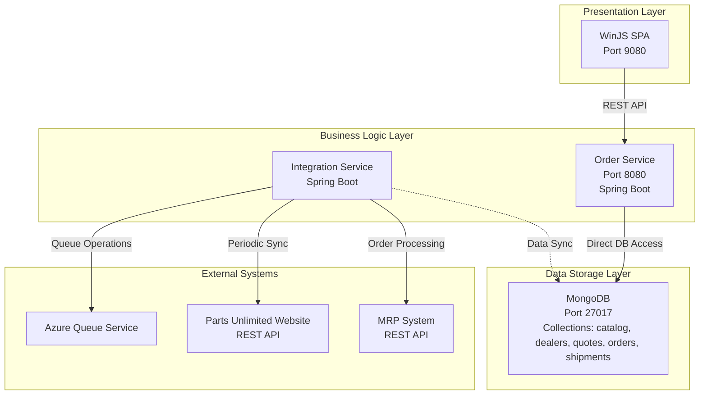

The component boundaries reflect the three-tier monolithic architecture with clear separation of concerns between presentation, business logic, and data layers. Communication primarily flows from the WinJS frontend through REST APIs to the Order Service for core business operations, while the Integration Service handles asynchronous external system connectivity via queue-based messaging and scheduled tasks.