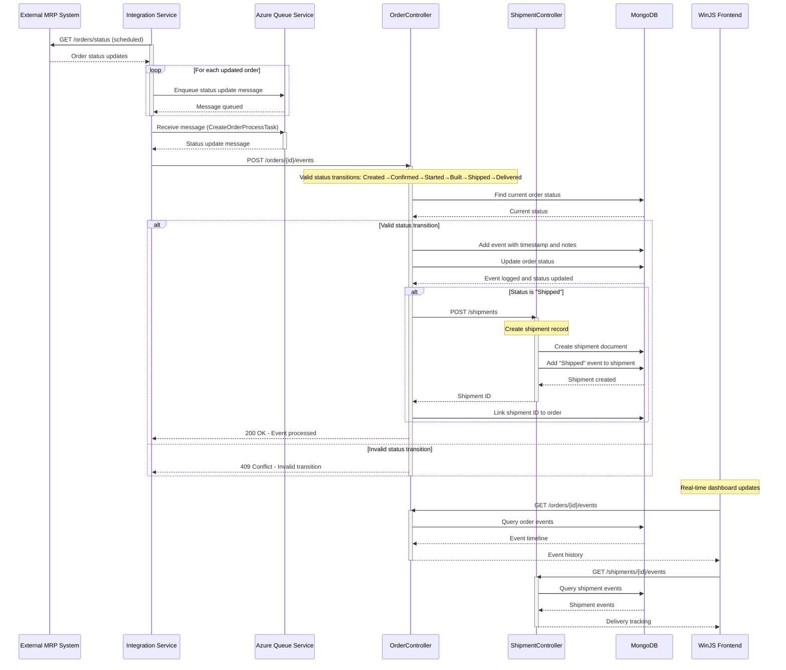
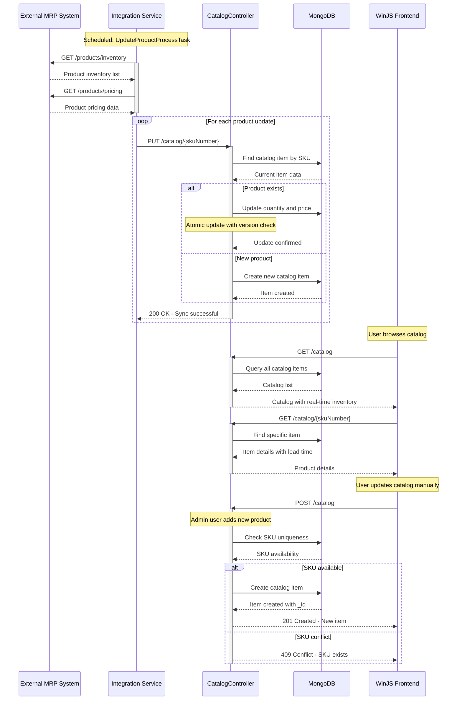
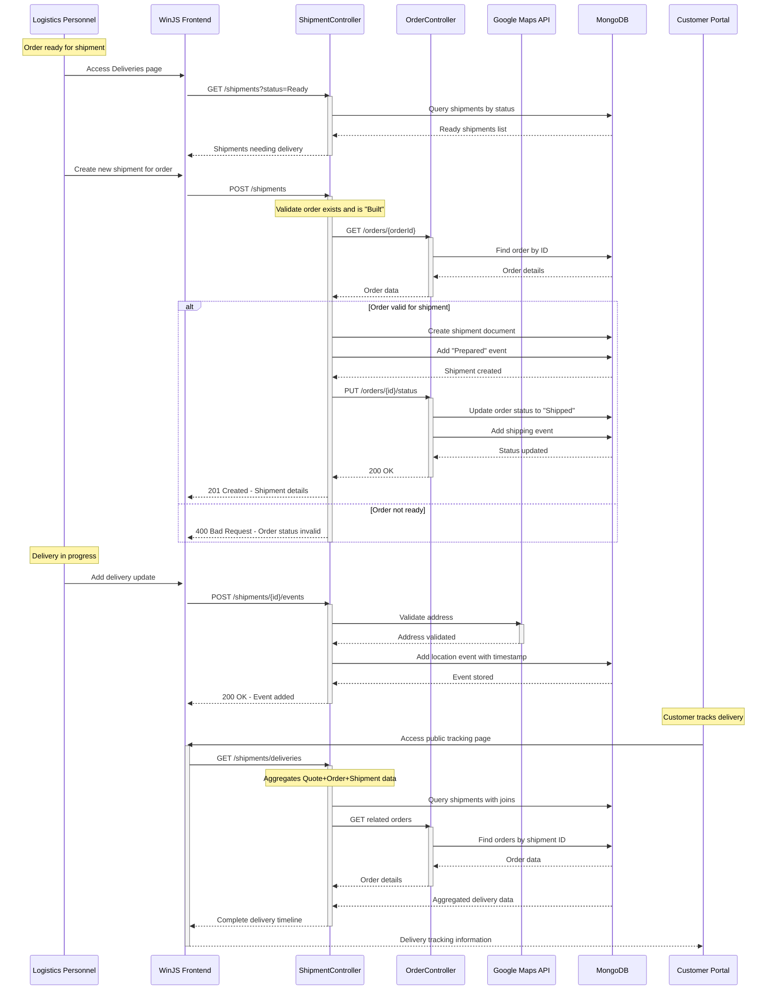

## 1. Quote-to-Order Processing Workflow

**Purpose**: Convert a customer quote into a confirmed order, initiating the manufacturing process. This is the primary revenue-generating workflow that captures customer commitment and triggers production planning.

**Trigger**: User clicks "Convert to Order" from the quote management page in the WinJS frontend.

**Communication Patterns**: REST API calls (synchronous), database transactions, event logging.

```mermaid
sequenceDiagram
    participant Frontend as WinJS Frontend
    participant OrderService as Order Service (8080)
    participant QuoteController as QuoteController
    participant OrderController as OrderController
    participant MongoDB as MongoDB
    participant Integration as Integration Service
    
    Frontend->>QuoteController: GET /quotes/{id}
    activate QuoteController
    QuoteController->>MongoDB: Find quote by ID
    MongoDB-->>QuoteController: Quote document
    QuoteController-->>Frontend: Quote details with items
    deactivate QuoteController
    
    Frontend->>OrderController: POST /orders?fromQuote={quoteId}
    activate OrderController
    
    Note over OrderController: Validate quote exists and not expired
    OrderController->>MongoDB: Query quote by ID
    MongoDB-->>OrderController: Quote data
    
    alt Quote valid and not expired
        OrderController->>MongoDB: Create order document
        Note over OrderController: orderId = "order-{quoteId}"
        OrderController->>MongoDB: Insert order with status "Created"
        MongoDB-->>OrderController: Order ID generated
        
        OrderController->>MongoDB: Create initial order event
        Note over OrderController: Event: Status=Created, Timestamp=now
        MongoDB-->>OrderController: Event stored
        
        OrderController->>MongoDB: Update order status to "Confirmed"
        MongoDB-->>OrderController: Status updated
        
        OrderController->>Integration: Queue order processing message
        Note over Integration: Asynchronous notification to external MRP
        Integration-->>OrderController: Message queued
        
        OrderController-->>Frontend: 201 Created - Order details
    else Quote invalid or expired
        OrderController-->>Frontend: 400 Bad Request - Error details
    end
    
    deactivate OrderController
    
    Frontend->>OrderController: GET /orders/{orderId}
    activate OrderController
    OrderController->>MongoDB: Find order with events
    MongoDB-->>OrderController: Order with full event history
    OrderController-->>Frontend: Order details
    deactivate OrderController
    
    Integration->>OrderController: POST /orders/{id}/events (async)
    activate OrderController
    Note over Integration: Scheduled task processes queued orders
    OrderController->>MongoDB: Add "Started" event
    OrderController->>MongoDB: Update order status to "Started"
    MongoDB-->>OrderController: Event and status stored
    OrderController-->>Integration: 200 OK
    deactivate Integration
    deactivate OrderController
```

## 2. Order Status Progression and Event Tracking Workflow

**Purpose**: Track the lifecycle of an order through manufacturing stages, providing visibility into production progress and delivery status.

**Trigger**: Scheduled tasks in Integration Service poll for status updates from external MRP system.

**Communication Patterns**: Asynchronous queue processing, REST API integration, event sourcing pattern.



## 3. Catalog Inventory Synchronization Workflow

**Purpose**: Maintain accurate product inventory and pricing data between the MRP system and the internal catalog, ensuring quote accuracy and production planning.

**Trigger**: Scheduled task runs periodically (UpdateProductProcessTask) to sync with external systems.

**Communication Patterns**: Scheduled batch processing, REST API integration, optimistic locking for concurrent updates.



## 4. Shipment and Delivery Tracking Workflow

**Purpose**: Track order delivery progress, manage logistics, and provide customers with real-time delivery information.

**Trigger**: Order status changes to "Shipped" or manual shipment entry by logistics personnel.

**Communication Patterns**: Event-driven updates, location-based tracking, aggregation of data across multiple collections.



## 5. Frontend Dashboard Data Aggregation Workflow

**Purpose**: Provide a comprehensive view of business metrics by aggregating data from multiple services for the main dashboard.

**Trigger**: User loads the main dashboard page or refreshes data.

**Communication Patterns**: Parallel API calls, optimistic UI updates, session state management.

```mermaid
sequenceDiagram
    participant User as User
    participant Frontend as WinJS Frontend
    participant Dashboard as Dashboard Controller
    participant OrderController as OrderController
    participant QuoteController as QuoteController
    participant ShipmentController as ShipmentController
    participant CatalogController as CatalogController
    participant DealerController as DealerController
    participant MongoDB as MongoDB
    participant Session as Session State
    
    User->>Frontend: Load main dashboard
    activate Frontend
    
    Note over Frontend: Initialize dashboard with cached data
    Frontend->>Session: Load cached dashboard state
    Session-->>Frontend: Previous state (if exists)
    Frontend->>User: Show cached UI immediately
    deactivate Frontend
    
    Note over Frontend: Parallel API calls for fresh data
    par Get order metrics
        Frontend->>OrderController: GET /orders?limit=100
        activate OrderController
        OrderController->>MongoDB: Query recent orders
        MongoDB-->>OrderController: Order list with status
        OrderController-->>Frontend: Orders data
        deactivate OrderController
    and Get quote metrics
        Frontend->>QuoteController: GET /quotes?limit=100
        activate QuoteController
        QuoteController->>MongoDB: Query recent quotes
        MongoDB-->>QuoteController: Quote list
        QuoteController-->>Frontend: Quotes data
        deactivate QuoteController
    and Get delivery metrics
        Frontend->>ShipmentController: GET /shipments/deliveries
        activate ShipmentController
        ShipmentController->>MongoDB: Aggregate delivery data
        MongoDB-->>ShipmentController: Delivery statistics
        ShipmentController-->>Frontend: Delivery metrics
        deactivate ShipmentController
    and Get catalog status
        Frontend->>CatalogController: GET /catalog?lowStock=true
        activate CatalogController
        CatalogController->>MongoDB: Query low inventory items
        MongoDB-->>CatalogController: Low stock list
        CatalogController-->>Frontend: Inventory alerts
        deactivate CatalogController
    and Get dealer activity
        Frontend->>DealerController: GET /dealers
        activate DealerController
        DealerController->>MongoDB: Query all dealers
        MongoDB-->>DealerController: Dealer list
        DealerController-->>Frontend: Dealer data
        deactivate DealerController
    end
    
    Frontend->>Dashboard: Process aggregated data
    activate Dashboard
    Note over Dashboard: Calculate KPIs: revenue, orders pending, delivery rate
    Dashboard-->>Frontend: Processed metrics
    deactivate Dashboard
    
    Frontend->>Session: Update cached state
    Session-->>Frontend: State saved
    
    Frontend->>User: Update dashboard with live data
    deactivate Frontend
    
    Note over User: Interactive dashboard actions
    User->>Frontend: Click on orders widget
    activate Frontend
    Frontend->>User: Navigate to orders page
    deactivate Frontend
    
    User->>Frontend: Filter by status
    activate Frontend
    Frontend->>OrderController: GET /orders?status={filter}
    activate OrderController
    OrderController->>MongoDB: Query filtered orders
    MongoDB-->>OrderController: Filtered results
    OrderController-->>Frontend: Filtered orders
    deactivate OrderController
    Frontend->>User: Display filtered results
    deactivate Frontend
```