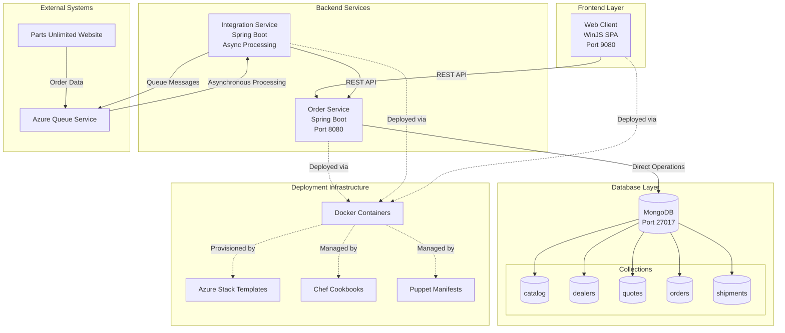

The component boundaries reflect a three-tier architecture with clear separation between presentation, business logic, and data layers. The Order Service serves as the primary API gateway handling all synchronous operations for orders, quotes, catalog, and dealers, while the Integration Service isolates asynchronous external communications using message queues. MongoDB collections are organized by business domain rather than service boundaries, indicating a monolithic data pattern that suggests natural service boundaries for future microservice decomposition.