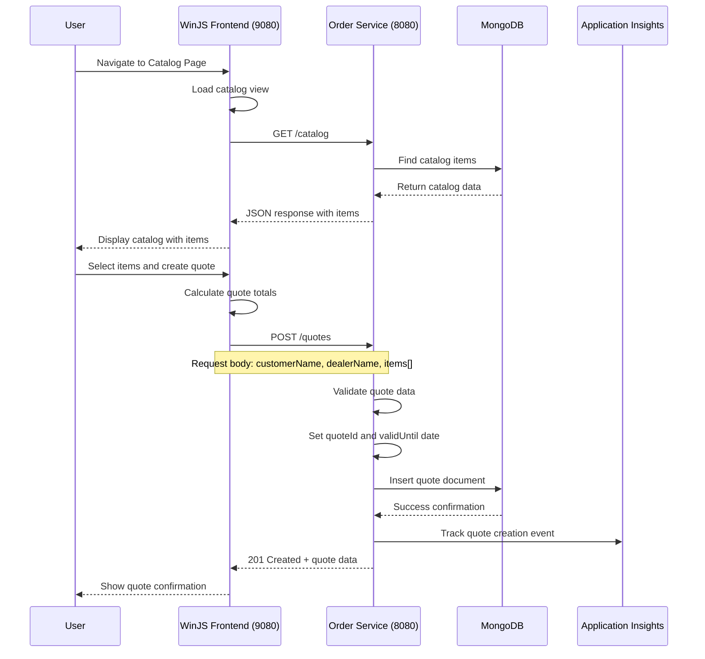
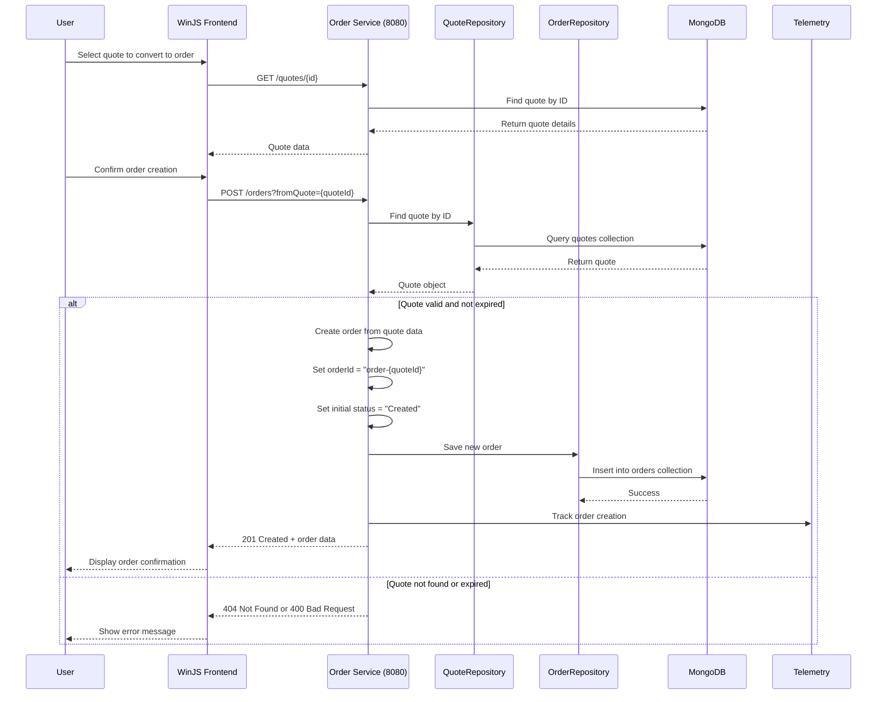
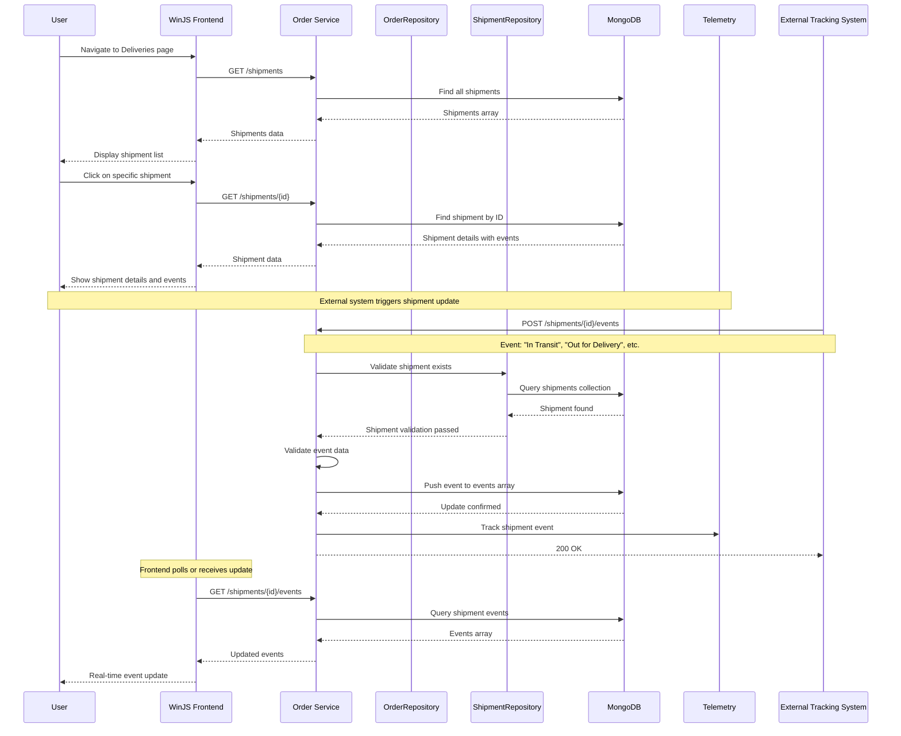
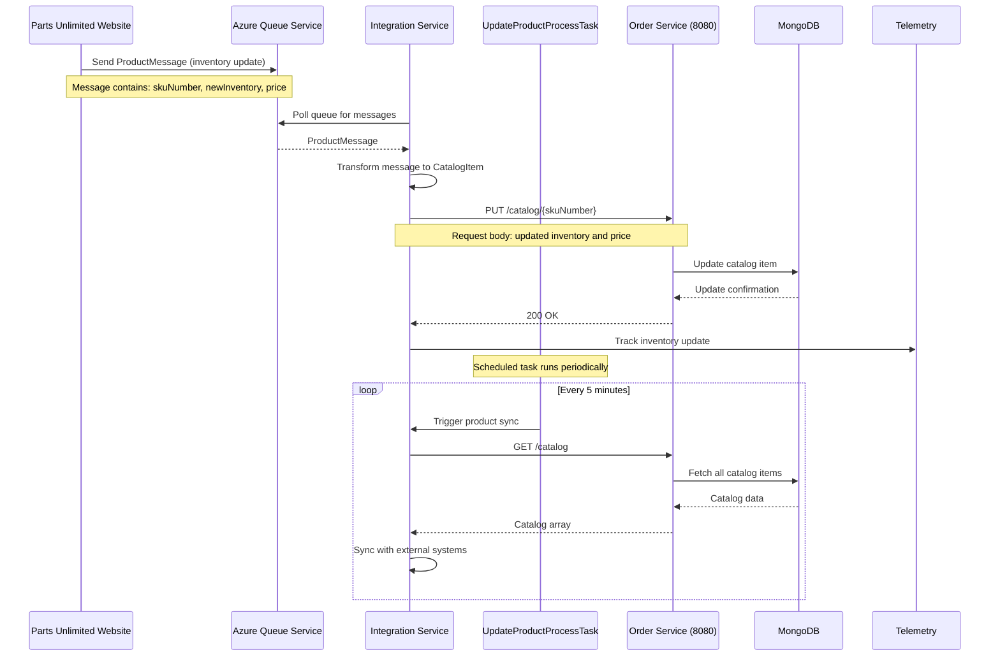
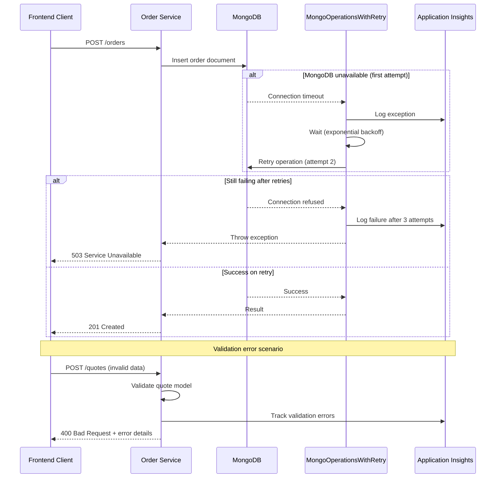
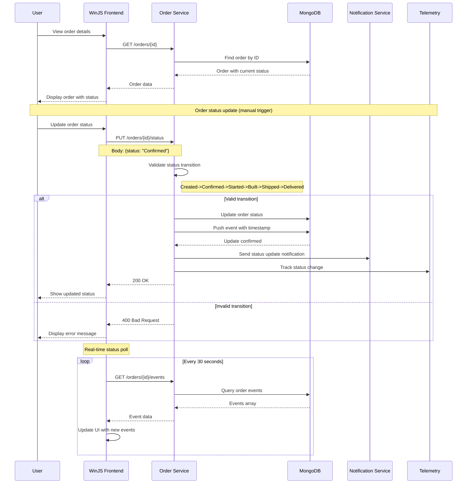

## 1. Quote Creation Workflow

## 2. Order Creation from Quote Workflow

## 3. Shipment Tracking and Events Workflow

## 4. Integration Service - Inventory Update Workflow

## 5. Error Handling and Recovery Patterns

## 6. Order Status Progression Workflow

