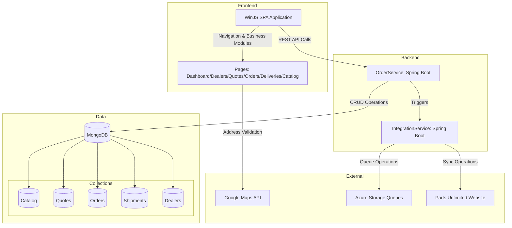

The component boundaries separate presentation (WinJS SPA), business logic (Spring Boot services), and data persistence (MongoDB), with clear API contracts between layers. Communication patterns follow a request-response model for user interactions via REST APIs, while asynchronous queue-based messaging handles external system integration to maintain loose coupling.