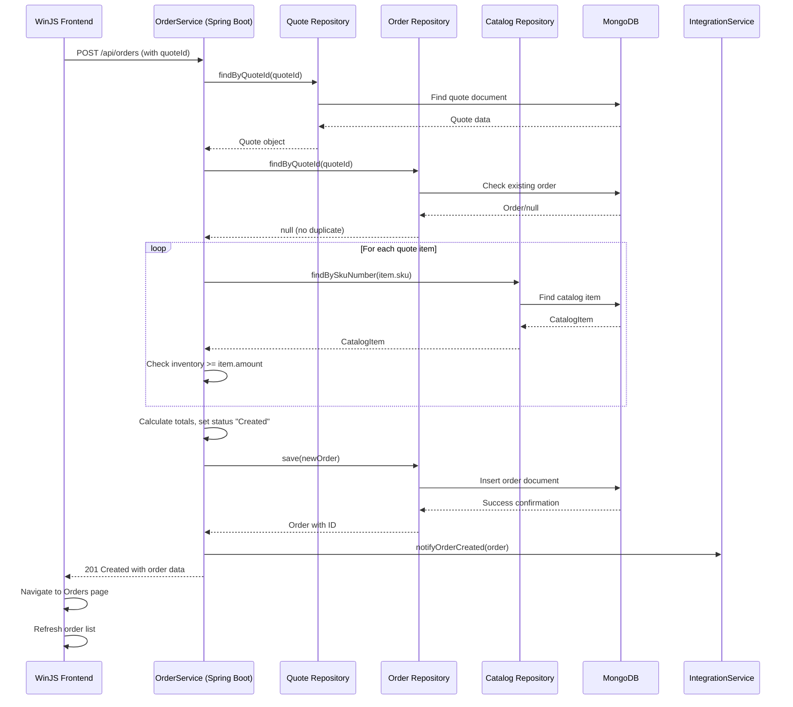
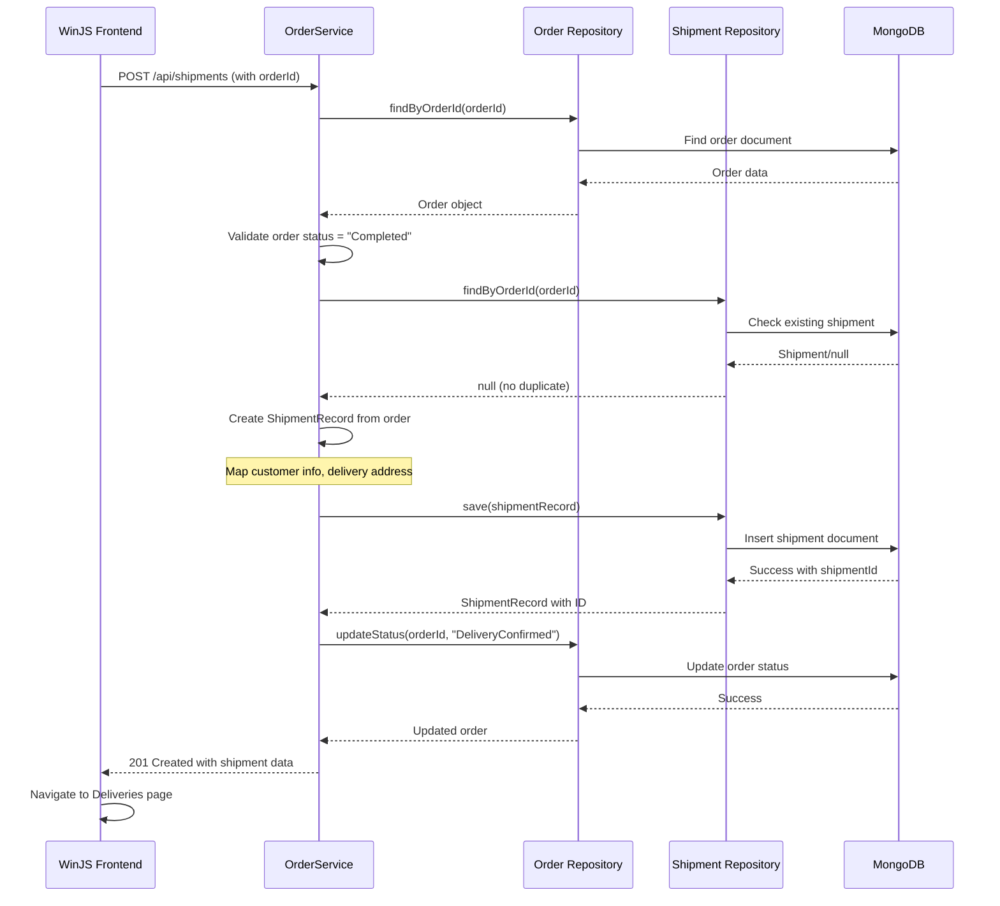
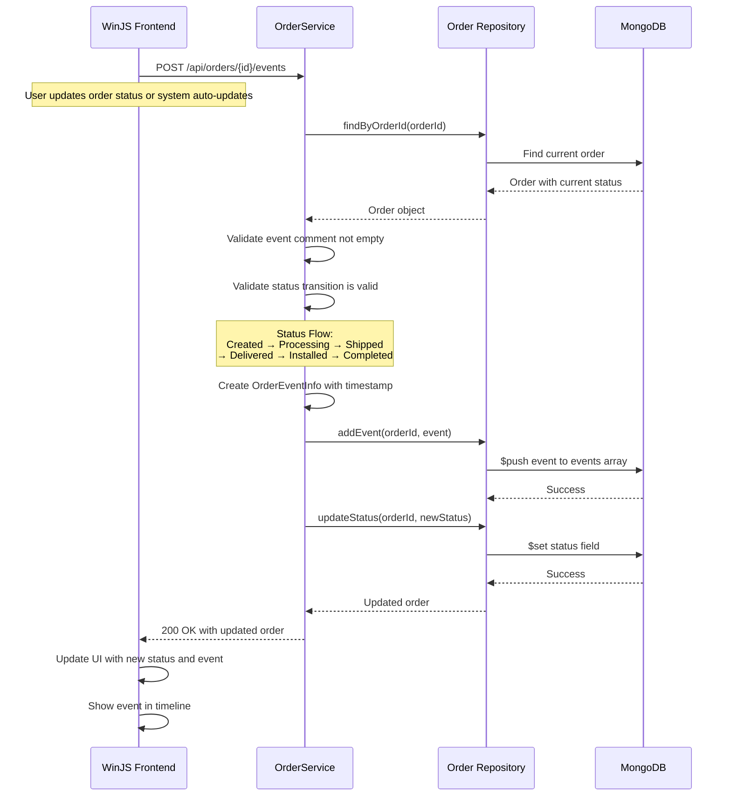
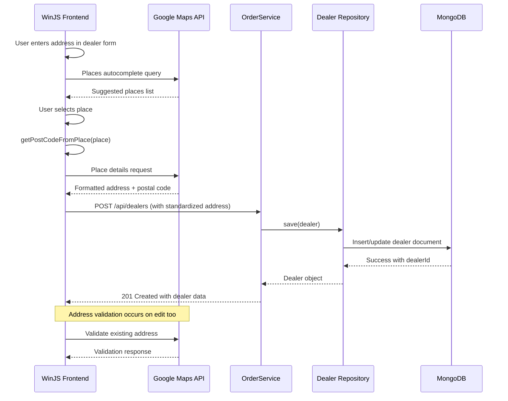
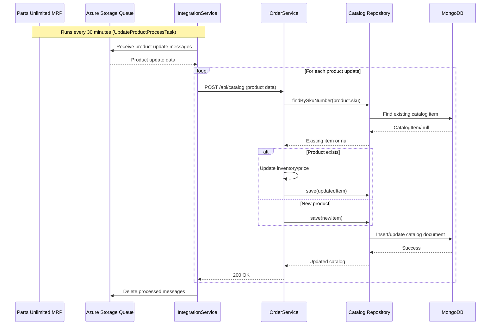
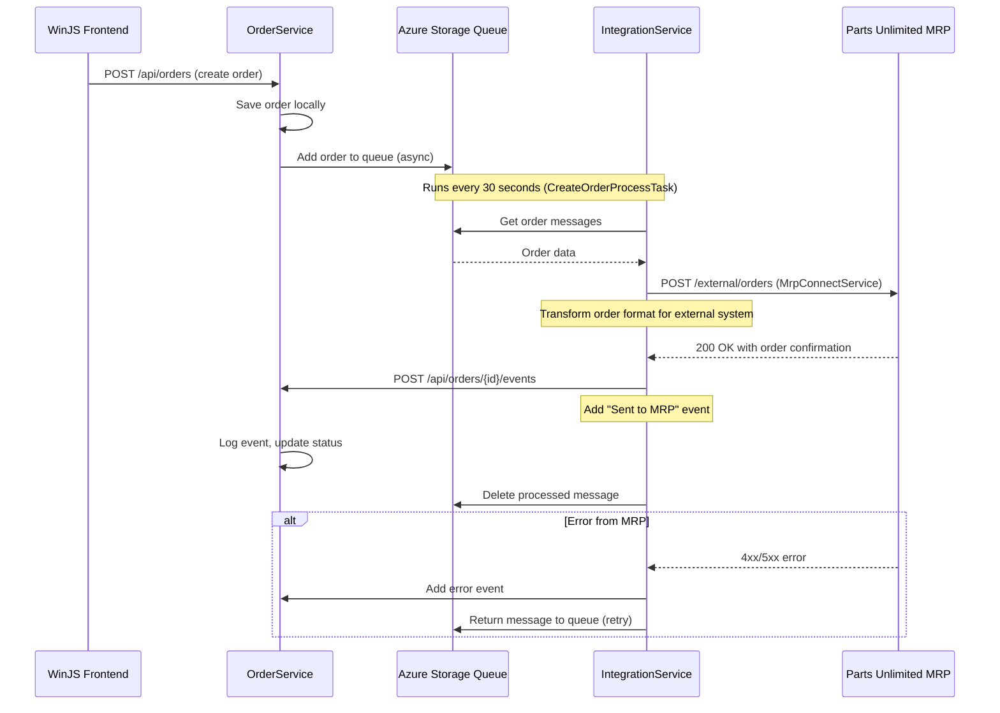
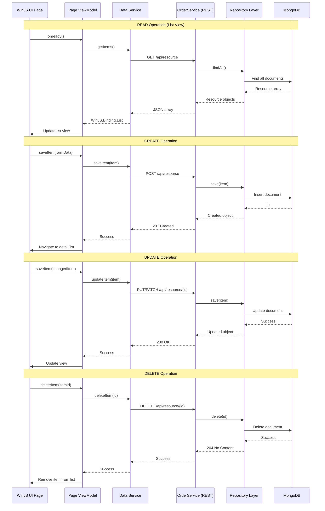
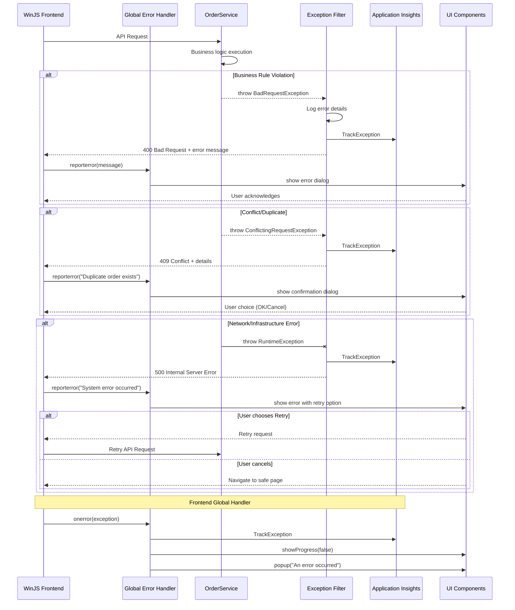

# Workflow 1: Quote-to-Order Conversion

## Purpose
Converts a validated quote into an order, checking inventory and preventing duplicate orders. Triggered when user clicks "Create Order" from the Quotes page.

## Communication Patterns
- Synchronous REST API calls throughout
- Database transactions for data consistency
- Repository pattern abstraction
- No async messaging in this flow

---

# Workflow 2: Order-to-Delivery Flow

## Purpose
Creates a delivery/shipment record when an order reaches "Completed" status. Triggered automatically or manually when order is ready for delivery.

## Communication Patterns
- Synchronous REST operations
- Database transaction spans multiple collections
- Status update follows state machine pattern
- Atomic operations ensure consistency

---

# Workflow 3: Order Status Progression with Events

## Purpose
Tracks order lifecycle through 8 states with event logging. Events are added at each status change milestone.

## Communication Patterns
- Event sourcing pattern for order history
- MongoDB array operations for event storage
- State machine validation
- Real-time UI updates after status change

---

# Workflow 4: Address Standardization Flow

## Purpose
Standardizes dealer addresses using Google Maps Places API when creating or updating dealer information. Triggered during dealer CRUD operations.

## Communication Patterns
- Third-party API integration (Google Maps)
- Async autocomplete API calls
- Client-side address processing
- Standardized data storage

---

# Workflow 5: Catalog Synchronization Flow

## Purpose
Periodic synchronization of catalog data between MRP system and local database via Azure queues. Runs every 30 minutes.

## Communication Patterns
- Scheduled task execution
- Queue-based messaging (polling)
- Batch processing
- Idempotent update operations

---

# Workflow 6: Azure Queue Order Processing

## Purpose
Processes orders from Azure Storage Queue, forwarding to external MRP system. Scheduled task runs every 30 seconds.

## Communication Patterns
- Asynchronous queue processing
- External system integration
- Retry mechanism on failure
- Event logging for audit trail

---

# Workflow 7: Frontend CRUD Operations (Generic)

## Purpose
Standard CRUD operations performed by the WinJS frontend for all entities (dealers, quotes, orders, etc.). Shows data binding and REST interaction pattern.

## Communication Patterns
- MVVM pattern with data binding
- Observable collections (WinJS.Binding.List)
- Two-way data binding for forms
- RESTful resource operations
- Optimistic UI updates

---

# Workflow 8: Error Handling and Recovery Flow

## Purpose
Global error handling across frontend and backend with user notification, logging, and recovery mechanisms.

## Communication Patterns
- Global exception filters in Spring
- Centralized error logging
- User-friendly error messages
- Retry mechanisms for transient failures
- Telemetry integration for monitoring