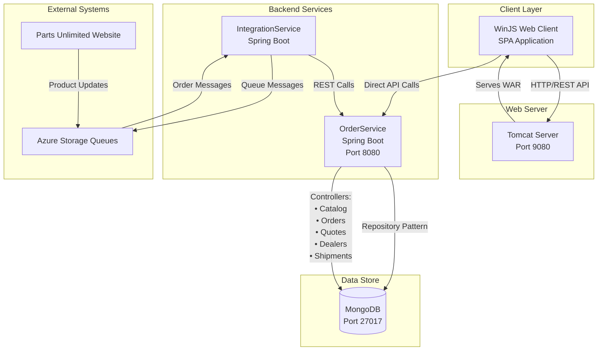

The architecture maintains clear separation between the WinJS SPA frontend, Tomcat web server, and Spring Boot services, with MongoDB as the shared data store. Communication uses synchronous REST APIs for direct interactions and asynchronous Azure queues for decoupled integration with the external website. The OrderService encapsulates core business logic through domain-specific controllers while the IntegrationService acts as an anti-corruption layer handling message transformation.