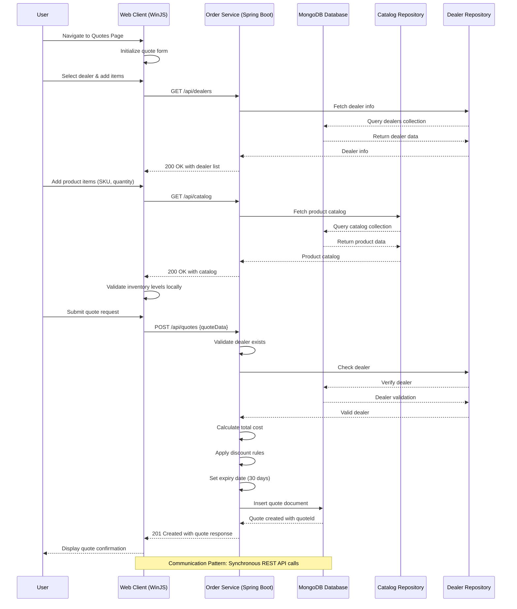
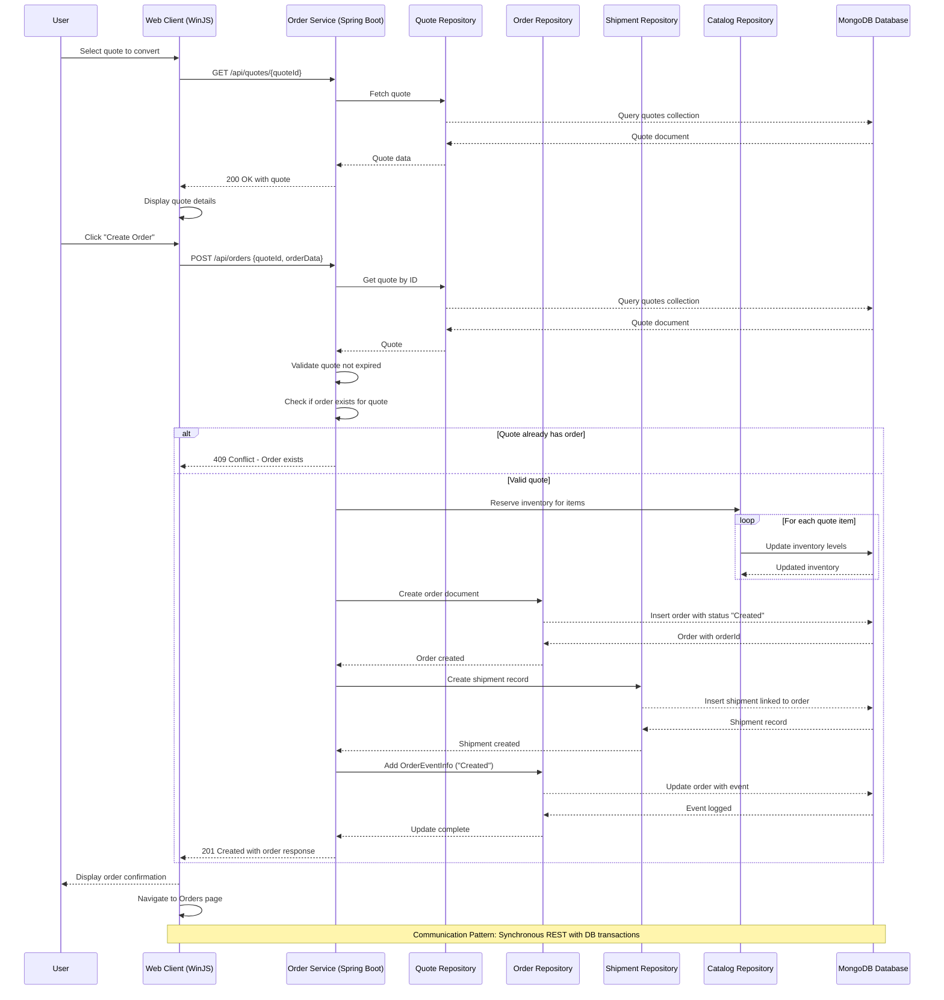
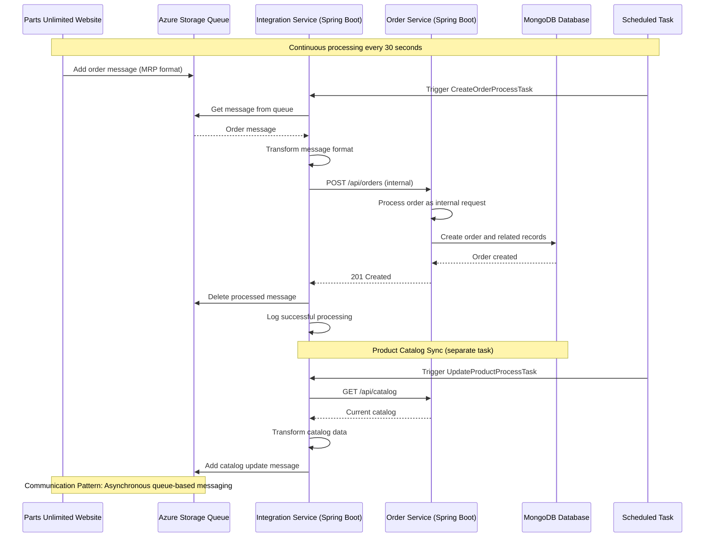
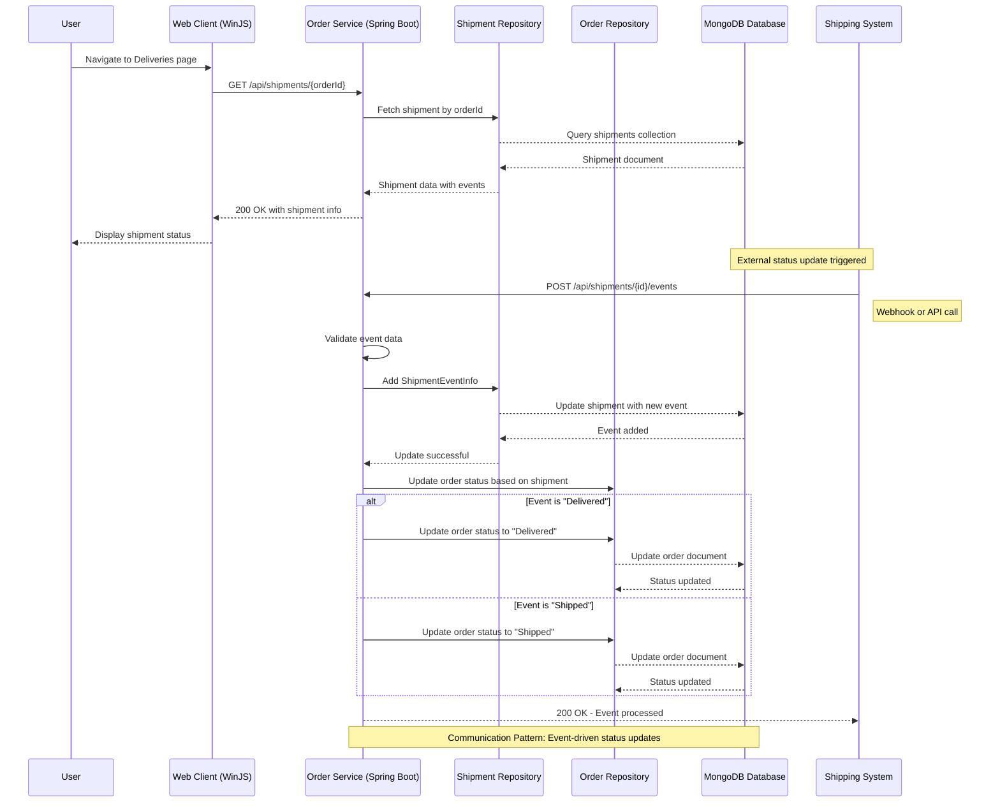
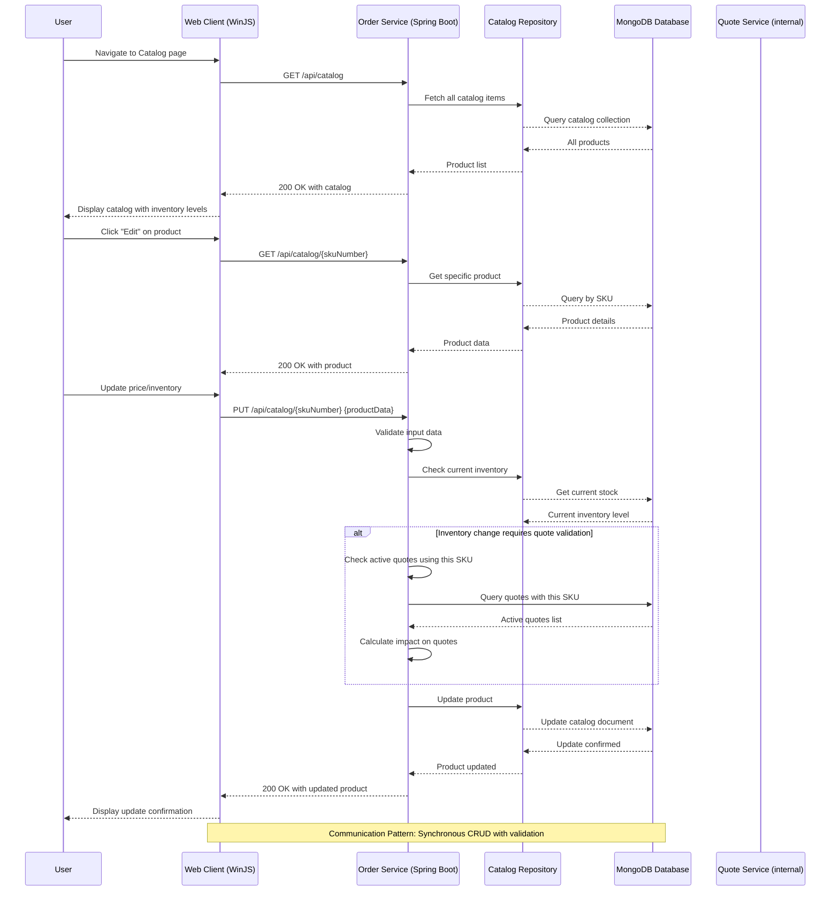
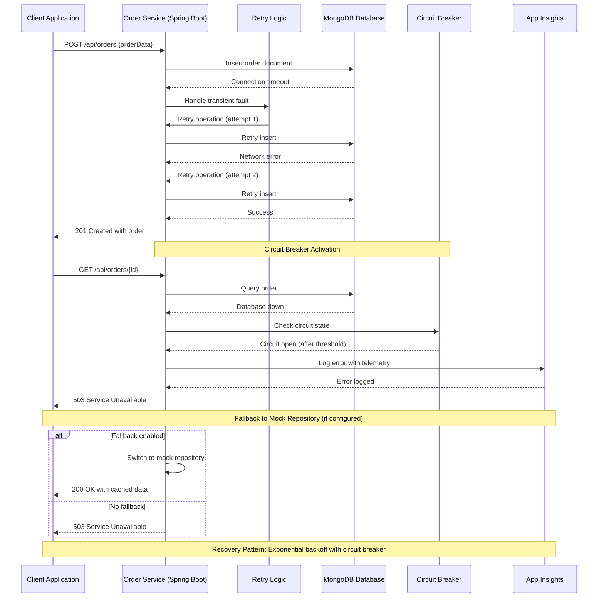

# Parts Unlimited MRP - Dynamic Interaction Flows and Sequence Diagrams

## 1. Quote Generation Workflow

## 2. Order Creation from Quote Workflow

## 3. Integration Processing Workflow (External Website)

## 4. Shipment Tracking and Status Update Workflow

## 5. Catalog Management with Inventory Check Workflow

## 6. Error Handling and Recovery Pattern

