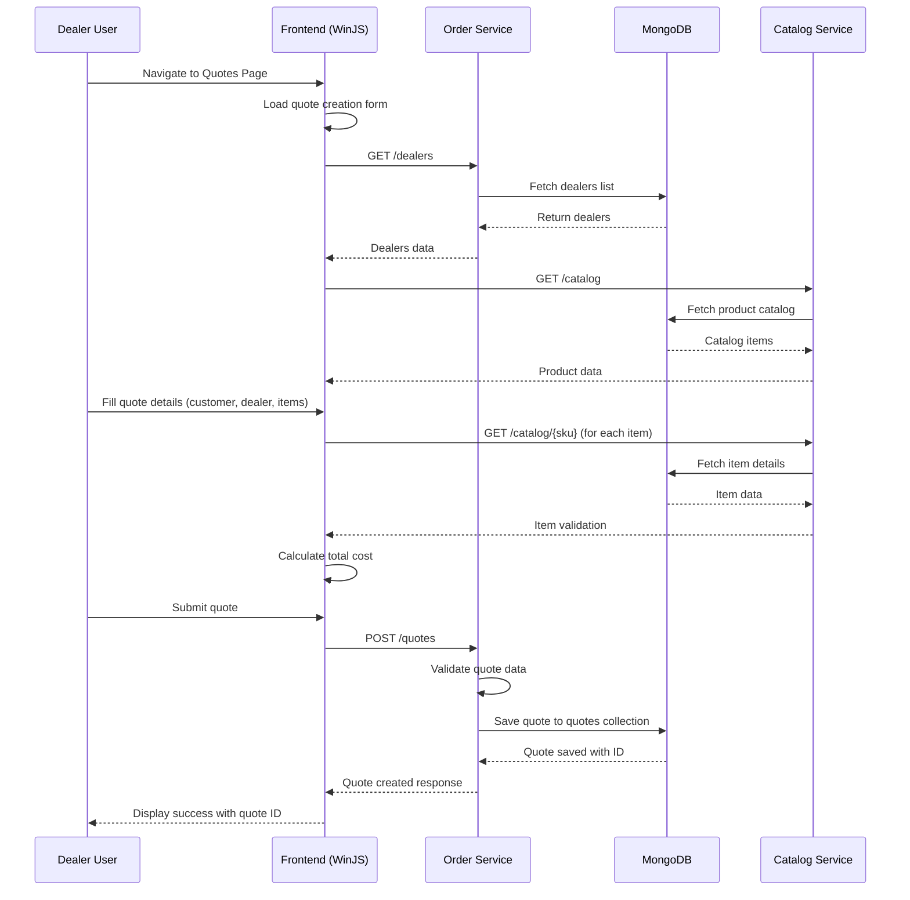
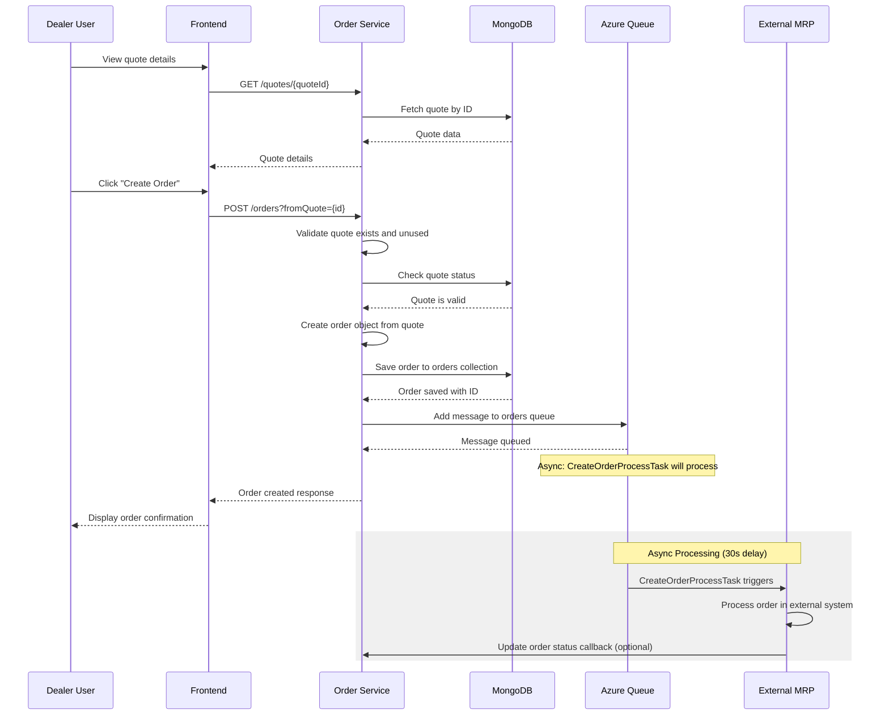
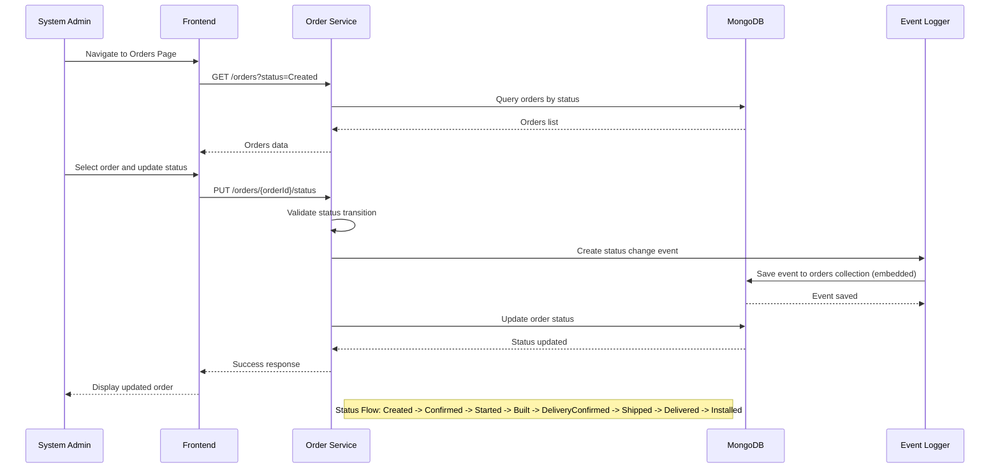
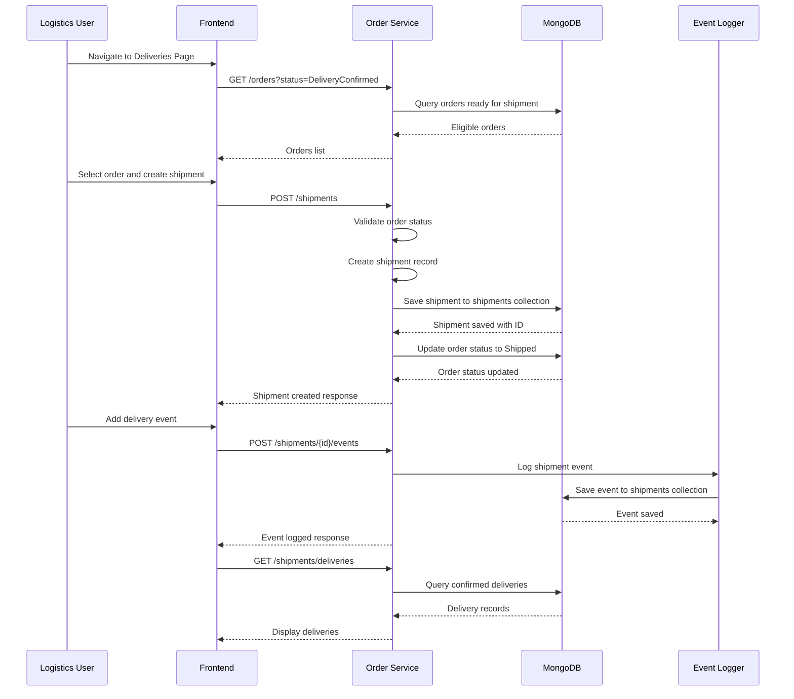
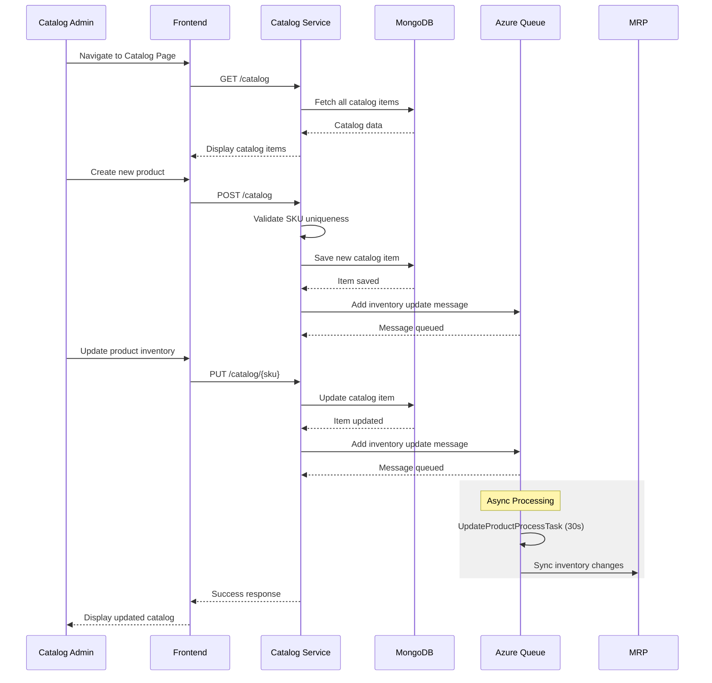
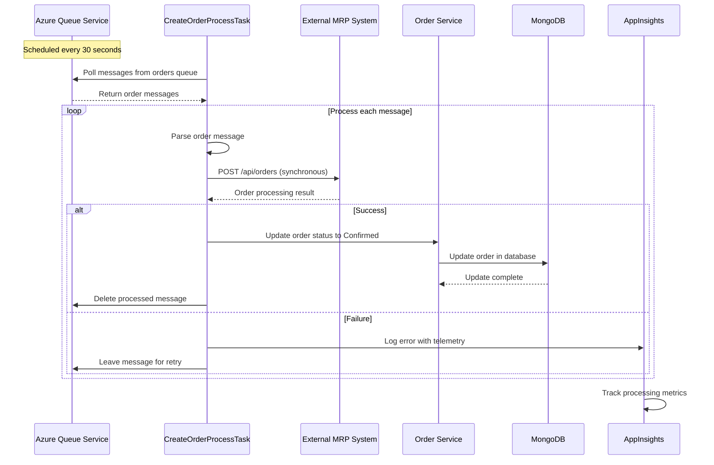
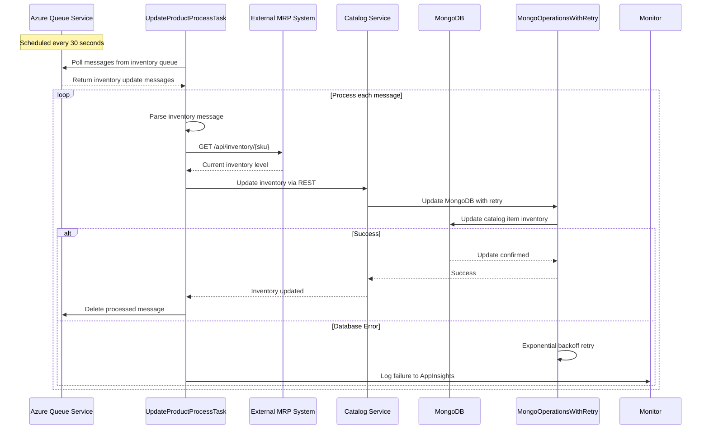
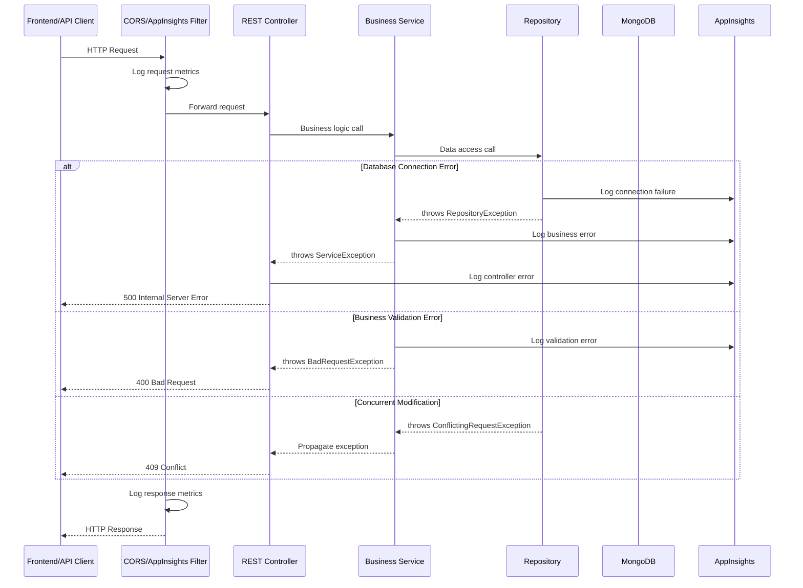

## 1. Quote Creation Workflow

**Description**: Dealers create sales quotes for customers by selecting products from the catalog, adding specifications, and calculating pricing. The workflow involves frontend form validation, real-time catalog lookups, and quote persistence.

**Communication Patterns**:
- Synchronous REST calls between frontend and backend
- Database transactions for quote persistence
- Real-time catalog validation through synchronous API calls

## 2. Quote to Order Conversion Workflow

**Description**: Converting a quote to an order creates a persistent order record and triggers asynchronous processing in the external MRP system through Azure Queue messaging.

**Communication Patterns**:
- Synchronous REST for order creation
- Asynchronous queue-based messaging for MRP integration
- Database transaction ensuring quote-to-order atomicity
- Scheduled task processing with 30-second intervals

## 3. Order Status Progression Workflow

**Description**: Order status follows a strict 8-state lifecycle. Each status change creates an event log entry for audit trail and tracking purposes.

**Communication Patterns**:
- Synchronous REST calls for status updates
- Embedded document updates in MongoDB
- Event logging within the same transaction
- Client-side filtering for order lists

## 4. Shipment Creation and Tracking Workflow

**Description**: Shipment workflow creates delivery records for confirmed orders, tracks shipping events, and maintains delivery status throughout the logistics process.

**Communication Patterns**:
- Synchronous REST for CRUD operations
- Cross-collection database operations (orders -> shipments)
- Event logging for tracking
- Status synchronization between related entities

## 5. Catalog Management Workflow

**Description**: Catalog management handles product CRUD operations, inventory updates, and synchronizes changes with external systems through asynchronous queue processing.

**Communication Patterns**:
- Synchronous REST for catalog operations
- Async queue messaging for external synchronization
- Database transactions for data consistency
- Scheduled batch processing for sync operations

## 6. Queue-based Order Processing Workflow

**Description**: Background task processes queued orders by integrating with external MRP system, updating order status based on processing results, and handling failures with retry logic.

**Communication Patterns**:
- Scheduled task execution (Spring @Scheduled)
- Queue message polling and processing
- Synchronous REST calls to external MRP
- Database updates for status synchronization
- Telemetry and monitoring integration
- Failure handling with message retention

## 7. Inventory Synchronization Workflow

**Description**: Scheduled task synchronizes inventory levels between local catalog and external MRP system, implementing retry logic for database operations and error tracking.

**Communication Patterns**:
- Scheduled task with fixed rate (30s)
- External API integration for inventory sync
- Database operations with retry mechanism
- Telemetry for monitoring failures
- Queue message management

## 8. Error Handling and Recovery Pattern

**Description**: Comprehensive error handling pattern spanning all application layers, with proper exception propagation, logging, monitoring integration, and appropriate HTTP status codes.

**Communication Patterns**:
- Filter chain for cross-cutting concerns
- Exception hierarchy for different error types
- Centralized logging and monitoring
- HTTP status code mapping
- Transaction rollback on database errors