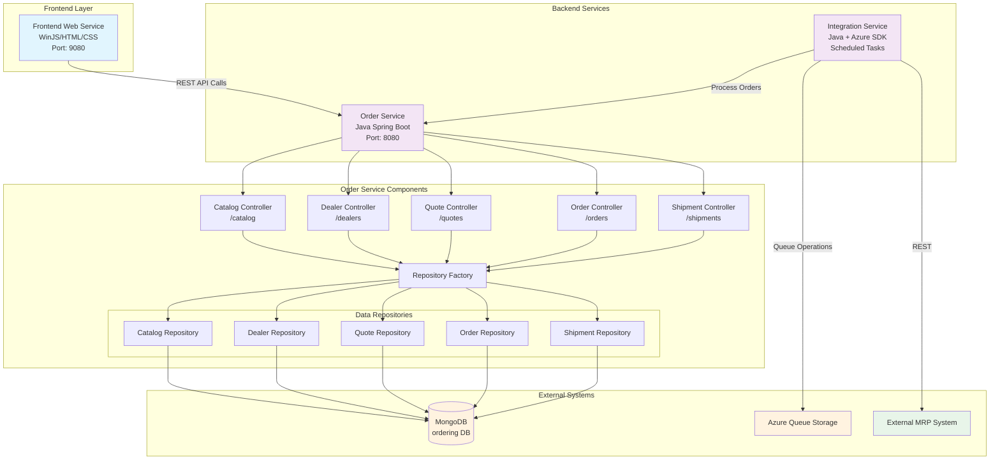

```mermaid
graph TB
    subgraph "Frontend Layer"
        WebUI[Frontend Web Service<br/>WinJS/HTML/CSS<br/>Port: 9080]
    end
    
    subgraph "Backend Services"
        OrderService[Order Service<br/>Java Spring Boot<br/>Port: 8080]
        IntegrationService[Integration Service<br/>Java + Azure SDK<br/>Scheduled Tasks]
    end
    
    subgraph "Order Service Components"
        CatalogController[Catalog Controller<br/>/catalog]
        DealerController[Dealer Controller<br/>/dealers]
        QuoteController[Quote Controller<br/>/quotes]
        OrderController[Order Controller<br/>/orders]
        ShipmentController[Shipment Controller<br/>/shipments]
        
        RepositoryFactory[Repository Factory]
        
        subgraph "Data Repositories"
            CatalogRepo[Catalog Repository]
            DealerRepo[Dealer Repository]
            QuoteRepo[Quote Repository]
            OrderRepo[Order Repository]
            ShipmentRepo[Shipment Repository]
        end
    end
    
    subgraph "External Systems"
        MongoDB[(MongoDB<br/>ordering DB)]
        AzureQueue[Azure Queue Storage]
        ExternalMRP[External MRP System]
    end
    
    %% Connections
    WebUI -->|REST API Calls| OrderService
    OrderService --> CatalogController
    OrderService --> DealerController
    OrderService --> QuoteController
    OrderService --> OrderController
    OrderService --> ShipmentController
    
    CatalogController --> RepositoryFactory
    DealerController --> RepositoryFactory
    QuoteController --> RepositoryFactory
    OrderController --> RepositoryFactory
    ShipmentController --> RepositoryFactory
    
    RepositoryFactory --> CatalogRepo
    RepositoryFactory --> DealerRepo
    RepositoryFactory --> QuoteRepo
    RepositoryFactory --> OrderRepo
    RepositoryFactory --> ShipmentRepo
    
    CatalogRepo --> MongoDB
    DealerRepo --> MongoDB
    QuoteRepo --> MongoDB
    OrderRepo --> MongoDB
    ShipmentRepo --> MongoDB
    
    IntegrationService -->|REST| ExternalMRP
    IntegrationService -->|Queue Operations| AzureQueue
    IntegrationService -->|Process Orders| OrderService
    
    %% Styling
    classDef frontend fill:#e1f5fe
    classDef backend fill:#f3e5f5
    classDef database fill:#fff3e0
    classDef external fill:#e8f5e9
    
    class WebUI frontend
    class OrderService,IntegrationService backend
    class MongoDB,AzureQueue database
    class ExternalMRP external
```