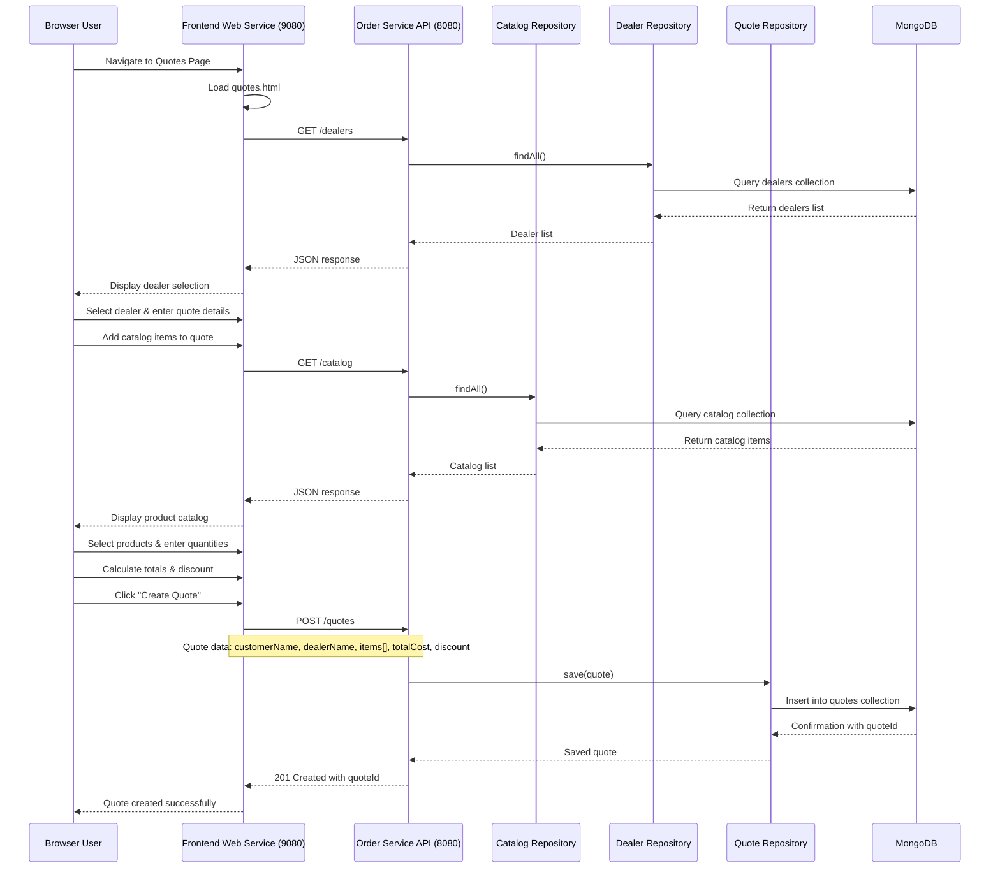
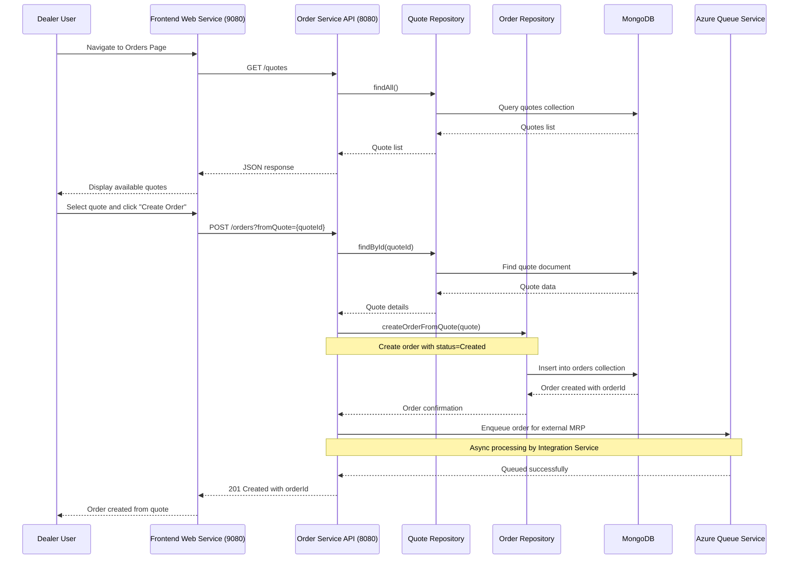
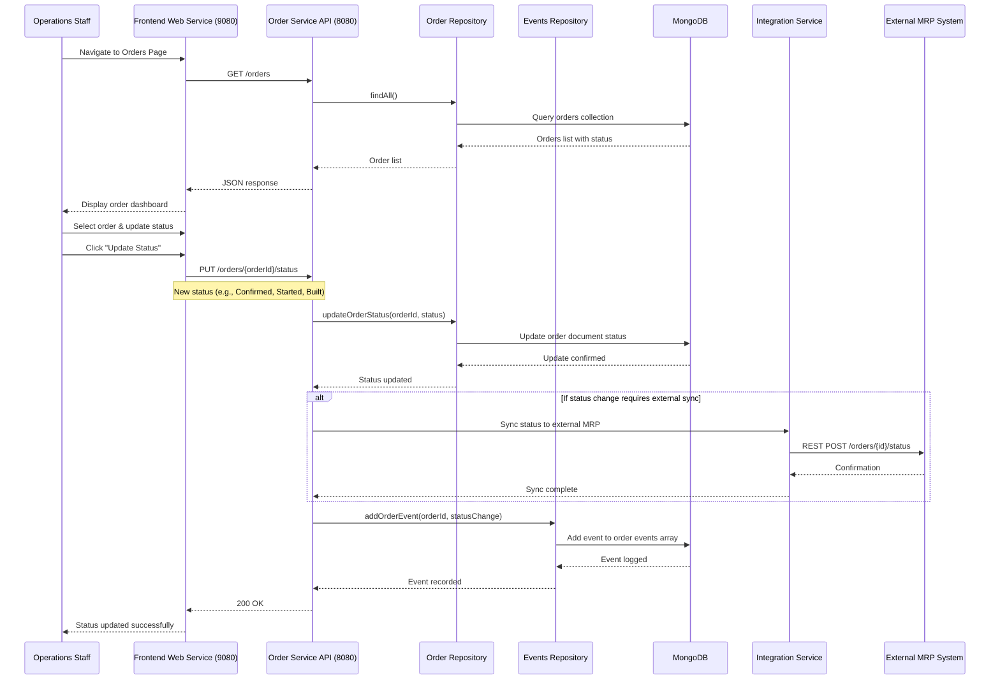
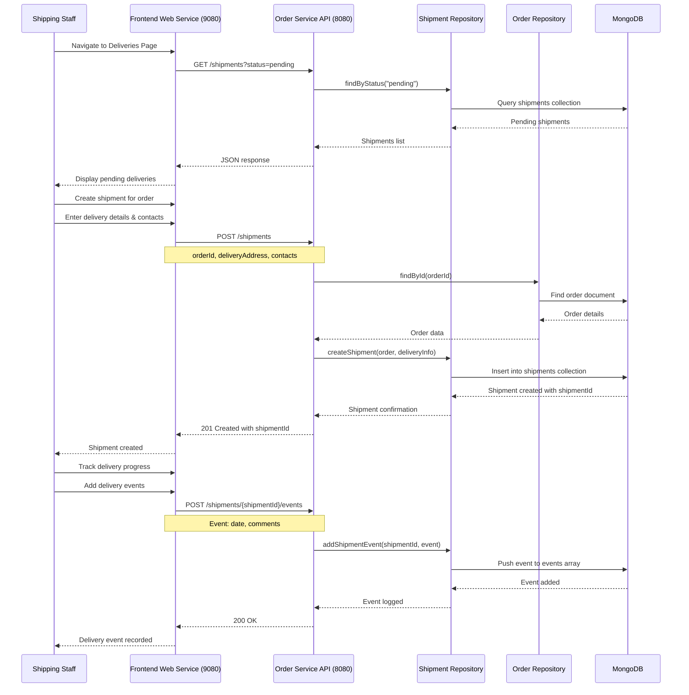
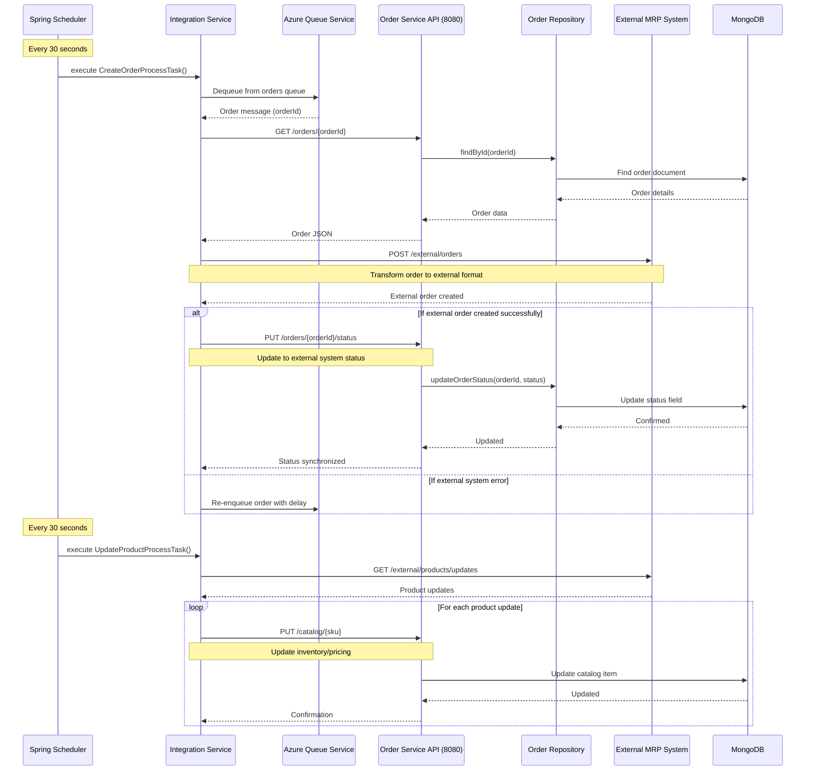
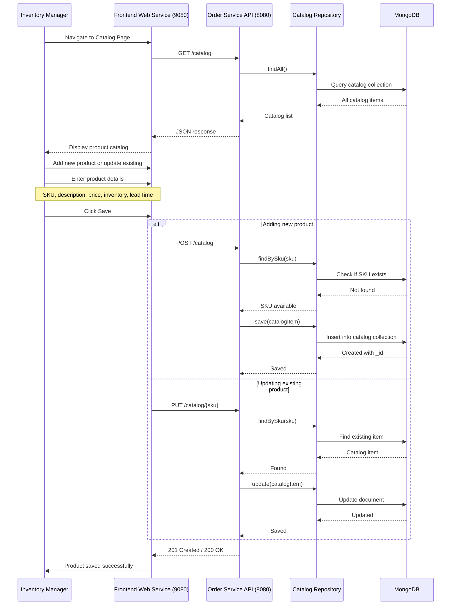
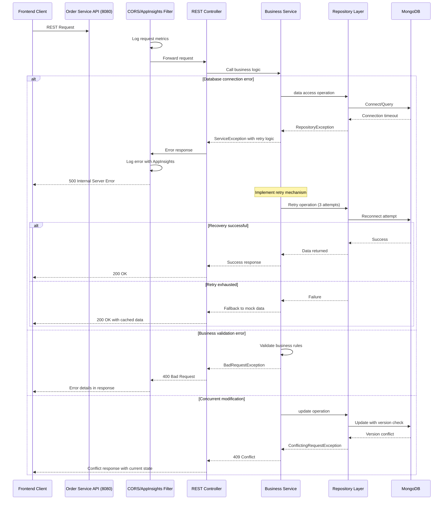

# Key Workflow Sequence Diagrams for Parts Unlimited MRP System

## 1. Quote Creation Workflow

**Purpose**: Enables dealers to create customer quotes with product selections and pricing calculations
**Trigger**: User navigates to Quotes module and fills quote form
**Communication Pattern**: Synchronous REST API calls, database transactions

---

## 2. Order Creation from Quote Workflow

**Purpose**: Converts approved quotes into executable orders
**Trigger**: Dealer selects quote and initiates order creation
**Communication Pattern**: Synchronous API call + asynchronous queue message

---

## 3. Order Fulfillment & Status Update Workflow

**Purpose**: Manages order lifecycle through production stages
**Trigger**: Operations staff updates order status
**Communication Pattern**: Synchronous REST updates, optional external MRP sync

---

## 4. Shipment & Delivery Tracking Workflow

**Purpose**: Tracks shipments and delivery events for orders
**Trigger**: Shipping staff creates shipments and updates delivery status
**Communication Pattern**: Synchronous REST API calls with event logging

---

## 5. External MRP Integration Workflow

**Purpose**: Synchronizes orders and catalog with external MRP system
**Trigger**: Scheduled tasks every 30 seconds
**Communication Pattern**: Asynchronous queue processing, REST API integration

---

## 6. Catalog Management Workflow

**Purpose**: Manages product catalog, inventory levels, and pricing
**Trigger**: Inventory manager adds or updates products
**Communication Pattern**: Synchronous REST API calls with database validation

---

## 7. Error Handling & Recovery Pattern

**Purpose**: Handles errors gracefully with retry mechanisms and fallback strategies
**Trigger**: Any operation failure (database errors, validation failures, conflicts)
**Communication Pattern**: Error propagation through layers, monitoring integration, retry logic