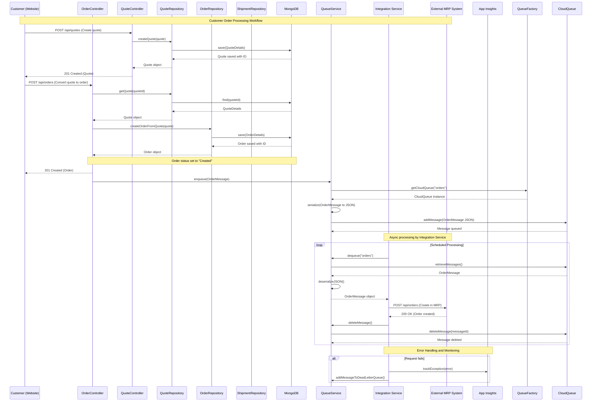
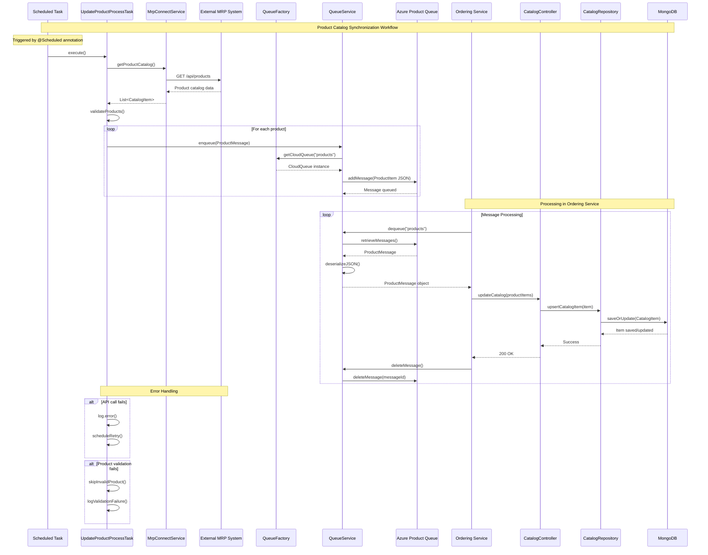
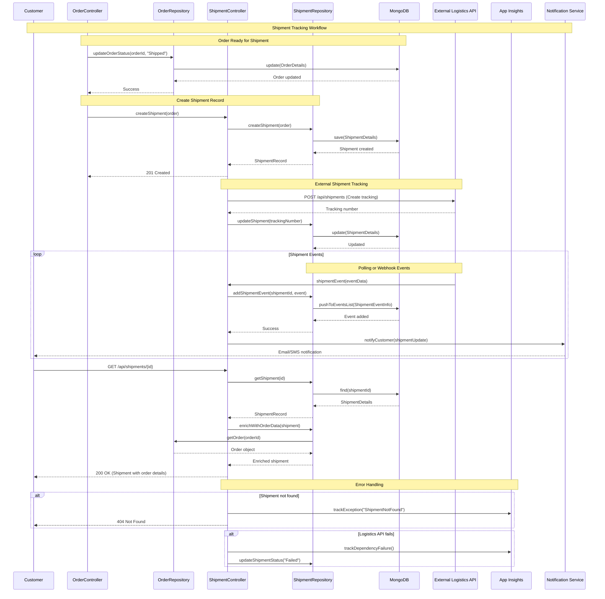
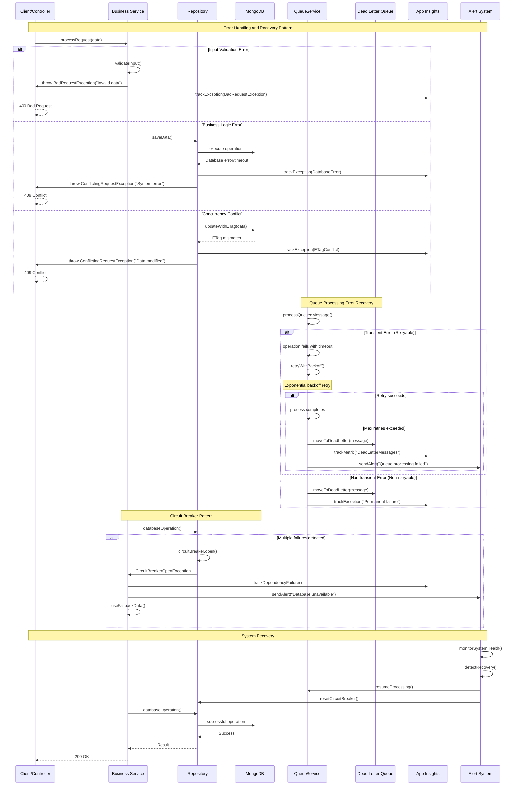
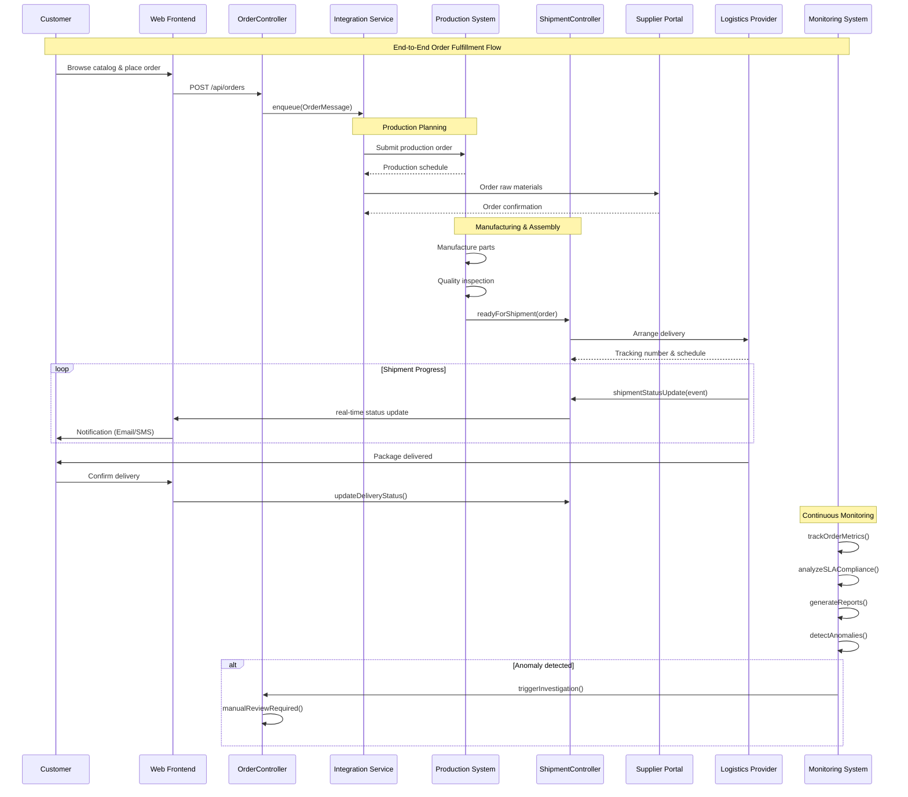

## 1. Customer Order Processing Workflow

### Workflow Description
The customer order processing workflow handles the complete lifecycle from quote generation to order creation and integration with external MRP systems. It starts with a customer requesting a quote, which is converted to an order, then processed asynchronously through message queues.

### Communication Patterns
- **Synchronous REST calls**: Customer -> Controllers, Controllers -> Repositories
- **Asynchronous messaging**: QueueService between ordering and integration services
- **Database transactions**: MongoDB operations via repositories
- **External API calls**: Integration service -> External MRP system

## 2. Product Catalog Synchronization Workflow

### Workflow Description
This workflow synchronizes product catalog data from the external MRP system to maintain consistency across the manufacturing supply chain. It runs on a scheduled basis, fetching updates and processing them asynchronously.

### Communication Patterns
- **Scheduled polling**: Timer-based task execution
- **Synchronous REST**: External MRP API calls
- **Asynchronous messaging**: Queue-based product updates
- **Database transactions**: MongoDB upsert operations
- **Retry mechanisms**: Built-in retry logic for transient failures

## 3. Shipment Tracking Workflow

### Workflow Description
The shipment tracking workflow manages the complete lifecycle of order fulfillment, from shipment creation through delivery tracking. It integrates with external logistics providers and maintains an audit trail of all shipment events.

### Communication Patterns
- **Synchronous REST**: Customer queries, internal API calls
- **Database transactions**: MongoDB operations for persistence
- **External API integration**: Logistics provider APIs
- **Event-driven updates**: Shipment status changes
- **Notification system**: Customer notifications via separate service

## 4. Error Handling and Recovery Pattern

### Workflow Description
This workflow demonstrates the comprehensive error handling and recovery patterns implemented throughout the MRP system, including input validation, database error handling, queue processing failures, and circuit breaker patterns for resilience.

### Communication Patterns
- **Exception propagation**: Structured error handling through custom exceptions
- **Telemetry integration**: All errors tracked in Application Insights
- **Dead letter queue**: Failed messages isolated for manual review
- **Circuit breaker**: Prevents cascade failures during outages
- **Alerting system**: Notifications for critical failures
- **Retry mechanisms**: Exponential backoff for transient failures

## 5. End-to-End Order Fulfillment Flow

### Workflow Description
This comprehensive workflow shows the complete order fulfillment process from customer order to final delivery, including production planning, supplier coordination, manufacturing, logistics, and continuous monitoring.

### Communication Patterns
- **Web interface**: Customer interactions through frontend
- **Service integration**: Multiple system coordination
- **External APIs**: Supplier and logistics provider integration
- **Real-time updates**: Live status notifications
- **Continuous monitoring**: System performance and SLA tracking