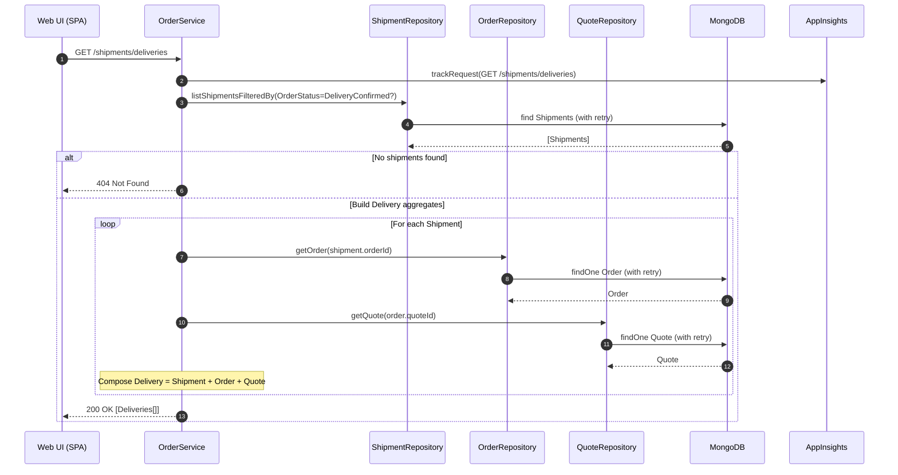
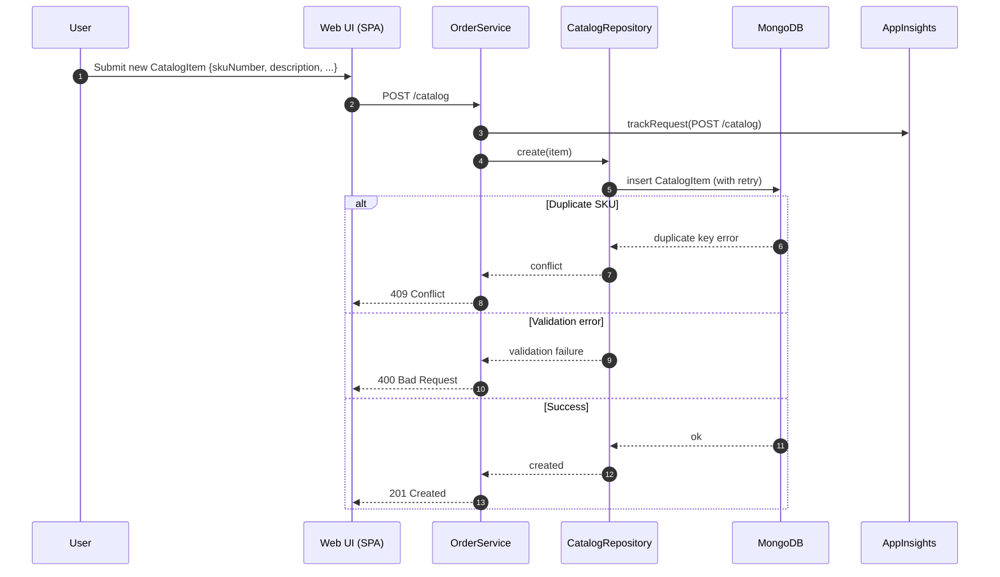
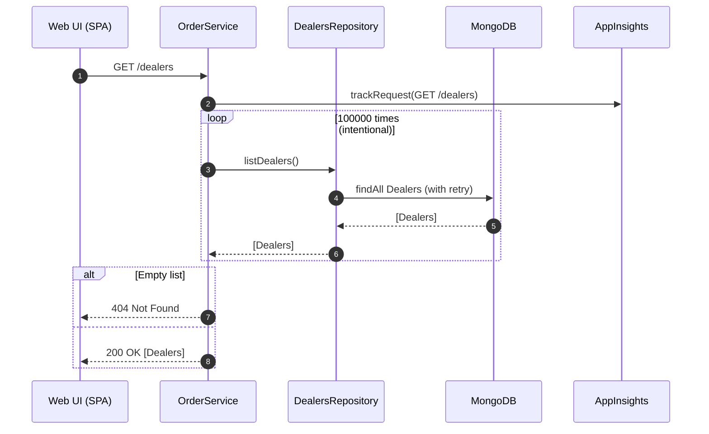
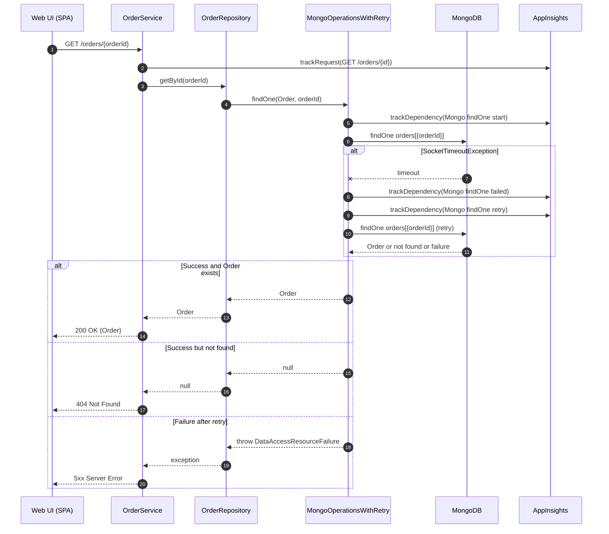
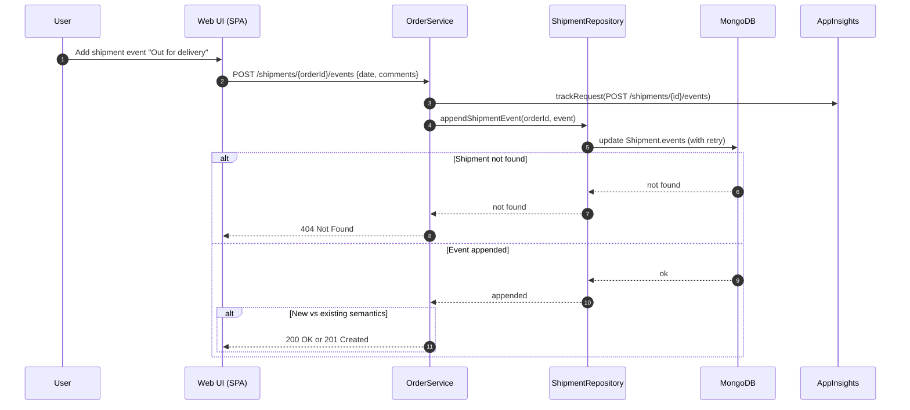
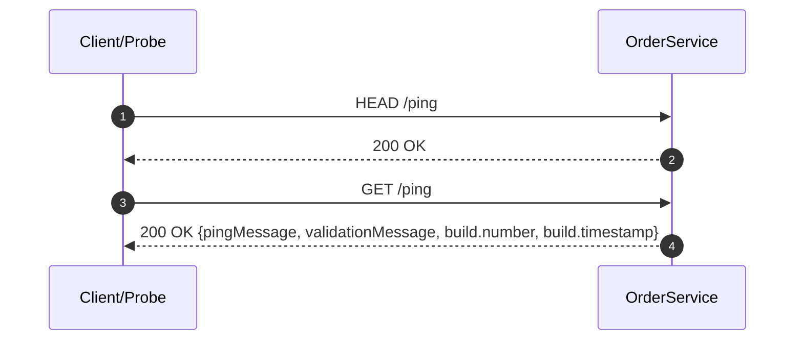

# Dynamic Interaction Flows and Sequence Diagrams

## 1) Quote → Order → Shipment (Web UI happy path)

Purpose and triggers:
- Purpose: Enable a user to create a customer quote, convert it into an order, and create a shipment/delivery record.
- Trigger: User actions in the SPA on Quotes, Orders, and Deliveries pages.

Communication patterns:
- Web UI → OrderService: synchronous REST (JSON).
- OrderService → MongoDB: synchronous repository calls with retry wrapper (MongoOperationsWithRetry).
- Cross-repo rules: Quote upserts Dealer; Order requires existing Quote; Shipment requires existing Order.
- Telemetry: AppInsights filter for requests/exceptions; dependency telemetry for Mongo operations.

```mermaid
sequenceDiagram
    autonumber
    participant U as User
    participant W as Web UI (SPA)
    participant OS as OrderService (REST)
    participant DR as DealersRepository
    participant QR as QuoteRepository
    participant OR as OrderRepository
    participant SR as ShipmentRepository
    participant DB as MongoDB
    participant AI as AppInsights

    U->>W: Fill Quote form and submit
    W->>OS: POST /quotes {customerName, dealerName, items, ...}
    OS->>AI: trackRequest(POST /quotes)

    Note over OS: Validate Quote payload

    OS->>DR: upsertDealer(dealerName)
    DR->>DB: save/find Dealer (with retry)
    DB-->>DR: ok

    OS->>QR: createQuote(Quote)
    QR->>DB: insert Quote (with retry; gen id if missing)
    DB-->>QR: quoteId
    QR-->>OS: quoteId
    OS-->>W: 201 Created Location:/quotes/{quoteId}

    U->>W: Create Order from Quote
    W->>OS: POST /orders?fromQuote={quoteId}
    OS->>AI: trackRequest(POST /orders?fromQuote)

    OS->>QR: getQuoteById(quoteId)
    QR->>DB: findOne Quote (with retry)
    DB-->>QR: Quote
    QR-->>OS: Quote

    alt Order already exists for Quote
        OS-->>W: 409 Conflict
    else Create new Order
        OS->>OR: createOrder("order-{quoteId}", quoteId, status=Created)
        OR->>DB: insert Order (with retry)
        DB-->>OR: orderId
        OR-->>OS: orderId
        OS-->>W: 201 Created Location:/orders/{orderId}
    end

    U->>W: Create Delivery from Order
    W->>OS: POST /shipments {orderId, deliveryAddress, contact, phones, deliveryDate}
    OS->>AI: trackRequest(POST /shipments)

    OS->>OR: getOrder(orderId)
    OR->>DB: findOne Order (with retry)
    DB-->>OR: Order or null
    alt Order not found
        OS-->>W: 400 Bad Request
    else Order exists
        OS->>SR: createShipment(orderId, ...)
        SR->>DB: insert Shipment (with retry)
        DB-->>SR: ok
        SR-->>OS: ok
        OS-->>W: 201 Created
    end
```

---

## 2) Order status update with event append

Purpose and triggers:
- Purpose: Track order lifecycle changes and automatically append timestamped events.
- Trigger: User updates order status or adds an event from Orders/Order Events UI.

Communication patterns:
- Web UI → OrderService: synchronous REST (PUT).
- OrderService → MongoDB: repository update with retry.
- Server stamps current date on status change and events.

```mermaid
sequenceDiagram
    autonumber
    participant U as User
    participant W as Web UI (SPA)
    participant OS as OrderService
    participant OR as OrderRepository
    participant DB as MongoDB
    participant AI as AppInsights

    U->>W: Set status=Confirmed
    W->>OS: PUT /orders/{orderId}/status {status: Confirmed}
    OS->>AI: trackRequest(PUT /orders/{id}/status)

    Note over OS: Build OrderUpdateInfo; append event with current timestamp

    OS->>OR: updateStatusAndAppendEvent(orderId, status, now(), "Status changed")
    OR->>DB: save Order (with retry)
    DB-->>OR: ok

    alt Order not found
        OS-->>W: 400 Bad Request
    else Updated
        OS-->>W: 200 OK
    end

    U->>W: Add manual event "Customer called"
    W->>OS: POST /orders/{orderId}/events {comments:"Customer called"}
    OS->>AI: trackRequest(POST /orders/{id}/events)

    Note over OS: Controller overwrites event date with current timestamp

    OS->>OR: appendEvent(orderId, now(), "Customer called")
    OR->>DB: save Order (with retry)
    DB-->>OR: ok
    OS-->>W: 201 Created
```

---

## 3) Deliveries view (aggregated read model)

Purpose and triggers:
- Purpose: Provide a combined view of Shipment + Order + Quote for delivery tracking.
- Trigger: User opens Deliveries page in UI.

Communication patterns:
- Web UI → OrderService: synchronous REST (GET /shipments/deliveries).
- OrderService → MongoDB: multiple repository reads; ShipmentRepo filters by associated Order status; composition at controller/service layer.
- Returns 404 if none.



---

## 4) Orders ingestion from Azure Queue (IntegrationService)

Purpose and triggers:
- Purpose: Asynchronously create Quote → Order → Shipment from external “orders” messages.
- Trigger: Scheduled task runs every 30 seconds, polling Azure Storage Queue “orders”.

Communication patterns:
- IntegrationService ↔ Azure Queue: asynchronous polling and delete on success.
- IntegrationService → OrderService: synchronous REST POSTs.
- OrderService → MongoDB: repository writes with retry.
- Reliability: at-least-once; no idempotency keys; partial failures can cause duplicates on reprocessing.

```mermaid
sequenceDiagram
    autonumber
    participant S as Scheduler (30s)
    participant IS as IntegrationService
    participant QO as Azure Queue "orders"
    participant OS as OrderService
    participant DB as MongoDB

    S->>IS: Trigger CreateOrderProcessTask
    IS->>QO: getMessages(visibilityTimeout=300s)
    QO-->>IS: [OrderMessage]*

    loop For each OrderMessage
        IS->>IS: Parse JSON
        alt Malformed JSON
            IS->>QO: deleteMessage(msg)
            Note over IS: Logged and discarded
        else Valid message
            IS->>OS: POST /quotes (from OrderMessage)
            OS->>DB: insert Quote (with retry)
            DB-->>OS: quoteId
            OS-->>IS: 201 Created {quoteId}

            IS->>OS: POST /orders?fromQuote={quoteId}
            OS->>DB: insert Order (with retry)
            DB-->>OS: orderId
            OS-->>IS: 201 Created {orderId}

            IS->>OS: POST /shipments {orderId, derived deliveryDate=now+14}
            OS->>DB: insert Shipment (with retry)
            DB-->>OS: ok
            OS-->>IS: 201 Created

            IS->>QO: deleteMessage(msg)
        end

        alt Any REST step fails (409/400/5xx)
            Note over IS,QO: Message not deleted; becomes visible after timeout → reprocessed (possible duplicates)
        end
    end
```

---

## 5) Inventory export to “product” queue (IntegrationService)

Purpose and triggers:
- Purpose: Periodically publish current catalog inventory to downstream systems via “product” queue.
- Trigger: Scheduled task runs every 30 seconds.

Communication patterns:
- IntegrationService → OrderService: synchronous REST GET.
- IntegrationService → Azure Queue: asynchronous message enqueue.
- Behavior: If GET returns 404 (empty), skip publish.

```mermaid
sequenceDiagram
    autonumber
    participant S as Scheduler (30s)
    participant IS as IntegrationService
    participant OS as OrderService
    participant QP as Azure Queue "product"

    S->>IS: Trigger UpdateProductProcessTask
    IS->>OS: GET /catalog
    alt Catalog has items
        OS-->>IS: 200 OK [CatalogItem[]]
        IS->>IS: Transform to ProductMessage (skuNumber, inventory, leadTime)
        IS->>QP: addMessage(ProductMessage)
        QP-->>IS: ack
    else Empty catalog
        OS-->>IS: 404 Not Found
        IS->>IS: Skip publish; log info
    end
```

---

## 6) Catalog item creation with duplicate/error handling

Purpose and triggers:
- Purpose: Maintain SKU catalog; demonstrate 409 duplicate and 400 validation semantics.
- Trigger: User creates a new catalog item in the UI.

Communication patterns:
- Web UI → OrderService: synchronous REST POST.
- OrderService → MongoDB: insert with unique index/semantic checks; retry on transient failures.



---

## 7) Dealer list with intentional high-load loop (APM demo)

Purpose and triggers:
- Purpose: Generate load for monitoring labs by performing many repository calls.
- Trigger: UI requests dealer list.

Communication patterns:
- Web UI → OrderService: synchronous REST GET.
- OrderService → MongoDB: repeated repository reads in a tight loop.
- Observability: Significant AppInsights request duration and Mongo dependency telemetry.



---

## 8) Mongo operation retry and telemetry (resilience path)

Purpose and triggers:
- Purpose: Demonstrate single-retry behavior on Mongo socket timeouts and telemetry capture.
- Trigger: Any read (example: GET /orders/{id} from UI).

Communication patterns:
- Web UI → OrderService: synchronous REST GET.
- OrderService → MongoDB: MongoOperationsWithRetry wraps calls, emits dependency telemetry, and retries once on SocketTimeoutException.
- Error mapping: 404 if not found; 5xx if persistent failure after retry.



---

## 9) Deliveries: shipment event append

Purpose and triggers:
- Purpose: Track delivery events (e.g., “Out for delivery”), allowing UI to append events to shipment.
- Trigger: User adds a shipment event from Deliveries page.

Communication patterns:
- Web UI → OrderService: synchronous REST (POST /shipments/{orderId}/events).
- OrderService → MongoDB: update shipment document with retry.
- Status codes: 200 OK if appended; 201 Created otherwise; 404 if shipment not found.



---

## 10) Health check and build info

Purpose and triggers:
- Purpose: Verify service liveness and expose config/build info.
- Trigger: Ops health probe or developer tools.

Communication patterns:
- Client → OrderService: synchronous REST GET/HEAD.
- No database call required.



---

# Notes on Error Handling and Recovery Patterns

- Synchronous REST:
  - 404 returned for empty list endpoints (Catalog, Dealers, Quotes search, Orders list, Shipments list/Deliveries).
  - 409 Conflict on duplicate Catalog POST and Order creation from already-used Quote.
  - 400 Bad Request on validation errors and some duplicate/invalid states (Quotes duplicate, Shipments duplicate/invalid, Order status update not found).

- Asynchronous queues:
  - Orders ingestion: at-least-once; messages deleted only on full success or malformed JSON. No idempotency keys → duplicates possible on retries.
  - Inventory export: publishes only on non-404 GET /catalog.

- Persistence and resilience:
  - MongoOperationsWithRetry: single retry on DataAccessResourceFailureException with SocketTimeoutException; telemetry recorded per attempt.
  - No transactional guarantees across documents (MongoDB). Cross-repo invariants enforced at application layer.

- Observability:
  - AppInsights request telemetry for each REST call.
  - Mongo dependency telemetry captured for each DB operation (name, duration, success).
  - Dealer list GET intentionally amplifies load for APM demonstrations.