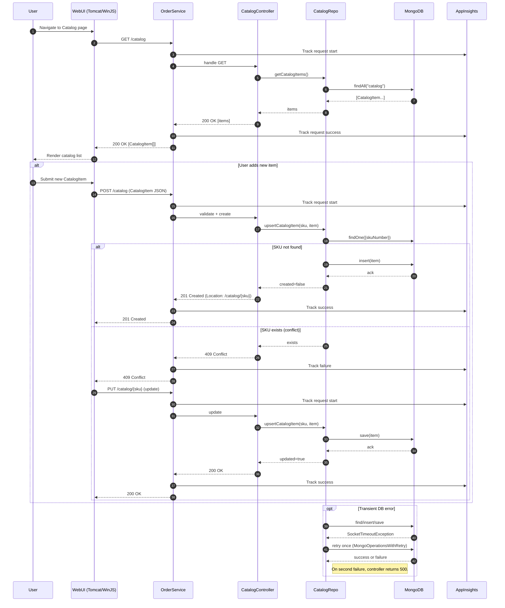
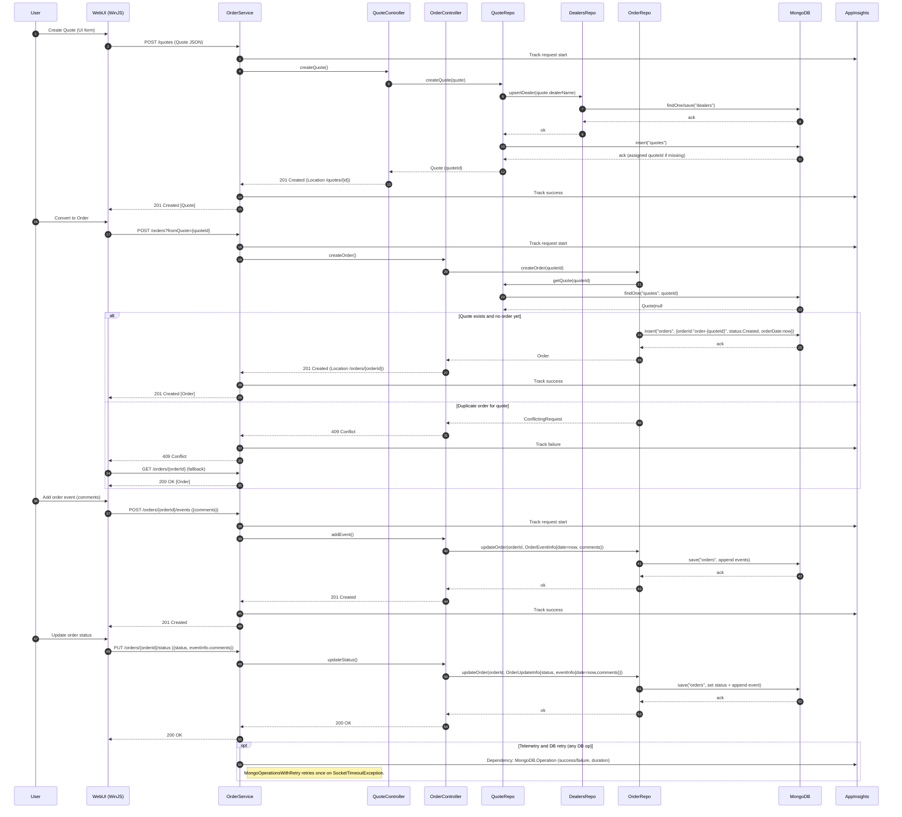
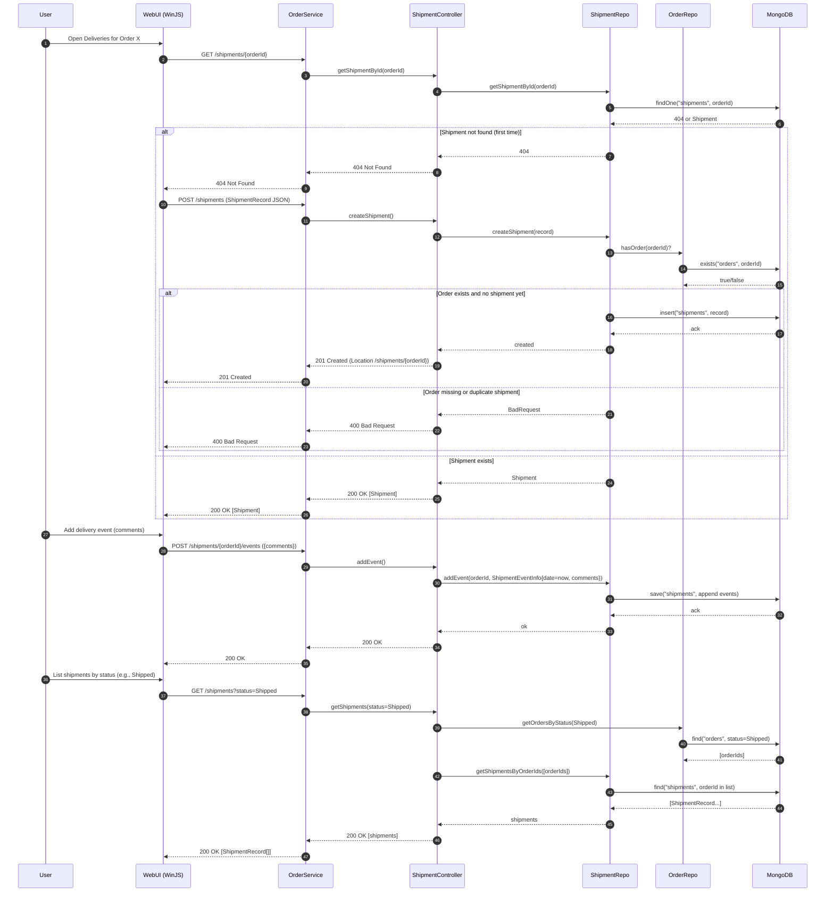
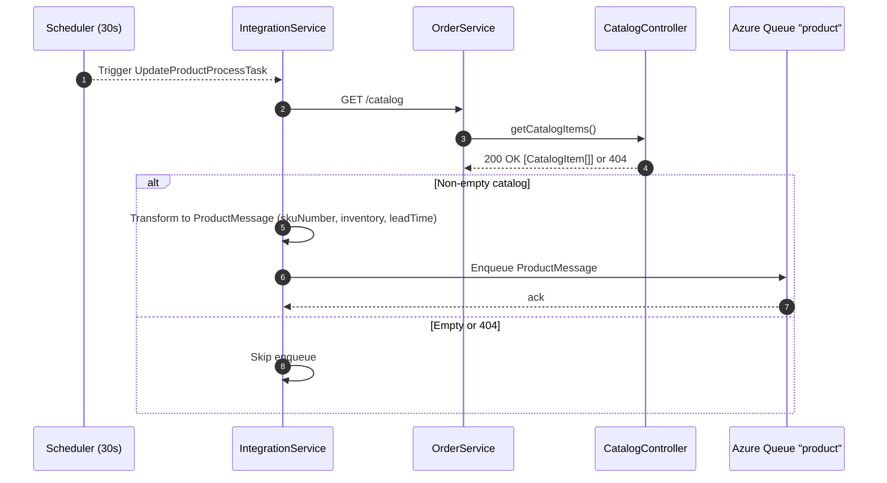
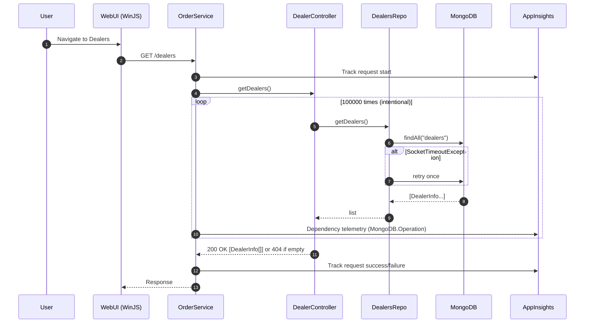
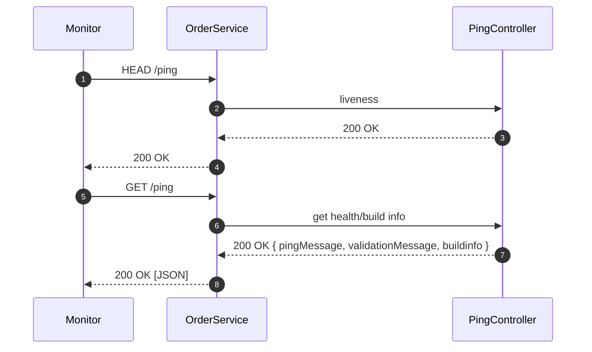

# Workflow 1: Catalog browsing and upsert (UI-driven)

- Purpose and trigger:
  - A user views the product catalog and adds or updates a CatalogItem.
  - Triggered by navigating to the Catalog page and submitting a new/edited item.
- Communication patterns:
  - WebUI -> OrderService: REST (JSON) over HTTP (GET /catalog, POST /catalog, PUT /catalog/{sku})
  - OrderService -> MongoDB: synchronous DB calls (find/insert/save) with one-time retry on SocketTimeout via MongoOperationsWithRetry
  - Telemetry: Application Insights for HTTP requests and DB dependencies
- Data flow:
  - CatalogItem { skuNumber, description, price, inventory, leadTime }
  - On GET: list of catalog items from MongoDB
  - On POST/PUT: CatalogItem JSON payload validated and persisted




# Workflow 2: Quote to Order (UI-driven), with dealer upsert and order event/status updates

- Purpose and trigger:
  - A sales user creates a Quote, then converts it to an Order; later adds events and updates status.
  - Triggered by user actions on Quotes and Orders pages.
- Communication patterns:
  - WebUI -> OrderService: REST (JSON) over HTTP (POST /quotes, POST /orders?fromQuote, POST /orders/{id}/events, PUT /orders/{id}/status)
  - Internal repo chaining: QuoteRepo ensures Dealer existence (DealersRepo upsert); OrderRepo validates Quote existence and uniqueness
  - OrderService -> MongoDB: synchronous with retry wrapper
  - Telemetry: Application Insights
- Data flow:
  - Quote { quoteId?, dealerName, customerName, quoteItems[], totalCost, discount, city, postalCode, state }
  - DealerInfo { name, contact, address, email, phone } (auto-upserted if missing)
  - Order { orderId = "order-{quoteId}", quoteId, orderDate, status, events[] }
  - OrderEventInfo { date (server-stamped), comments }




# Workflow 3: Shipment (Delivery) creation from an Order and event management (UI-driven)

- Purpose and trigger:
  - A logistics user creates a ShipmentRecord for an existing Order and manages delivery events.
  - Triggered by navigating to Deliveries and selecting an Order to create/update a shipment.
- Communication patterns:
  - WebUI -> OrderService: REST (JSON) over HTTP (GET/POST/PUT /shipments, POST /shipments/{orderId}/events, GET /shipments?status=)
  - Internal validation: ShipmentRepo validates existence of Order via OrderRepo
  - OrderService -> MongoDB: synchronous with retry wrapper
- Data flow:
  - ShipmentRecord { orderId, deliveryDate, deliveryAddress, contactName, primaryContactPhone, alternateContactPhone, events[] }
  - ShipmentEventInfo { date (server-stamped), comments }
  - Listing by status uses Order.status to filter shipments




# Workflow 4: External order ingestion via Azure Queue (event-driven, IntegrationService)

- Purpose and trigger:
  - Integrate website orders asynchronously into MRP: consume OrderMessage from Azure Storage Queue, then create Quote, Order, and Shipment in MRP.
  - Triggered by IntegrationService scheduled task every 30s (fixedDelay).
- Communication patterns:
  - IntegrationService <-> Azure Storage Queue: asynchronous dequeue/delete (orders queue)
  - IntegrationService -> OrderService: synchronous REST (POST /quotes, POST /orders?fromQuote, POST /shipments)
  - OrderService -> MongoDB: synchronous persistence with retry
  - Error handling: at-least-once queue semantics; on deserialization error, message deleted; on REST failure, message not deleted (visible after timeout), causing retries and potential duplicates; no idempotency key
- Data flow:
  - OrderMessage { customerName, dealerName, address, phone, city, state, postalCode, totalCost, discount, items[{skuNumber, price}] }
  - Quote(OrderMessage), Order(from Quote), ShipmentRecord(OrderMessage + orderId)

```mermaid
sequenceDiagram
  autonumber
  participant Scheduler as Scheduler (30s)
  participant IntSvc as IntegrationService
  participant OrdersQ as Azure Queue "orders"
  participant OrderSvc as OrderService
  participant QuoteCtrl as QuoteController
  participant OrderCtrl as OrderController
  participant ShipCtrl as ShipmentController

  Scheduler-->>IntSvc: Trigger CreateOrderProcessTask
  loop until queue empty
    IntSvc->>OrdersQ: Dequeue message (visibilityTimeout=300s)
    OrdersQ-->>IntSvc: OrderMessage | null
    alt Message retrieved
      IntSvc->>IntSvc: Deserialize OrderMessage -> Quote + ShipmentRecord templates
      alt Deserialization error
        IntSvc->>OrdersQ: Delete message (poison)
        OrdersQ-->>IntSvc: ack
      else Valid message
        IntSvc->>OrderSvc: POST /quotes (from OrderMessage)
        alt 201 Created
          IntSvc->>OrderSvc: POST /orders?fromQuote={quoteId}
          alt 201 Created
            IntSvc->>OrderSvc: POST /shipments (ShipmentRecord with orderId)
            alt 201 Created
              IntSvc->>OrdersQ: Delete message
              OrdersQ-->>IntSvc: ack
            else 4xx/5xx on /shipments
              IntSvc->>IntSvc: Log error; do NOT delete message
              Note right of IntSvc: Message reappears after visibility timeout (at-least-once)
            end
          else 409 Conflict (order exists) or 4xx/5xx
            IntSvc->>IntSvc: Log error; do NOT delete message
          end
        else 4xx/5xx on /quotes (e.g., duplicate quote ID)
          IntSvc->>IntSvc: Log error; do NOT delete message
        end
      end
    else No message
      IntSvc-->>Scheduler: Sleep until next tick
    end
  end

  Note over IntSvc,OrderSvc: No idempotency keys; duplicate processing can occur on retries.<br/>Order creation conflicts (409) surface as errors here.
```


# Workflow 5: Inventory publish to website via product queue (event-driven, IntegrationService)

- Purpose and trigger:
  - Periodically export current catalog inventory/lead times to the website via Azure Storage Queue “product”.
  - Triggered by IntegrationService scheduled task every 30s (fixedDelay).
- Communication patterns:
  - IntegrationService -> OrderService: synchronous REST (GET /catalog)
  - IntegrationService -> Azure Queue “product”: asynchronous enqueue of ProductMessage
- Data flow:
  - ProductMessage { productList: [{ skuNumber, inventory, leadTime }] } built from OrderService CatalogItem list




# Workflow 6: Dealer listing heavy-load path with telemetry and DB retry

- Purpose and trigger:
  - Demonstrate APM/telemetry under load; DealerController intentionally executes 100000 repository calls on GET /dealers.
  - Triggered by a user viewing Dealers.
- Communication patterns:
  - WebUI -> OrderService: REST (GET /dealers)
  - OrderService -> MongoDB: repeated synchronous reads with one-time retry on SocketTimeout per call
  - Telemetry: Application Insights per HTTP request and per DB dependency
- Data flow:
  - DealerInfo[] from MongoDB




# Workflow 7: Health check (operational)

- Purpose and trigger:
  - External monitors check service liveness and build/config info.
  - Triggered by monitoring system or during deployments.
- Communication patterns:
  - Client/Monitor -> OrderService: REST (HEAD/GET /ping)
- Data flow:
  - GET /ping returns pingMessage, validationMessage, build.number, build.timestamp




# Error handling and recovery patterns (cross-cutting highlights)

- Synchronous REST error semantics:
  - Validation errors: 400 Bad Request (e.g., invalid Dealer, duplicate Quote or Shipment, etc.)
  - Not found: 404 (single entity missing or empty list)
  - Conflict: 409 (duplicate Catalog POST, Order already exists for quote)
  - Success codes: 200 OK (read/update), 201 Created (create/event), 204 No Content (delete)
- Database resilience:
  - MongoOperationsWithRetry retries once on SocketTimeoutException for common operations; emits dependency telemetry for success/failure and duration
- Telemetry:
  - Application Insights filter around each OrderService HTTP request; dependency telemetry around each MongoDB operation
- CORS:
  - SimpleCORSFilter permits browser calls from WebUI to OrderService across ports
- Queue processing (IntegrationService):
  - At-least-once delivery: messages are deleted only on end-to-end success
  - Deserialization errors: messages deleted to avoid poison loops
  - No explicit idempotency/circuit breaker: partial failures may cause duplicates on retry (e.g., quotes, orders, shipments)