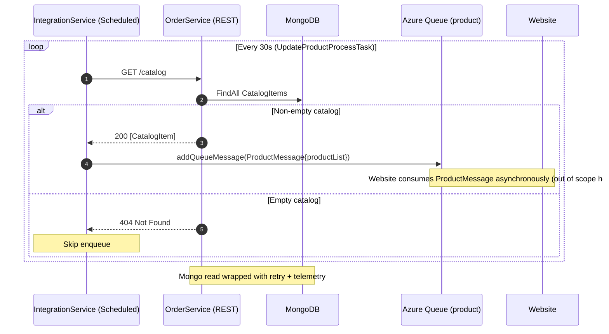
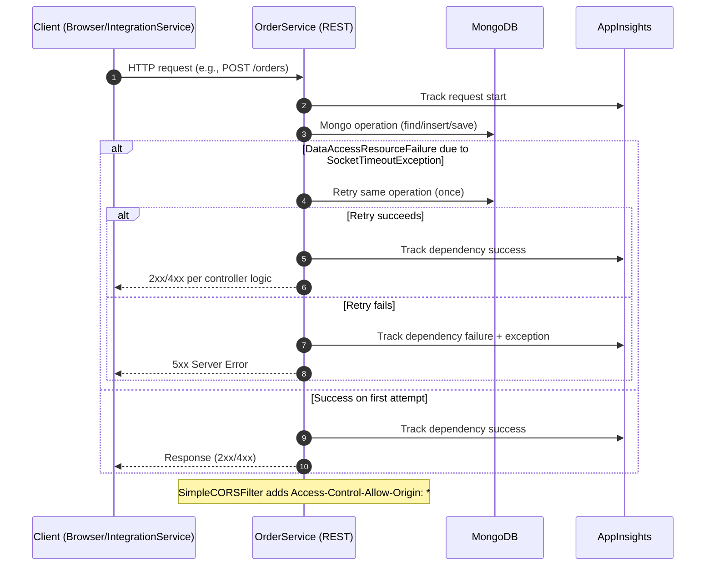

## Workflow 1: Web UI creates Quote, then creates Order from Quote, and updates Order status

Purpose and triggers:
- Purpose: Allow a user to create a quote, convert it to an order, and update order status from the Web UI.
- Trigger: User actions in the Web client (static SPA) invoking AJAX requests.

Communication patterns:
- Synchronous REST: Browser → OrderService (POST /quotes, POST /orders?fromQuote, PUT /orders/{id}/status).
- Database operations: OrderService → MongoDB (CRUD via MongoTemplate with retry).
- Cross-cutting: CORS filter for cross-origin, Application Insights telemetry on requests and Mongo dependencies.

```mermaid
sequenceDiagram
    autonumber
    participant U as User
    participant B as Browser (Web UI)
    participant OS as OrderService (REST)
    participant MDB as MongoDB

    rect rgb(245,245,245)
    U->>B: Fill quote form and submit
    B->>OS: POST /quotes (Quote JSON)
    note over OS: Validates dealer/customer, quote items
    OS->>MDB: Find Dealer by name
    alt Dealer exists
        OS->>MDB: Insert Quote
        OS-->>B: 201 Created (Quote with quoteId, Location: /quotes/{id})
    else Dealer missing or validation error
        OS-->>B: 400 Bad Request
    end
    note over OS,MDB: MongoOperationsWithRetry: retry once on socket timeout; AppInsights tracks dependency
    end

    rect rgb(245,245,245)
    U->>B: Click "Create Order from Quote"
    B->>OS: POST /orders?fromQuote={quoteId}
    note over OS: Validates quote; one order per quote (conflict on duplicate)
    OS->>MDB: Find Quote by quoteId
    alt Quote exists and no Order exists
        OS->>MDB: Insert Order {orderId="order-{quoteId}"}
        OS-->>B: 201 Created (Order with orderId)
    else Order already exists
        OS-->>B: 409 Conflict
    else Quote missing/invalid
        OS-->>B: 400 Bad Request
    end
    note over OS,MDB: Mongo retry+telemetry around find/insert
    end

    rect rgb(245,245,245)
    U->>B: Update order status
    B->>OS: PUT /orders/{orderId}/status (OrderUpdateInfo)
    note over OS: Adds server-side timestamped event; validates transition
    OS->>MDB: Update Order status and append event
    OS-->>B: 200 OK
    end

    note over OS: CORS enabled; AppInsightsFilter tracks requests/exceptions
```

---

## Workflow 2: Integration ingestion — Website order message → Quote, Order, Shipment

Purpose and triggers:
- Purpose: Orchestrate backend object creation from external Website orders via queue.
- Triggers: Website enqueues OrderMessage to Azure Storage “orders” queue; IntegrationService scheduled task runs every 30s.

Communication patterns:
- Asynchronous messaging: Website → Azure Storage Queue (“orders”).
- Synchronous REST: IntegrationService → OrderService (POST /quotes, POST /orders?fromQuote, POST /shipments).
- Database operations: OrderService → MongoDB.
- Error handling: Malformed messages deleted; HTTP failures cause message to reappear after visibility timeout; idempotency via 409 handling.
- Observability: AppInsights for HTTP and Mongo dependencies; logs in IntegrationService.

```mermaid
sequenceDiagram
    autonumber
    participant W as Website
    participant OQ as Azure Queue (orders)
    participant IS as IntegrationService (Scheduled)
    participant OS as OrderService (REST)
    participant MDB as MongoDB

    rect rgb(235,250,235)
    W->>OQ: Enqueue OrderMessage (JSON)
    end

    loop Every 30s (CreateOrderProcessTask)
        IS->>OQ: getQueueMessage(visibility=300s)
        alt Malformed JSON / deserialization error
            IS->>OQ: deleteQueueMessage
            note over IS: Drop poison message to avoid infinite retries
        else Valid OrderMessage
            IS->>OS: POST /quotes (derived from OrderMessage)
            alt 201 Created (returns Quote with quoteId)
                OS->>MDB: Insert Quote
                OS-->>IS: Quote JSON
                IS->>OS: POST /orders?fromQuote={quoteId}
                alt 201 Created (Order)
                    OS->>MDB: Insert Order
                    OS-->>IS: Order JSON
                else 409 Conflict (order already exists)
                    OS-->>IS: 409 Conflict
                    note over IS: Treat as idempotent → continue to shipment
                else 400/404/5xx
                    OS-->>IS: Error
                    note over IS: Do NOT delete message; it becomes visible after 300s for retry
                    continue
                end

                IS->>OS: POST /shipments (ShipmentRecord; deliveryDate≈now+14d)
                alt 201 Created
                    OS->>MDB: Insert Shipment (deliveryDate field NOT persisted in current mapping)
                    OS-->>IS: Shipment JSON
                    IS->>OQ: deleteQueueMessage
                else 409 Conflict (shipment exists)
                    IS->>OQ: deleteQueueMessage
                else 4xx/5xx
                    note over IS: Leave message for retry after visibility timeout
                end
            else 409 Conflict (duplicate quote)
                OS-->>IS: 409 Conflict
                note over IS: No quoteId returned → cannot proceed; leave message for retry/manual handling
            else 5xx / network failure
                note over IS: Transient failure; message will reappear after timeout
            end
        end
    end

    note over OS,MDB: MongoOperationsWithRetry wraps Mongo calls; telemetry emitted per operation
```

---

## Workflow 3: Integration product inventory broadcast — Catalog → Product queue

Purpose and triggers:
- Purpose: Publish product inventory updates to Website via queue.
- Trigger: Scheduled task every 30s in IntegrationService.

Communication patterns:
- Synchronous REST: IntegrationService → OrderService (GET /catalog).
- Database operations: OrderService → MongoDB (read catalog).
- Asynchronous messaging: IntegrationService → Azure Storage Queue (“product”).



---

## Workflow 4: Deliveries aggregation read — Browser reads composed deliveries

Purpose and triggers:
- Purpose: Provide a read-only aggregate view combining Shipment, Order, and Quote for shipments with DeliveryConfirmed.
- Trigger: User navigates to Deliveries page in Web UI.

Communication patterns:
- Synchronous REST: Browser → OrderService (GET /shipments/deliveries).
- Database operations: OrderService → MongoDB (multiple queries and in-process joins).
- No external messaging.

```mermaid
sequenceDiagram
    autonumber
    participant B as Browser (Web UI)
    participant OS as OrderService (REST)
    participant MDB as MongoDB

    B->>OS: GET /shipments/deliveries
    note over OS: Build Delivery aggregates for DeliveryConfirmed shipments
    OS->>MDB: Find Shipments with status=DeliveryConfirmed
    loop For each ShipmentRecord
        OS->>MDB: Find Order by orderId
        OS->>MDB: Find Quote by quoteId (from Order)
        OS-->OS: Compose Delivery {shipment + order + quote}
    end
    OS-->>B: 200 [Delivery]

    note over OS,MDB: Multiple Mongo queries; no cross-service calls; telemetry captured per dependency
```

---

## Workflow 5: Resilience and error handling — Mongo retry and telemetry around repository operations

Purpose and triggers:
- Purpose: Generic error handling pattern for data access; improve resilience and observability.
- Trigger: Any REST endpoint in OrderService performing MongoDB operations.

Communication patterns:
- Synchronous REST: Client → OrderService.
- Database operations: OrderService → MongoDB with a single retry on specific failures.
- Observability: Application Insights telemetry for requests and Mongo dependencies.



---