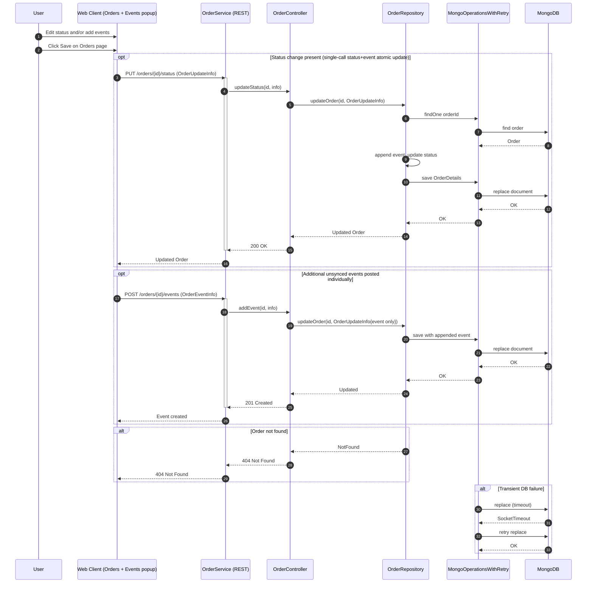
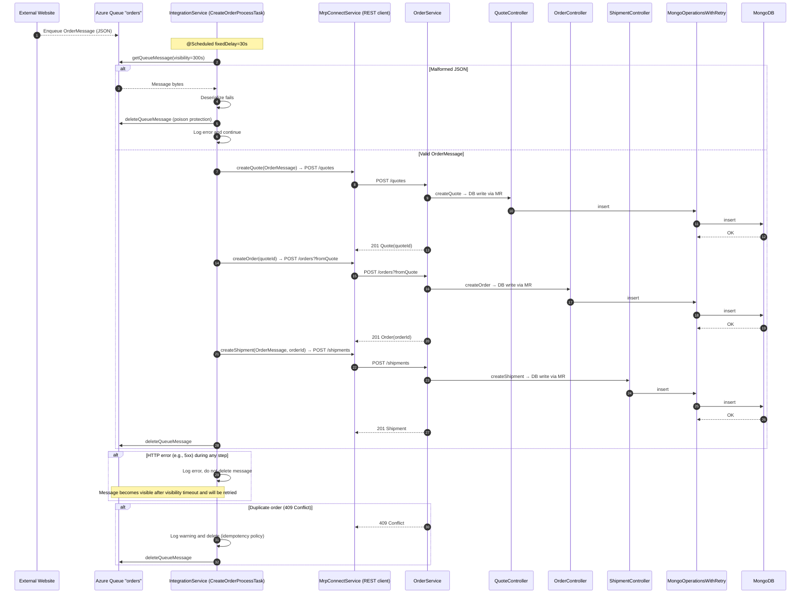
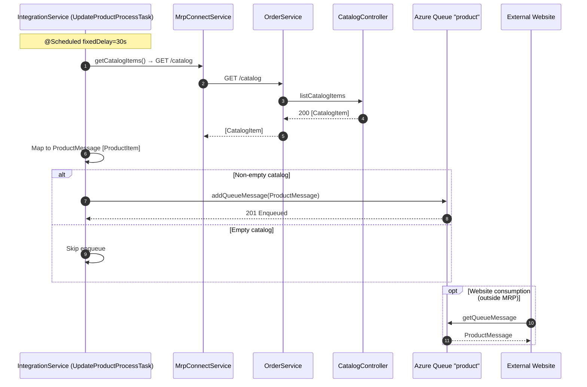
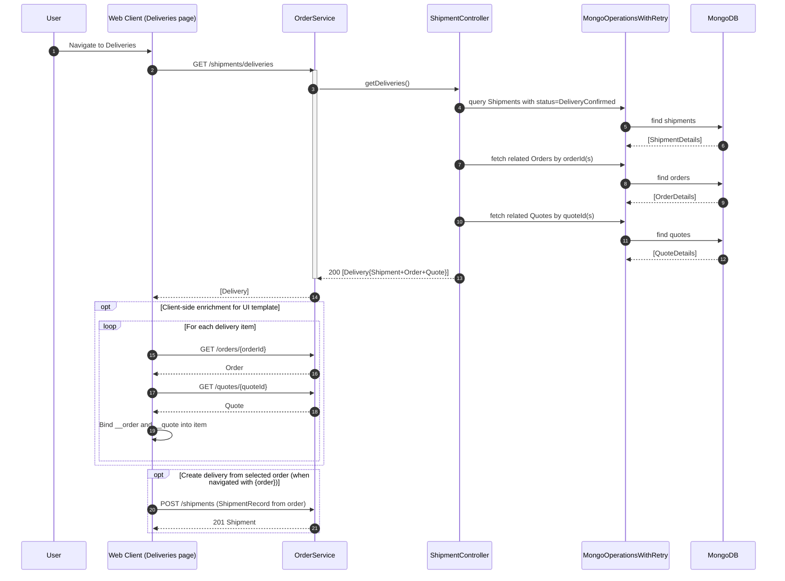
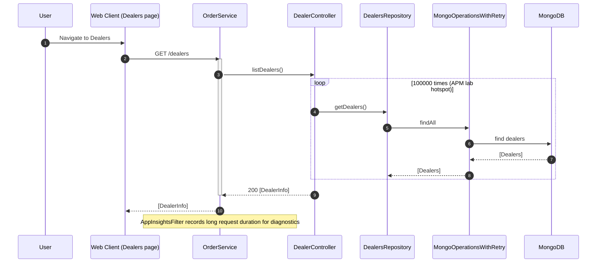

# Workflow 1 — Create Quote → Create Order from Quote → Create Shipment (Delivery) from Order

Purpose and triggers
- Purpose: End-to-end user flow to create a new quote, convert it to an order, and initiate shipment.
- Triggers: User actions in the Web Client (WinJS) — Save Quote, Create Order from Quote, Deliver/Create Shipment from Order.

Communication patterns
- Web Client → OrderService: synchronous REST/JSON
  - POST /quotes
  - POST /orders?fromQuote={quoteId}
  - POST /shipments (with ShipmentRecord)
- OrderService → MongoDB: synchronous DB writes via MongoOperationsWithRetry (retry-once on transient failures)
- Cross-cutting: SimpleCORSFilter for browser calls; AppInsightsFilter for request/exception telemetry

```mermaid
sequenceDiagram
  autonumber
  participant U as User
  participant W as Web Client (WinJS/Data)
  participant OS as OrderService (REST)
  participant QC as QuoteController
  participant OC as OrderController
  participant SC as ShipmentController
  participant RF as RepositoryFactory
  participant QR as QuoteRepository
  participant OR as OrderRepository
  participant SR as ShipmentRepository
  participant MR as MongoOperationsWithRetry
  participant DB as MongoDB

  U->>W: Enter Quote details and click Save
  W->>OS: POST /quotes (Quote JSON)
  activate OS
  OS->>RF: resolve repositories (storage=mongodb)
  OS->>QC: validate payload
  QC->>QR: createQuote(Quote)
  QR->>MR: insert QuoteDetails
  MR->>DB: insert document
  DB-->>MR: OK
  MR-->>QR: OK
  QR-->>QC: Quote with quoteId
  QC-->>OS: 201 Created (Location /quotes/{quoteId})
  deactivate OS
  OS-->>W: Quote(created)

  U->>W: From Quote, choose "Create Order"
  W->>OS: POST /orders?fromQuote={quoteId}
  activate OS
  OS->>OC: createOrder(fromQuoteId)
  OC->>OR: createOrder(fromQuoteId)
  OR->>QR: getQuote(quoteId) (validate exists)
  QR->>MR: findOne quoteId
  MR->>DB: find quote
  DB-->>MR: Quote found
  MR-->>QR: Quote
  OR->>MR: insert OrderDetails (orderId="order-{quoteId}", status=Created)
  MR->>DB: insert document
  DB-->>MR: OK
  MR-->>OR: OK
  OR-->>OC: Order
  OC-->>OS: 201 Created (Location /orders/{orderId})
  deactivate OS
  OS-->>W: Order(created)

  U->>W: From Order, choose "Deliver" (create shipment)
  W->>OS: POST /shipments (ShipmentRecord with orderId)
  activate OS
  OS->>SC: createShipment(record)
  SC->>SR: createShipment(record)
  SR->>OR: hasOrder(orderId) (validate)
  OR->>MR: findOne orderId
  MR->>DB: find order
  DB-->>MR: Order found
  MR-->>OR: OK
  SR->>MR: insert ShipmentDetails
  MR->>DB: insert document
  DB-->>MR: OK
  MR-->>SR: OK
  SR-->>SC: ShipmentRecord
  SC-->>OS: 201 Created (Location /shipments/{orderId})
  deactivate OS
  OS-->>W: Shipment(created)

  alt Duplicate order for quote
    OR-->>OC: ConflictingRequestException
    OC-->>OS: 409 Conflict
    OS-->>W: 409 Conflict
  end

  alt Transient Mongo failure on write
    MR->>DB: insert (timeout)
    DB-->>MR: SocketTimeoutException
    MR->>DB: retry insert
    DB-->>MR: OK
    MR-->>(caller): success
  end
```


# Workflow 2 — Update Order Status and Manage Order Events

Purpose and triggers
- Purpose: Record order lifecycle changes and audit history (events).
- Triggers: User modifies status and/or events in the Orders page; events may be edited in a popup and persisted on Save.

Communication patterns
- Web Client → OrderService: synchronous REST/JSON
  - PUT /orders/{orderId}/status with OrderUpdateInfo{status, eventInfo}
  - POST /orders/{orderId}/events with OrderEventInfo (optional, if Data layer posts discrete events)
- OrderService → MongoDB: synchronous writes via MongoOperationsWithRetry




# Workflow 3 — IntegrationService Order Intake (Event-driven: Website → Azure Queue → MRP)

Purpose and triggers
- Purpose: Automatically ingest website orders into MRP as Quotes + Orders + Shipments.
- Triggers: Website enqueues OrderMessage into Azure Storage Queue “orders”; scheduled task runs every 30 seconds.

Communication patterns
- Website → Azure Storage Queue “orders”: asynchronous message enqueue (JSON)
- IntegrationService → Azure Queue: pull with visibility timeout; delete after success; malformed messages deleted immediately
- IntegrationService → OrderService: synchronous REST/JSON
  - POST /quotes
  - POST /orders?fromQuote={quoteId}
  - POST /shipments
- OrderService → MongoDB: synchronous DB writes via MongoOperationsWithRetry




# Workflow 4 — IntegrationService Product Inventory Updates (MRP → Azure Queue “product”)

Purpose and triggers
- Purpose: Publish current catalog inventory/lead time snapshots for the website.
- Triggers: Scheduled task every 30 seconds.

Communication patterns
- IntegrationService → OrderService: synchronous REST/JSON
  - GET /catalog
- IntegrationService → Azure Queue “product”: asynchronous message enqueue with ProductMessage JSON
- Website → Azure Queue “product”: pull/consume (out of scope of codebase, shown for completeness)




# Workflow 5 — Deliveries Page Composition (Read model aggregation and enrichment)

Purpose and triggers
- Purpose: Display deliveries with related order and quote context; optionally create a delivery from an order.
- Triggers: User navigates to Deliveries; Web Client loads list and enriches items for UI rendering.

Communication patterns
- Web Client → OrderService: synchronous REST/JSON
  - GET /shipments/deliveries (aggregated Delivery DTOs)
  - Optionally, per-item GET /orders/{orderId} and GET /quotes/{quoteId} for extra fields (client-side enrichment)
- OrderService → MongoDB: synchronous reads via MongoOperationsWithRetry across Shipment, Order, Quote repositories (server-side aggregation)




# Workflow 6 — Dealers List Retrieval (Known APM Hotspot)

Purpose and triggers
- Purpose: Load list of dealers for maintenance; demonstrate performance anti-pattern (intentional lab).
- Triggers: User navigates to Dealers; Web Client loads dealer list.

Communication patterns
- Web Client → OrderService: synchronous REST/JSON
  - GET /dealers
- OrderService → MongoDB: synchronous reads; controller loops 100000x internally (intentional), causing heavy load
- Observability: AppInsightsFilter tracks long request durations/exceptions

