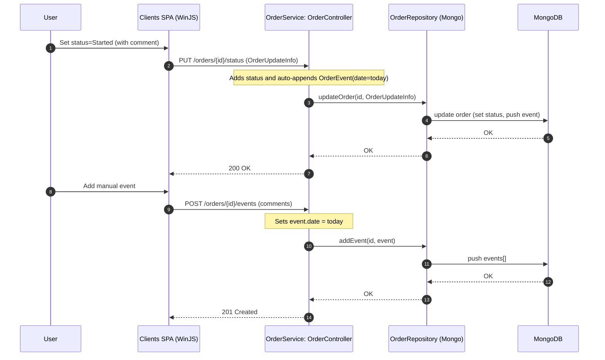
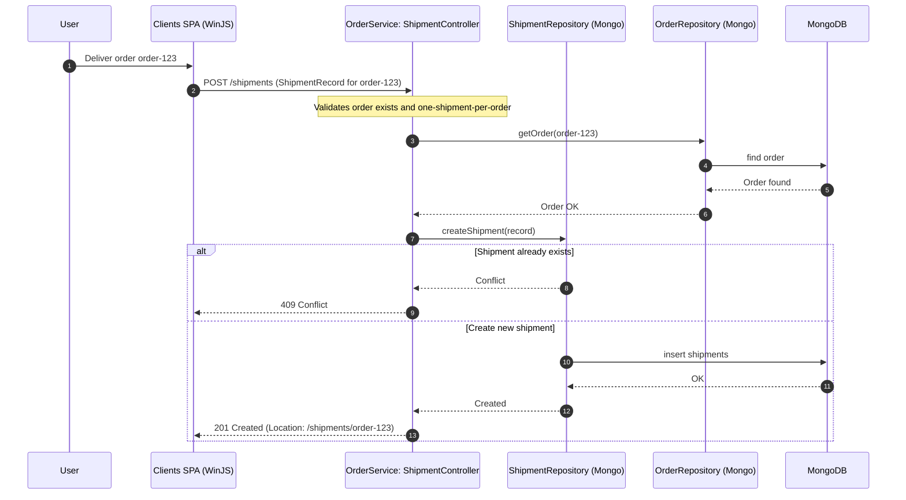
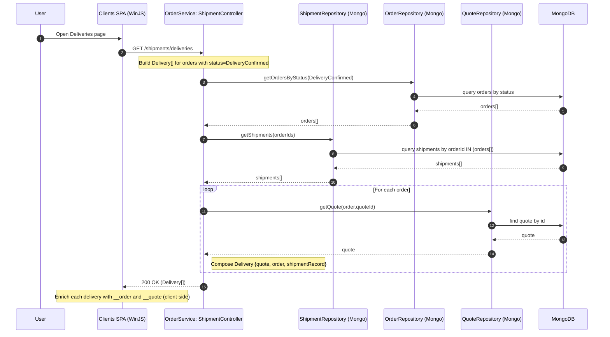
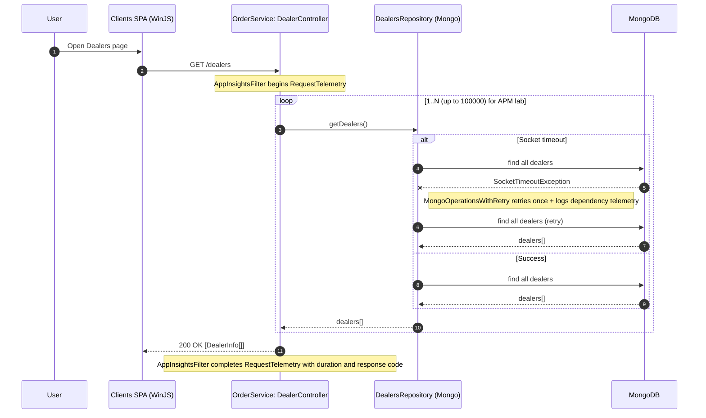

# Workflow 1: Create Quote then Create Order (via Clients SPA)

Purpose and triggers:
- Purpose: Let a user create a sales quote and turn it into a manufacturing order.
- Trigger: User clicks “Create Quote” in the SPA, then “Create Order from Quote”.

Communication patterns:
- REST (sync): POST /quotes; POST /orders?fromQuote=.
- Database: MongoDB inserts (quotes, orders) with single retry on SocketTimeoutException.
- Cross-cutting: AppInsights request/dependency telemetry; CORS open.

```mermaid
sequenceDiagram
    autonumber
    participant U as User
    participant SPA as Clients SPA (WinJS)
    participant QCtl as OrderService: QuoteController
    participant OCtl as OrderService: OrderController
    participant QRepo as QuoteRepository (Mongo)
    participant ORepo as OrderRepository (Mongo)
    participant Mongo as MongoDB

    U->>SPA: Fill quote form + add items (incl. extras)
    SPA->>QCtl: POST /quotes (JSON Quote)
    Note over QCtl: AppInsightsFilter wraps request; CORS allows origin
    QCtl->>QRepo: createQuote(Quote)
    alt Mongo socket timeout on insert
        QRepo->>Mongo: insert quotes
        Mongo--xQRepo: SocketTimeoutException
        Note right of QRepo: MongoOperationsWithRetry retries once
        QRepo->>Mongo: insert quotes (retry)
        Mongo-->>QRepo: OK
    else Success first try
        QRepo->>Mongo: insert quotes
        Mongo-->>QRepo: OK
    end
    QRepo-->>QCtl: Quote created
    QCtl-->>SPA: 201 Created (Location: /quotes/{id})

    U->>SPA: Create Order from Quote
    SPA->>OCtl: POST /orders?fromQuote={quoteId}
    Note over OCtl: Constructs orderId = "order-{quoteId}", status=Created, orderDate=today
    OCtl->>ORepo: hasOrder/getOrderByQuoteId(quoteId)
    alt Order already exists
        ORepo-->>OCtl: found
        OCtl-->>SPA: 409 Conflict (idempotency)
    else No existing order
        ORepo->>Mongo: insert orders (order-<quoteId>)
        Mongo-->>ORepo: OK
        ORepo-->>OCtl: Order created
        OCtl-->>SPA: 201 Created (Location: /orders/order-<quoteId>)
    end
```

---

# Workflow 2: Update Order Status and Append Events (via Clients SPA)

Purpose and triggers:
- Purpose: Advance order lifecycle and capture timeline of events.
- Trigger: User changes status or adds a comment/event in the SPA.

Communication patterns:
- REST (sync): PUT /orders/{id}/status; POST /orders/{id}/events.
- Database: MongoDB update and push to events[]; Appends event.date = current short date.



---

# Workflow 3: Create Shipment/Delivery from an Order (via Clients SPA)

Purpose and triggers:
- Purpose: Schedule delivery and capture shipment details for an order.
- Trigger: User clicks “Deliver” from an order in the SPA.

Communication patterns:
- REST (sync): POST /shipments.
- Database: MongoDB insert (shipments) with uniqueness guard (one per order).



---

# Workflow 4: View Deliveries (aggregate read model)

Purpose and triggers:
- Purpose: Show deliveries that are ready/confirmed, with their related quote and order.
- Trigger: User navigates to Deliveries page in the SPA.

Communication patterns:
- REST (sync): GET /shipments/deliveries returns Delivery[] {quote, order, shipmentRecord}.
- Database: Aggregation across shipments, orders, quotes (repository joins by business ids).
- Client-side: Enriches each Delivery with __order and __quote for UI convenience.



---

# Workflow 5: External Order Ingestion via Azure Queue (IntegrationService)

Purpose and triggers:
- Purpose: Bridge website orders into MRP by creating quotes, orders, and shipments.
- Trigger: New OrderMessage in Azure Storage Queue “orders”; scheduled poll every 30s.

Communication patterns:
- Async messaging: Azure Queue “orders” (dequeue/delete with visibility timeout).
- REST (sync): POST /quotes; POST /orders?fromQuote=; POST /shipments.
- Error handling: On JSON/IO parse error → log + delete message (poison-avoid). On REST failure → log, do not delete (message will reappear). Idempotency via 409 on order creation.

```mermaid
sequenceDiagram
    autonumber
    participant Ext as External Website
    participant Q as Azure Queue "orders"
    participant IS as IntegrationService (Scheduler 30s)
    participant MRP as MrpConnectService (RestTemplate)
    participant QCtl as OrderService: QuoteController
    participant OCtl as OrderService: OrderController
    participant SCtl as OrderService: ShipmentController

    Ext-->>Q: Enqueue OrderMessage (JSON)
    loop Every 30s
        IS->>Q: Dequeue(visibilityTimeout=300s)
        alt No message
            Q-->>IS: empty
            IS-->>IS: Sleep until next tick
        else Message available
            Q-->>IS: CloudQueueMessage + raw JSON
            IS-->>IS: Deserialize to OrderMessage
            alt Deserialization/IO error
                IS-->>Q: Delete message
                IS-->>IS: Log error (poison avoided)
            else Valid OrderMessage
                IS->>MRP: Build Quote from OrderMessage
                MRP->>QCtl: POST /quotes (JSON Quote)
                alt Quote validation/duplicate error
                    QCtl-->>MRP: 400 Bad Request
                    MRP-->>IS: Propagate error (log)
                    IS-->>Q: Delete message (cannot recover)
                else Quote created
                    QCtl-->>MRP: 201 Created
                    MRP->>OCtl: POST /orders?fromQuote={quoteId}
                    alt Order already exists (idempotent)
                        OCtl-->>MRP: 409 Conflict
                        Note right of IS: Treat as success and continue
                    else Created
                        OCtl-->>MRP: 201 Created
                    end
                    IS->>MRP: Build ShipmentRecord (deliveryDate = now+14d)
                    MRP->>SCtl: POST /shipments
                    alt Shipment created
                        SCtl-->>MRP: 201 Created
                        IS->>Q: Delete message
                    else REST failure (network/5xx)
                        SCtl--xMRP: Exception
                        IS-->>IS: Log error
                        Note over IS,Q: Message not deleted; becomes visible after timeout (retry later)
                    end
                end
            end
        end
    end
```

---

# Workflow 6: Inventory Publish to Website via Azure Queue (IntegrationService)

Purpose and triggers:
- Purpose: Publish current inventory/lead time to the website.
- Trigger: Scheduled job every 30s.

Communication patterns:
- REST (sync): GET /catalog (OrderService).
- Async messaging: Enqueue ProductMessage to Azure Queue “product”.
- Error handling: If GET /catalog fails (404/5xx) → log and skip; queue errors → log and continue.

```mermaid
sequenceDiagram
    autonumber
    participant IS as IntegrationService (Scheduler 30s)
    participant MRP as MrpConnectService (RestTemplate)
    participant Ctl as OrderService: CatalogController
    participant Q as Azure Queue "product"

    loop Every 30s
        IS->>Ctl: GET /catalog
        alt Catalog available
            Ctl-->>IS: 200 [CatalogItem[]]
            IS-->>IS: Map to ProductMessage (skuNumber, inventory, leadTime)
            IS->>Q: Enqueue ProductMessage
            Q-->>IS: 201 Accepted
        else Empty/Not found
            Ctl-->>IS: 404
            IS-->>IS: Log "no catalog"; skip publish
        else REST/Network error
            Ctl--xIS: Exception
            IS-->>IS: Log error; retry next tick
        end
    end
```

---

# Workflow 7: Dealers List (performance hot path, retry and telemetry)

Purpose and triggers:
- Purpose: Let users list dealers; demonstrates known performance loop and Mongo retry/telemetry.
- Trigger: User opens Dealers page in the SPA.

Communication patterns:
- REST (sync): GET /dealers.
- Database: Multiple repeated repository reads (intentional APM exercise).
- Resiliency: MongoOperationsWithRetry (single retry on SocketTimeoutException).
- Observability: AppInsights requests and MongoDB dependency telemetry around each call.



---

# Error Handling and Recovery Patterns (cross-cutting highlights)

- AppInsightsFilter on OrderService: wraps every HTTP request, capturing request/exception telemetry with correlation; included implicitly in flows above.
- MongoOperationsWithRetry: on SocketTimeoutException during Mongo operation, retries once and records dependency telemetry with success/failure and duration.
- OrderService HTTP semantics:
  - 201 Created with Location on POST success; 200 on GET/PUT; 204 on delete; 400 on validation/duplicate quote; 404 when not found; 409 on duplicate order-from-quote or duplicate shipment.
- IntegrationService queue processing:
  - Orders ingest: delete message on JSON/IO parse failure or after successful end-to-end processing; on transient REST failures, do not delete → message becomes visible again for retry after visibility timeout.
  - Inventory publish: best-effort; logs failures and continues next tick.
- Client-side SPA:
  - Save flows work with current and original clones for change tracking; enriches Delivery models locally for UI (__order, __quote).
  - Date handling normalizes pre-1970 dates for sorting; server sets event dates to current short date.