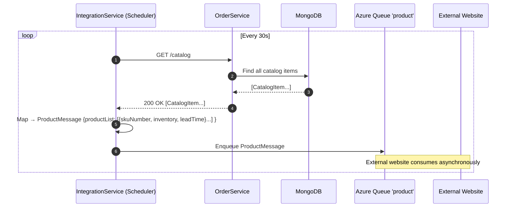
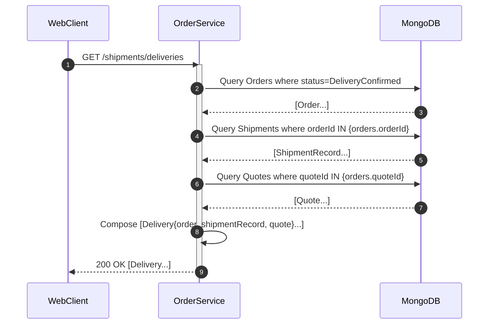
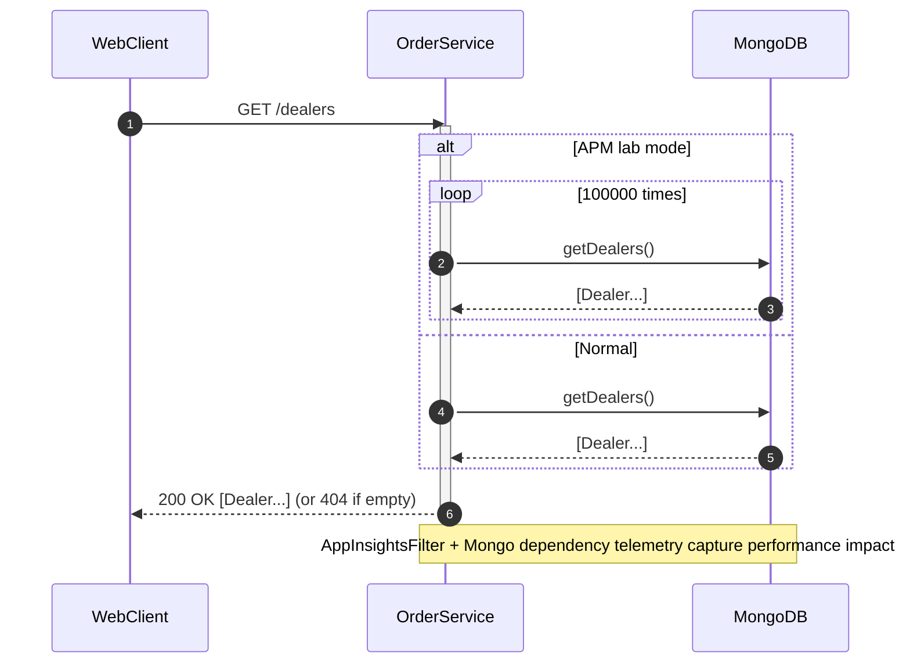

## Workflow 1: Quote creation from the Web Client

Purpose and trigger
- Purpose: Enable a user to create a Quote for a customer/dealer.
- Trigger: User clicks “Add” and “Save” in the Quotes page of the SPA.

Communication patterns
- WebClient → OrderService: synchronous REST (POST /quotes)
- OrderService → MongoDB: sync DB write (insert)
- Telemetry: request + dependency tracking (Application Insights)
- Errors: 400 validation, 201 Created on success, auto-create Dealer if missing (server-side)

```mermaid
sequenceDiagram
  autonumber
  participant U as User
  participant WC as WebClient (Clients SPA)
  participant OS as OrderService (Spring)
  participant DB as MongoDB (ordering.quotes, dealers)

  U->>WC: Enter quote details and Save
  WC->>OS: POST /quotes {dealerName, customerName, totalCost, discount, city, postalCode, state, quoteItems[]}
  activate OS
  OS->>OS: Validate Quote (fields present, unique quoteId if provided)
  alt Dealer missing
    OS->>DB: Upsert Dealer(name=dealerName)
  end
  OS->>DB: Insert Quote document
  DB-->>OS: OK
  OS-->>WC: 201 Created (Location: /quotes/{quoteId}) + Quote
  deactivate OS

  note over OS,DB: AppInsightsFilter logs request; Mongo decorator sends dependency telemetry and retries on transient error

  alt Validation error or duplicate id
    OS-->>WC: 400 Bad Request (errors[])
  end
```

- Data flow: JSON Quote → Mongo quotes collection; optional dealer upsert to dealers collection.


## Workflow 2: Create Order from Quote and Create Shipment (Deliveries)

Purpose and trigger
- Purpose: Convert an approved Quote into an Order and create a Shipment.
- Trigger: In Quotes page the user clicks “Create Order”; in Orders page the user clicks “Deliver”.

Communication patterns
- WebClient → OrderService: synchronous REST
  - POST /orders?fromQuote={quoteId}
  - POST /shipments (with ShipmentRecord)
- OrderService → MongoDB: sync DB writes to orders and shipments
- Errors: 400 (missing quote), 409 (order already exists), 201 on success

```mermaid
sequenceDiagram
  autonumber
  participant U as User
  participant WC as WebClient (Clients SPA)
  participant OS as OrderService
  participant DB as MongoDB

  U->>WC: In Quotes page, "Create Order"
  WC->>OS: POST /orders?fromQuote={quoteId}
  activate OS
  OS->>DB: Check Quote exists (quotes.findOne)
  alt Quote missing
    OS-->>WC: 400 Bad Request
    deactivate OS
  else Quote exists
    OS->>DB: Ensure no existing Order for quote (orders.findOne by quoteId)
    alt Order already exists
      OS-->>WC: 409 Conflict
      deactivate OS
    else Create order
      OS->>DB: Insert Order {orderId="order-{quoteId}", status=Created, date=now}
      DB-->>OS: OK
      OS-->>WC: 201 Created + Order
      deactivate OS

      U->>WC: In Orders page, click "Deliver"
      WC->>OS: POST /shipments {orderId, deliveryDate(+14d), deliveryAddress, contactName, phones, events[]}
      activate OS
      OS->>DB: Validate Order exists; ensure unique shipment per order
      OS->>DB: Insert ShipmentRecord
      DB-->>OS: OK
      OS-->>WC: 201 Created (Location: /shipments/{orderId}) + ShipmentRecord
      deactivate OS
    end
  end
```

- Data flow: QuoteId → derived Order(orderId=order-{quoteId}) → Shipment(orderId as FK-like key).
- Telemetry: request + dependency tracking on DB for each operation.


## Workflow 3: External website order ingestion via Azure Queue (IntegrationService)

Purpose and trigger
- Purpose: Asynchronously ingest website orders into MRP as Quote → Order → Shipment.
- Trigger: IntegrationService scheduled poll every 30s on “orders” queue.

Communication patterns
- ExternalWebsite → AzureQueueOrders: async message enqueue (OrderMessage JSON)
- IntegrationService → AzureQueueOrders: async dequeue (visibility timeout)
- IntegrationService → OrderService: synchronous REST (POST /quotes, POST /orders?fromQuote, POST /shipments)
- IntegrationService → AzureQueueOrders: async delete on success
- Errors: JSON deserialization errors lead to delete (poison handling); REST errors logged and message becomes visible again after timeout (idempotent order creation mitigates duplicates)

```mermaid
sequenceDiagram
  autonumber
  participant EW as External Website
  participant QO as Azure Queue 'orders'
  participant IS as IntegrationService (Scheduler)
  participant OS as OrderService
  participant DB as MongoDB

  EW->>QO: Enqueue OrderMessage {customerName, dealerName, items[], address, phones, totals}
  loop Every 30s
    IS->>QO: retrieveMessage(visibilityTimeout=300s)
    alt Message present
      QO-->>IS: CloudQueueMessage
      IS->>IS: Deserialize JSON → OrderMessage
      alt Deserialization failure
        IS->>QO: deleteMessage
        IS-->>IS: Log error; continue
      else Valid OrderMessage
        IS->>OS: POST /quotes (built from OrderMessage)
        OS->>DB: Insert Quote (or 400 on validation)
        DB-->>OS: OK
        OS-->>IS: 201 Created + quoteId

        IS->>OS: POST /orders?fromQuote={quoteId}
        OS->>DB: Check not exists; Insert Order
        DB-->>OS: OK
        OS-->>IS: 201 Created + orderId

        IS->>OS: POST /shipments {orderId, deliveryDate=now+14, address/phones, events[initial]}
        OS->>DB: Insert ShipmentRecord
        DB-->>OS: OK
        OS-->>IS: 201 Created

        IS->>QO: deleteMessage
      end
    else No message
      IS-->>IS: Sleep until next tick
    end
  end

  note over IS,OS: If REST call fails, IS logs error; message is not deleted and will reappear after visibility timeout.<br/>Order idempotency (409 if exists) mitigates duplicates on retry.
```

- Data flow: OrderMessage → Quote → Order → Shipment; queue message lifecycle managed by visibility + delete.


## Workflow 4: Inventory publishing to external website (product feed)

Purpose and trigger
- Purpose: Periodically publish current inventory/leadTime to the external site.
- Trigger: IntegrationService scheduled task every 30s.

Communication patterns
- IntegrationService → OrderService: synchronous REST (GET /catalog)
- IntegrationService → AzureQueueProduct: async enqueue ProductMessage
- Errors: REST failures logged; task continues next cycle



- Data flow: catalog documents → ProductMessage JSON → product queue.


## Workflow 5: Order status update (with retryable MongoDB dependency) and event append

Purpose and trigger
- Purpose: Update an order’s status and append an event (e.g., “Built”).
- Trigger: User changes status in Orders page and clicks Save, or uses specific “Update Status” action.

Communication patterns
- WebClient → OrderService: synchronous REST (PUT /orders/{orderId}/status with OrderUpdateInfo{status, eventInfo.comments})
- OrderService → MongoDB: sync update with retry on transient timeout
- Telemetry: request + dependency + exception telemetry on failure paths

```mermaid
sequenceDiagram
  autonumber
  participant U as User
  participant WC as WebClient
  participant OS as OrderService
  participant DB as MongoDB

  U->>WC: Change status and Save
  WC->>OS: PUT /orders/{orderId}/status {status, eventInfo:{comments}}
  activate OS
  OS->>OS: Inject current short date into eventInfo.date
  OS->>DB: Update Order(status, append event)  <<attempt 1>>
  alt SocketTimeoutException
    OS-->>OS: Log dependency failure; mark retry
    OS->>DB: Update Order(status, append event)  <<retry>>
    DB-->>OS: OK
  else Success
    DB-->>OS: OK
  end
  OS-->>WC: 200 OK + updated Order
  deactivate OS

  note over OS,DB: MongoOperationsWithRetry wraps operations; emits dependency telemetry and retries once on SocketTimeoutException
```

- Errors: If order missing → 400; otherwise 200 OK on success.


## Workflow 6: Shipments/deliveries aggregate read (server-side composition)

Purpose and trigger
- Purpose: Provide an aggregated “deliveries” view combining Shipment + Order + Quote for delivered orders.
- Trigger: Web client loads Deliveries page (or uses server aggregation endpoint).

Communication patterns
- WebClient → OrderService: synchronous REST (GET /shipments/deliveries)
- OrderService → MongoDB: multiple queries (orders by status DeliveryConfirmed, shipments by orderId IN, quotes by quoteId)
- Server-side composition: assemble Delivery DTOs



- Data flow: multi-collection reads → aggregated response; synchronous REST to client.


## Workflow 7: Dealer list fetch (APM lab path) and normal list behavior

Purpose and trigger
- Purpose: List dealers in UI; note APM lab variant triggers heavy DB load.
- Trigger: Web client navigates to Dealers page.

Communication patterns
- WebClient → OrderService: synchronous REST (GET /dealers)
- OrderService → MongoDB: normal single read; APM lab code loops repository 100000x (heavy synchronous calls)
- Errors: 404 if empty list



- Data flow: dealers collection read; potential load spike in lab mode.


## Event-driven interactions and error handling summary

- Asynchronous messaging
  - ExternalWebsite ↔ AzureQueueOrders ↔ IntegrationService: async, pull-based; visibility timeout prevents concurrent processing; deleteMessage on success or on deserialization failure; retries rely on queue re-visibility.
  - IntegrationService → AzureQueueProduct → ExternalWebsite: async product feed.

- Synchronous REST
  - Clients ↔ OrderService: CRUD operations across catalog, dealers, quotes, orders, shipments.
  - IntegrationService ↔ OrderService: Quote/Order/Shipment creation; catalog reads.

- Database transactions
  - Each controller action maps to one or a few MongoDB operations (no multi-document transactions).
  - Idempotency guard: POST /orders?fromQuote rejects duplicates (409) to handle retries gracefully.
  - Shipment uniqueness per order enforced in repository.

- Resilience and telemetry
  - MongoDB retry: MongoOperationsWithRetry retries once on SocketTimeoutException and records dependency telemetry.
  - Application Insights: per-request tracing via AppInsightsFilter; exceptions tracked.
  - Error returns: 400 on validation, 404 on not found, 409 on conflict; UI shows dialogs; IntegrationService logs and continues loops.