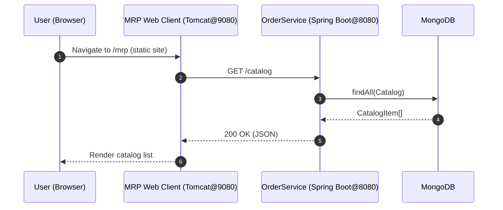
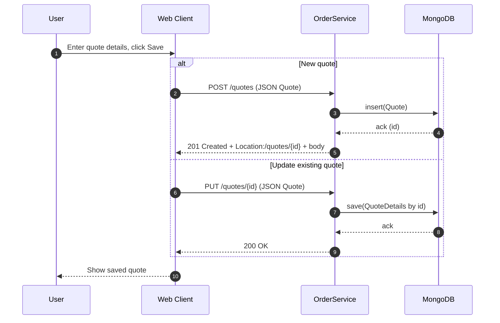
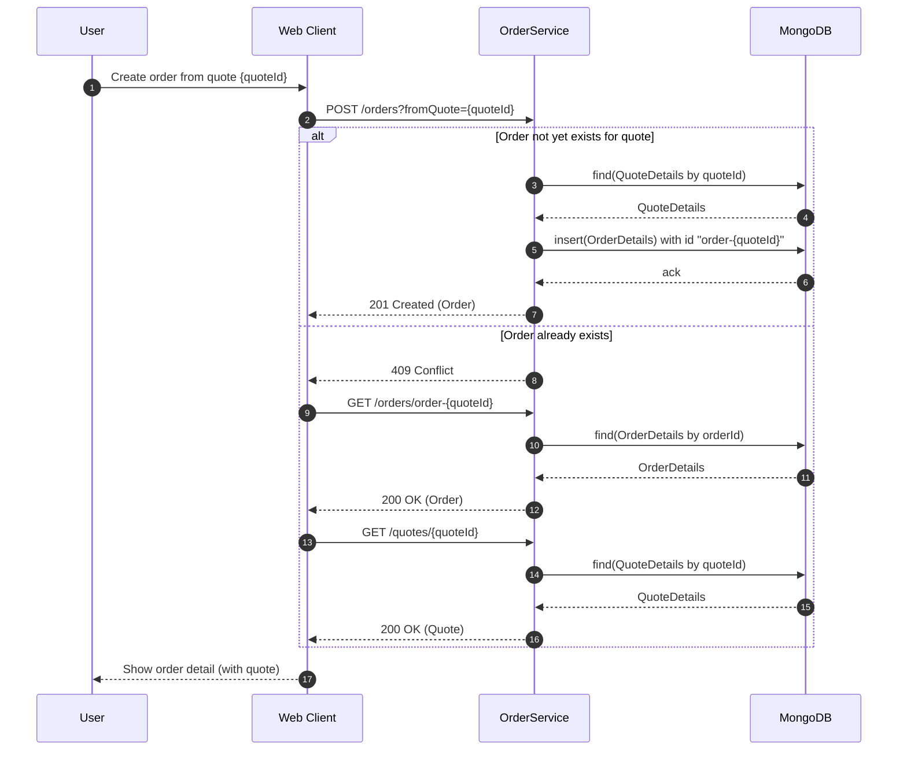
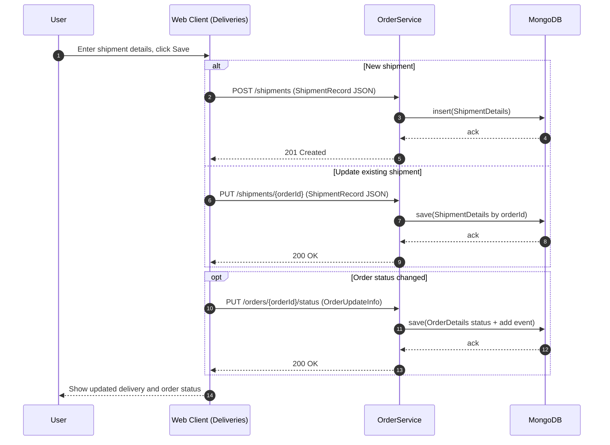
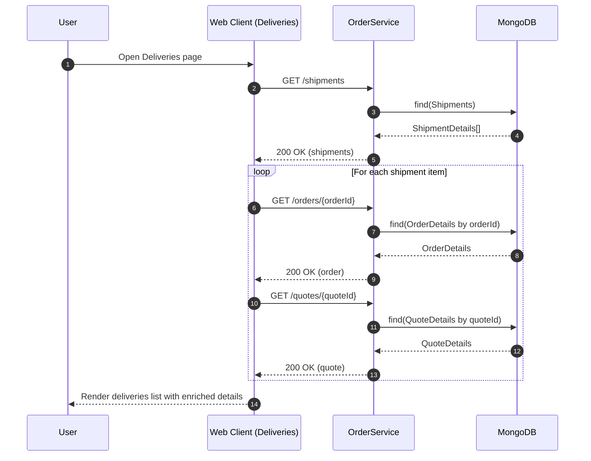
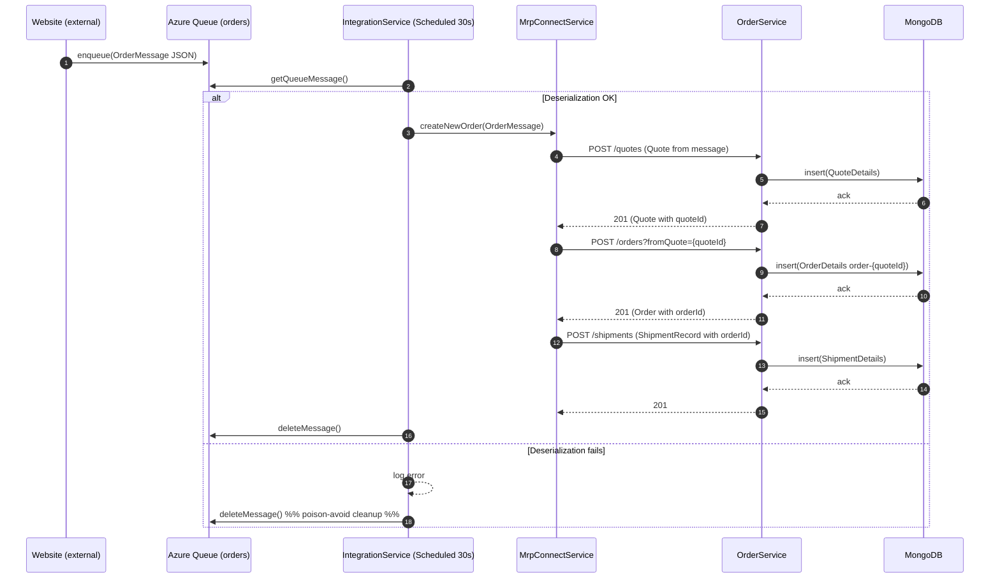
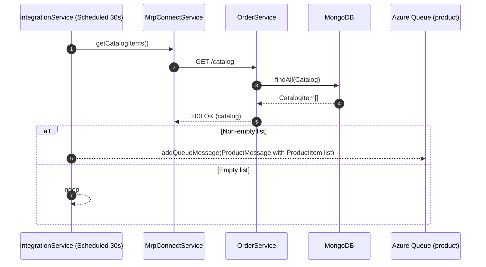
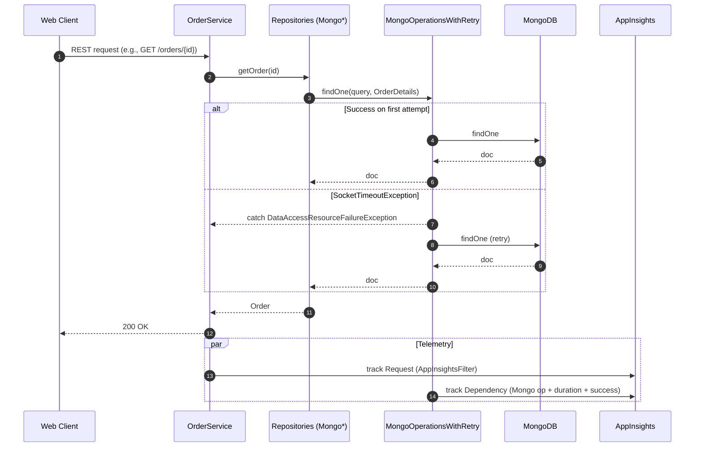

### Workflow 1: Browse catalog (read-only)
Purpose and trigger:
- Purpose: Display available products (catalog) to a user.
- Trigger: User opens the MRP web UI and navigates to the Catalog page.

Communication patterns:
- REST: GET /catalog
- Database: MongoDB findAll on catalog collection
- Rendering in browser

---

### Workflow 2: Create or update a quote from the UI
Purpose and trigger:
- Purpose: Create a new quote or update an existing one based on customer and sizing details.
- Trigger: User edits fields on Quotes page and clicks Save.

Communication patterns:
- REST: POST /quotes (create), PUT /quotes/{id} (update)
- Database: MongoDB insert/save in quotes collection

---

### Workflow 3: Create order from a quote (with conflict handling)
Purpose and trigger:
- Purpose: Convert an approved quote into an order; gracefully handle duplicate creations.
- Trigger: User clicks “Deliver”/“Create order” from the Quote detail or Orders page.

Communication patterns:
- REST: POST /orders?fromQuote={quoteId}
- Conflict resolution: If 409, GET /orders/order-{quoteId}, then GET /quotes/{quoteId}
- Database: MongoDB insert/select on orders, quotes

---

### Workflow 4: Create a shipment and update order status from Deliveries UI
Purpose and trigger:
- Purpose: Confirm delivery details and persist shipment; sync order status changes.
- Trigger: User opens Deliveries page, creates/edits a shipment and saves.

Communication patterns:
- REST: POST /shipments (create), PUT /orders/{orderId} (status and event), PUT /shipments/{orderId} (update)
- Database: MongoDB insert/save in shipments and orders collections

---

### Workflow 5: Deliveries page initial load (composite read)
Purpose and trigger:
- Purpose: Load shipments and hydrate each list item with linked order and quote for display.
- Trigger: User navigates to Deliveries page.

Communication patterns:
- REST: GET /shipments, then for each item GET /orders/{orderId}, then GET /quotes/{quoteId}
- Database: MongoDB reads in shipments, orders, and quotes collections

---

### Workflow 6: Event-driven order ingestion via IntegrationService (Azure Storage Queue -> MRP)
Purpose and trigger:
- Purpose: Integrate website orders asynchronously into MRP (quote → order → shipment).
- Trigger: Website posts OrderMessage to Azure Storage Queue “orders”; IntegrationService scheduled task runs every 30 seconds.

Communication patterns:
- Asynchronous: Azure Storage Queue (orders)
- REST: POST /quotes, POST /orders?fromQuote=..., POST /shipments
- Queue ops: getQueueMessage, deleteMessage
- Database: MongoDB inserts in quotes, orders, shipments

---

### Workflow 7: Event-driven product inventory publishing (IntegrationService -> Website)
Purpose and trigger:
- Purpose: Periodically publish current inventory/lead-time to the website.
- Trigger: Scheduled IntegrationService task (every 30 seconds).

Communication patterns:
- REST: GET /catalog
- Asynchronous: Azure Storage Queue (product)
- Database: MongoDB catalog read

---

### Workflow 8: Error handling and recovery
Purpose and trigger:
- Purpose: Demonstrate resilience patterns for transient MongoDB issues and poisoned queue messages.
- Trigger: Transient DB timeouts; malformed queue messages.

Communication patterns:
- Retry on transient DB error (SocketTimeout) within MongoOperationsWithRetry
- Delete malformed queue messages to avoid poison

- Queue deserialization error handling is shown in Workflow 6 (branch “Deserialization fails”: deleteMessage).

---

### Notes on ports and deployment
- Web client is served by Tomcat (default moved to 9080 in scripts), OrderService runs on 8080.
- Client-side baseAddress points to http://{hostname}:8080 for REST calls.
- Docker example maps:
  - db (MongoDB): 27017
  - order (OrderService): 8080
  - web (Tomcat serving static UI): 80
- Initial data seeding to MongoDB via MongoRecords.js included in deployment scripts.

---

### Summary of communication patterns
- Synchronous:
  - REST (JSON over HTTP): CRUD on /catalog, /dealers, /quotes, /orders, /shipments
  - Database transactions: MongoDB inserts/updates/queries via Spring Data MongoTemplate with retry wrapper
  - Telemetry: AppInsights Request and Dependency telemetry per request/DB op

- Asynchronous:
  - Azure Storage Queues:
    - orders: Website → IntegrationService (OrderMessage); IntegrationService deletes after successful processing or on deserialization error
    - product: IntegrationService → Website (ProductMessage)
  - Scheduled tasks: IntegrationService runs every 30 seconds for both order ingestion and inventory publishing

- Error handling:
  - OrderService controllers return 400/409/404/500 with clear semantics
  - Mongo operations retry once on SocketTimeoutException
  - Malformed queue messages are logged and deleted to prevent poison messages
  - CORS enabled for cross-origin UI calls