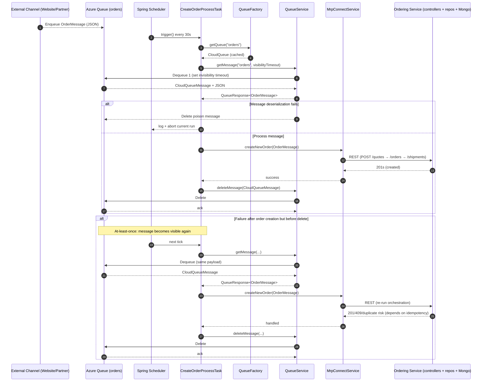
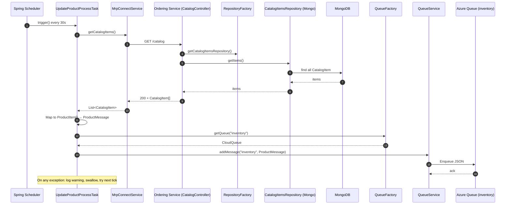
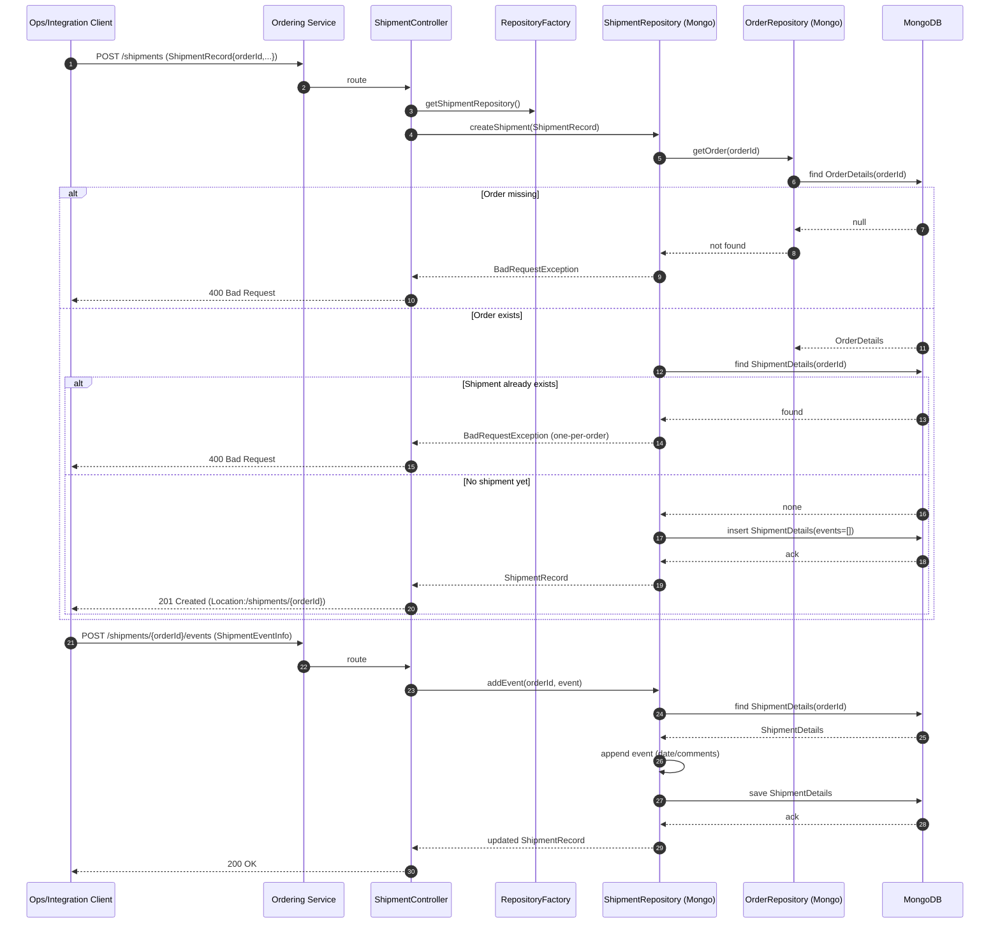
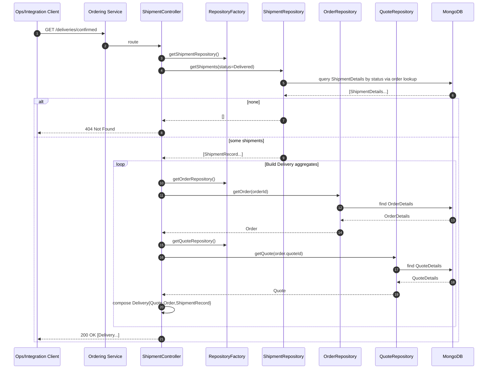
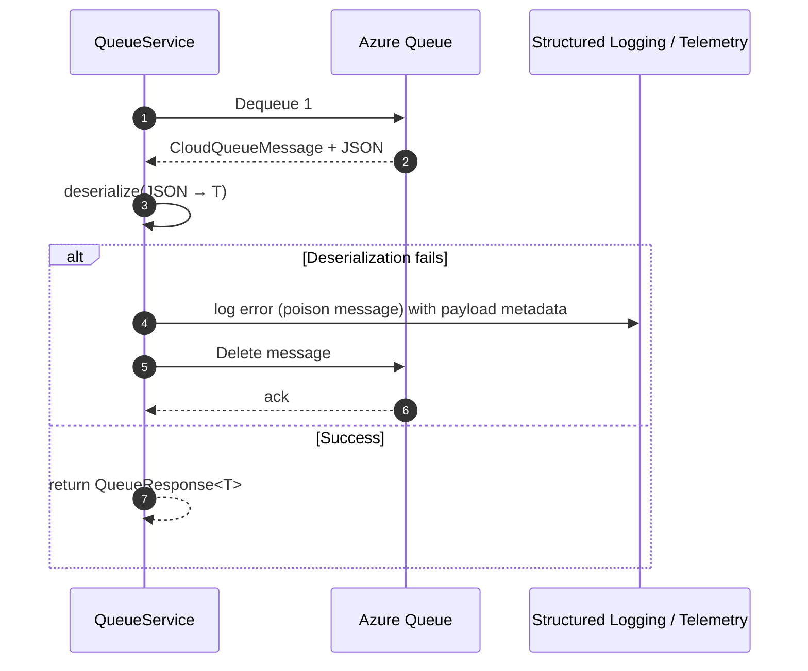

## Workflow 1: Synchronous website order (quote → order → shipment) via REST

Purpose and trigger:
- Purpose: End-to-end synchronous purchase flow initiated by a user or web front end.
- Trigger: Website submits an order request to the integration layer, which orchestrates quote creation, order placement, and shipment creation via MrpConnectService.

Communication patterns:
- Synchronous REST calls: Website → MrpConnectService → Ordering Service (QuoteController, OrderController, ShipmentController)
- Database transactions: MongoDB writes/reads via repositories
- Cross-cutting: Application Insights telemetry per HTTP request; CORS on all endpoints

```mermaid
sequenceDiagram
  autonumber
  participant UI as Website/UI
  participant MRPConn as MrpConnectService (REST adapter)
  participant OS as Ordering Service (Spring Boot)
  participant Qc as QuoteController
  participant Oc as OrderController
  participant Sc as ShipmentController
  participant RF as RepositoryFactory
  participant QR as QuoteRepository (Mongo)
  participant OR as OrderRepository (Mongo)
  participant SR as ShipmentRepository (Mongo)
  participant DB as MongoDB
  note over UI: User submits order request (cart, ship-to, dealer)

  UI->>MRPConn: createNewOrder(OrderMessage)
  note right of MRPConn: Orchestrates quote→order→shipment

  %% Create Quote
  MRPConn->>OS: POST /quotes (Quote payload)
  OS->>Qc: route
  Qc->>RF: getQuoteRepository()
  Qc->>QR: createQuote(Quote)
  QR->>DB: insert QuoteDetails
  DB-->>QR: ack + persisted
  QR-->>Qc: Quote(id)
  Qc-->>OS: 201 Created (Location:/quotes/{id})
  OS-->>MRPConn: 201 + Quote(id)

  %% Create Order from Quote
  MRPConn->>OS: POST /orders (from QuoteId)
  OS->>Oc: route
  Oc->>RF: getOrderRepository()
  Oc->>OR: createOrder(QuoteId)
  OR->>QR: getQuote(QuoteId)
  QR->>DB: find QuoteDetails
  DB-->>QR: QuoteDetails
  OR->>DB: insert OrderDetails (status=Created, events[Created])
  DB-->>OR: ack + OrderId
  OR-->>Oc: Order(orderId)
  Oc-->>OS: 201 Created (Location:/orders/{id})
  OS-->>MRPConn: 201 + Order(id)

  %% Create Shipment (one-per-order)
  MRPConn->>OS: POST /shipments (ShipmentRecord for orderId)
  OS->>Sc: route
  Sc->>RF: getShipmentRepository()
  Sc->>SR: createShipment(ShipmentRecord)
  SR->>OR: exists(orderId)?
  OR->>DB: find OrderDetails(orderId)
  DB-->>OR: found
  SR->>DB: insert ShipmentDetails (events initialized)
  DB-->>SR: ack
  SR-->>Sc: ShipmentRecord
  Sc-->>OS: 201 Created (Location:/shipments/{orderId})
  OS-->>MRPConn: 201 + Shipment
  MRPConn-->>UI: 200/201 OK (final acknowledgment)
  note over OS,DB: Each HTTP call is wrapped by AppInsights telemetry; CORS enabled
```


## Workflow 2: Asynchronous order intake via Azure Storage Queue

Purpose and trigger:
- Purpose: Decouple order capture from processing; drain queued orders into the ordering backend.
- Trigger: Spring scheduler fires CreateOrderProcessTask every 30s (Constants.POLL_INTERVAL), pulling OrderMessage from Azure queue.

Communication patterns:
- Asynchronous messaging: Azure Queue (enqueue/dequeue/delete)
- Synchronous REST: MrpConnectService orchestrates quote→order→shipment
- At-least-once delivery: Visibility timeouts; duplicates possible
- Error handling: Poison message auto-delete on deserialization failure; abort-run semantics on processing error




## Workflow 3: Catalog/inventory update feed to Azure Queue

Purpose and trigger:
- Purpose: Publish latest product availability to downstream channels via a durable queue.
- Trigger: Spring scheduler fires UpdateProductProcessTask every 30s.

Communication patterns:
- Synchronous REST: Fetch catalog from Ordering Service
- Asynchronous messaging: Enqueue ProductMessage to Azure inventory queue
- Error handling: Exceptions logged and swallowed; eventual consistency via next run




## Workflow 4: Order status update with event append

Purpose and trigger:
- Purpose: Advance order lifecycle and record an audit trail.
- Trigger: Ops or integration client calls update endpoint with OrderUpdateInfo.

Communication patterns:
- Synchronous REST: PATCH/PUT on /orders
- Database update: Mongo save with appended OrderEventInfo
- Error handling: 404 when order not found; AppInsights logs unexpected exceptions

```mermaid
sequenceDiagram
  autonumber
  participant Client as Ops/Integration Client
  participant OS as Ordering Service
  participant Oc as OrderController
  participant RF as RepositoryFactory
  participant OR as OrderRepository (Mongo)
  participant DB as MongoDB

  Client->>OS: PUT/PATCH /orders/{id}/status (OrderUpdateInfo{status, event})
  OS->>Oc: route
  Oc->>RF: getOrderRepository()
  Oc->>OR: updateOrder(orderId, OrderUpdateInfo)
  OR->>DB: find OrderDetails(orderId)
  alt not found
    DB-->>OR: null
    OR-->>Oc: not found
    Oc-->>Client: 404 Not Found
  else found
    DB-->>OR: OrderDetails
    OR->>OR: append OrderEventInfo; set status
    OR->>DB: save OrderDetails
    DB-->>OR: ack
    OR-->>Oc: updated Order
    Oc-->>Client: 200 OK (Order payload)
  end
  note over OS: AppInsights filters record timing and exceptions
```


## Workflow 5: Shipment creation and event handling with one-per-order enforcement

Purpose and trigger:
- Purpose: Create shipment for an order, then track milestones via shipment events.
- Triggers: Client POST /shipments to create; POST /shipments/{orderId}/events to append events.

Communication patterns:
- Synchronous REST: ShipmentController endpoints
- Database: Mongo CRUD with rule checks across repositories
- Error handling: BadRequestException → 400 for missing order or duplicate shipment




## Workflow 6: Delivery confirmations and aggregate retrieval

Purpose and trigger:
- Purpose: Produce Delivery aggregates (Quote + Order + Shipment) for confirmed/Delivered shipments.
- Trigger: Client calls GET deliveries/confirmed (or ShipmentController list by status and aggregation).

Communication patterns:
- Synchronous REST: GET for aggregated view
- Database reads: Fan-out to three repositories per shipment
- Error handling: 404 when no matching deliveries




## Error handling and recovery patterns

- REST validation and conflicts
  - BadRequestException → HTTP 400 (e.g., invalid payloads, one shipment per order violation, missing order for shipment)
  - ConflictingRequestException → HTTP 409 (e.g., duplicate resources like reusing a quote to create another order)
  - Not Found → HTTP 404 for empty lists or missing resources
  - AppInsights telemetry captures request timings and exceptions for all endpoints

- Queue processing resilience
  - At-least-once delivery: visibility timeouts; CreateOrderProcessTask aborts on error and retries next tick
  - Poison message handling: QueueService deletes messages that fail JSON deserialization to prevent infinite retries



- Repository-level rule enforcement
  - Quote reuse prevention on order creation in OrderRepository
  - One-shipment-per-order check in ShipmentRepository
  - Dealer upsert/validation during Quote create/update

- Observability and cross-cutting concerns
  - Application Insights filter wraps all HTTP requests with duration, status, and exception reporting
  - Structured logging across integration tasks and queue operations for traceability