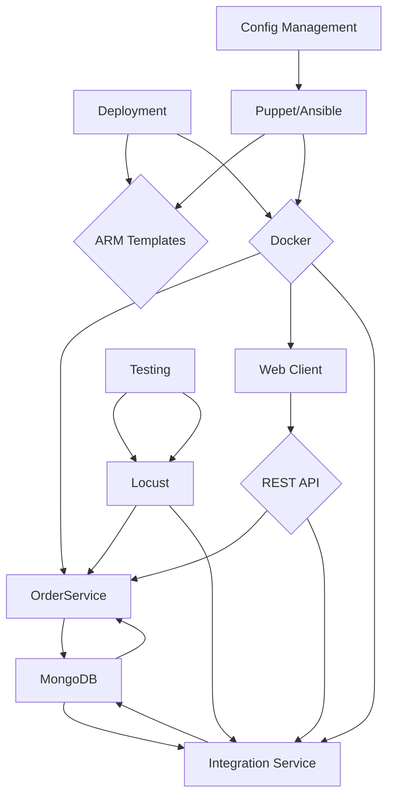

<think>
Okay, I need to start by understanding the current system structure based on the detailed codebase analysis provided. The main components mentioned are OrderService, IntegrationService, Dealer Management, Quote, Shipment, Catalog, Clients, Web, and their respective dependencies like MongoDB, ARM templates, Docker for deployment, and Puppet/Ansible for configuration.

First, I should identify the key components. The OrderService handles orders, dealers, quotes, and shipments. The IntegrationService deals with external systems. The Client and Web parts form the frontend. MongoDB is used for data storage, Docker for containerization, and Ansible/Puppet for infrastructure as code.

Next, I need to map interactions. The OrderService communicates with MongoDB for data storage. The Web and Client components interact with the OrderService via REST APIs. IntegrationService likely handles quotes and dealers. Docker and ARM templates manage deployment, while Ansible and Puppet take care of configurations.

I should also note the presence of Testing (JMeter) and DevOps (Travis CI) components, but since the user asked for component-level architecture, maybe focus on the main modules and their interactions. Let's ensure each key component is represented as a node, and their interactions as arrows. Make sure to group related components under the core service or microservice they belong to, if applicable.

Wait, in the earlier analysis, there's a discussion about decomposing into CatalogService, DealerService, QuoteService, OrderService, and ShipmentService. So maybe the current system is a monolith with these services, but the diagram should reflect the existing structure, not the decomposed version. The user wants a component-level diagram showing the current structure, not the proposed decomposition. So the components would be the existing ones: OrderService, IntegrationService, Clients, Web, Deployment, etc.

I'll structure the Mermaid diagram with the components in a top-down approach. Starting with Deployment (Docker, ARM Templates) at the top, as it's an external system that interacts with the main components. Then the core services like OrderService, which interacts with MongoDB and the Web/Client parts. IntegrationService might be separate. The frontend (Web, Clients) communicates with the backend services. Testing (Locust, JUnit) would be external to the main components, indicating their interaction with the services for testing purposes.

I need to make sure the diagram is readable and correctly maps all the key components and their interactions. Also, the rationale should explain the component boundaries and communication, such as why certain services are grouped, how they use REST APIs, and why Docker and ARM Templates are part of the deployment.

Alright, putting this all together into a Mermaid diagram using `graph TB` syntax. Each key component is a node, and their interactions are arrows labeled appropriately. Then, the rationale will explain the grouping and the communication patterns, like REST for frontend-backend, MongoDB for data storage, Docker for deployment.
</think>

### Component-Level Architecture Diagram

---

### Rationale

The component boundaries are defined by functional cohesion and deployment independence. **OrderService** centralizes order, dealer, quote, and shipment logic with MongoDB as its primary data store, while **Integration Service** handles external API interactions (e.g., Google Maps). The **Web Client** leverages REST APIs to communicate with backend services, emphasizing a decoupled frontend. **ARM Templates** and **Docker** abstract infrastructure and runtime environments, enabling scalable deployment. **Puppet/Ansible** manage configuration consistency across infrastructure and containers. Testing (JUnit, Locust) validates service behavior, ensuring reliability before deployment. This structure supports gradual decomposition by isolating core service responsibilities and infrastructure concerns.