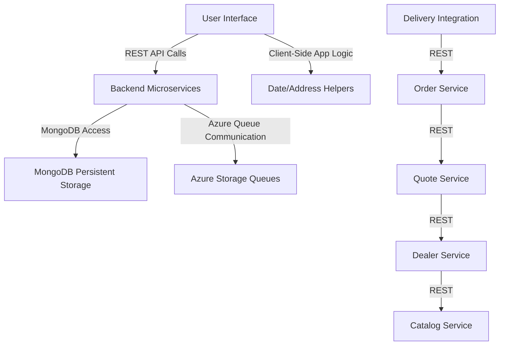

<think>
Okay, let me start by looking at each of the provided code chunks and figure out what they do. 

First, chunk 1 seems to be setup for a web application using Java, Spring Boot, and MongoDB. The directory structure includes backend services like OrderService and IntegrationService, clients for the web application, Docker configurations, deployment scripts, and various lab files. The technologies mentioned here include Java, MongoDB, Gradle, and deployment using ARM templates and Ansible. The integration with Microsoft's Azure is also evident through the use of Application Insights for monitoring.

Chunk 2 dives deeper into the deployment with ARM templates for Azure, Docker setups for the order service, and Ansible playbooks. There's also Puppet configuration for MRP apps and references to Chef automation. The Dockerfile and scripts here suggest containerization of the services for scalability and deployment flexibility.

Chunk 3 and 4 are about the backend services written in Java, using Spring Boot and REST controllers for handling order, delivery, quote, and dealer data. The models are backed by MongoDB, and there are integration services that push data through Azure queues. The use of Application Insights monitoring, along with build automation via Gradle, is prominent here.

Chunk 5 includes test implementations for the services and client-side code using WinJS for building the UI. The client application uses REST APIs to communicate with the backend, with configuration managed via serverconfig.js pointing to localhost:8080. There's also date-related logic and navigation handling for the frontend.

Chunk 6 is about the web UI, handling date formatting, navigation, and integration with backend APIs using WinJS. The client side is designed for Windows applications, with dependencies on Google Maps API for address-related functionality.

Putting this all together, the system is built with a microservices architecture in mind, using Java for the backend with Spring Boot, MongoDB for data storage, and containerization via Docker. Deployment is handled through Azure with ARM templates and Infrastructure as Code tools like Ansible and Puppet. The client side is a Windows application built with WinJS for the UI, which communicates with the backend services through REST APIs. Monitoring is in place via Application Insights, and testing is conducted with JUnit on the backend and potentially automated via CI/CD tools like Travis CI. There's also a mix of configuration management to handle both development and deployment across different environments.

Now, the main components would be:

- **Frontend Client (WinJS-based UI)**
- ** Backend Microservices (OrderService, QuoteService, DealerService, etc.)**
- **Data Storage (MongoDB)**
- **Message Brokers (Azure Storage Queues for order and product updates)**
- **Infrastructure Management (Azure ARM Templates, Puppet, Chef, Ansible)**
- **Monitoring (Application Insights)**
- **Deployment Automation (Docker, Travis CI, Jenkins)**
- **Testing Framework (JUnit for service layers, integration tests using mocks and MongoDB)**
- **Configuration Management (Properties files, environment-specific configurations)**

The system uses REST for communication between services, while message queues handle asynchronous updates between services. There's a layered architecture with the frontend interacting with the backend via HTTP, and services using repositories to abstract data access. The use of different configuration strategies for in-memory testing versus MongoDB deployment allows for flexibility across environments.

Looking at the files, there are also several labfiles and examples which might be for educational purposes, showing how to configure and deploy the services across different infrastructures. The use of Chef and Puppet indicates a shift to configuration management from the command line scripts.

For the architectural summary, I need to outline these components, their interactions, the communication patterns (synchronous REST, asynchronous messages), data flow, use of Infrastructure and Configuration as Code, deployment strategies, testing and monitoring practices. I should also highlight any patterns like microservices, client-server architecture, and how the system is structured for scalability, modularity, and maintainability.

Now, to structure the final summary, I need to make sure each section clearly describes the components, their responsibilities, the patterns used, and the technologies involved. The summary should allow someone to understand how the parts of the system work together, the role of each component, and any key architectural decisions made, such as the use of MongoDB for flexible data modeling, Spring Boot for backend microservices, and the containerization for easy deployment.
</think>

### **Parts Unlimited MRP System Architectural Summary**

---

#### **1. Core Components**


---

#### **2. Component Responsibilities**

| **Component**                  | **Technology**           | **Responsibility**                                                                                   |
|-------------------------------|--------------------------|-----------------------------------------------------------------------------------------------------|
| **UI (WinJS App)**            | HTML/JS + WinJS          | Handles user interaction, data editing, address input via Google Maps, and SPA navigation pattern.   |
| **Catalog Service**           | Spring Boot (Java)       | Manages product data (SKUs, pricing, dimensions).                                                     |
| **Dealer Service**            | Spring Boot (Java)       | CRUD operations for dealer information (name, contact, address).                                    |
| **Quote Service**             | Spring Boot (Java)       | Quote generation, validation, and relationship with dealers and catalog items.                      |
| **Order Service**             | Spring Boot (Java)       | Order lifecycle management (creation, status changes), dependent on quotes and delivery tracking.   |
| **Delivery Service**          | Spring Boot (Java)       | Coordinates shipment delivery events linked to orders.                                              |
| **MongoDB**                   | MongoDB (NoSQL)          | Persistent storage for all entities (catalog, dealers, quotes, orders, shipments).                  |
| **Azure Storage Queues**      | Azure Queue Storage      | Decouples services via message passing (e.g., order updates triggering delivery queue processes).   |
| **CI/CD Infrastructure**      | GitHub, Travis CI, ARM   | Automated testing and deployment using Infrastructure as Code (ARM) and Puppet/Ansible.            |
| **Monitoring**                | Azure Application Insights | Tracks API performance, errors, and request telemetry.                                              |

---

#### **3. Business Logic & Data Models**

- **Data Entities**:
  - **Catalog Item**:  
    ```json
    {
      "skuNumber": "FRC-0001",
      "description": "Refrigeration Unit",
      "price": 3500.00,
      "dimensions": { "width": 60, "height": 72, "depth": 32 }
    }
    ```
  - **Quote**:  
    ```json
    {
      "dealerName": "West Coast Appliances",
      "customerName": "Joe Smith",
      "validUntil": "2024-08-30",
      "items": [
        {
          "skuNumber": "FRC-0001",
          "unitPrice": 3500.00,
          "quantity": 2
        }
      ],
      "totalCost": 7000.00
    }
    ```
  - **Order**:  
    ```json
    {
      "orderId": "ORD-1234",
      "quoteId": "QTE-7890",
      "status": "Shipped",
      "events": [
        { "date": "2024-08-15", "note": "Order shipped" }
      ]
    }
    ```

- **Key Logic**:
  - **Order Lifecycle**: Orders are created from validated quotes and transition through statuses: "Created" → "Confirmed" → "Shipped".
  - **Shipping Integration**: Shipment details are updated via delivery service, which pulls updates from an Azure queue.
  - **Date Handling**: Complex date formatting and timezone conversion ensure consistent reporting and filtering.

---

#### **4. Communication & Service Interactions**

| **Communication Type**       | **Protocol** | **Use Cases**                                                                                  |
|------------------------------|--------------|------------------------------------------------------------------------------------------------|
| **REST APIs**                | HTTP         | CRUD operations between UI and services (GET for listing orders, POST to create quotes).       |
| **Asynchronous Queues**      | Azure Queue  | Order data flow triggers updates in delivery service (e.g., when an order is "confirmed").     |
| **Client-Side Communication** | WinJS        | Client manages UI state via data binding without backend polling (e.g., order editing updates in real time). |

---

#### **5. Deployment & Infrastructure**

- **Infrastructure as Code**:
  - **ARM Templates**: Automate deployment of VMs, networks, and storage.
  - **Chef/Puppet/Ansible**: Provision application-specific configurations (Tomcat, MongoDB, WAR deployment).
  - **Docker**: Isolate services in containers for scalability (OrderService, DeliveryService, etc.).

- **CI/CD Pipelines**:
  - **Travis CI**: Runs JUnit tests and linting (`.travis.yml` for Java services).
  - **Jenkins**: Orchestrates deployment via ARM or Ansible scripts on Azure VMs.

- **Environment Configurations**:
  - **dev/inmem**: Uses in-memory repositories for testing.
  - **prod/mongodb**: Uses production-grade MongoDB storage with real data.

---

#### **6. Testing Strategy**

| **Test Type**            | **Tools**                 | **Coverage**                                                                                   |
|--------------------------|---------------------------|------------------------------------------------------------------------------------------------|
| **Unit Testing**          | JUnit 4.12                | Validates service logic (e.g., catalog item validation, quotation arithmetic).                |
| **Integration Testing**   | Gradle, MongoDB Test Containment | Tests multi-service workflows (e.g., quote → order → delivery).                             |
| **UI Testing**            | WinJS + Manual            | Validates CRUD experiences, address input, and UI navigation behaviors.                       |
| **Load Testing**          | Locust                    | Simulates high concurrent user traffic using `locustfile.py`.                                 |

---

#### **7. Monitoring & Resilience**

- **Azure Application Insights**:
  - Tracks HTTP performance and exceptions.
  - Built into services (e.g., `AppInsightsFilter` in controllers).

- **Resilience Patterns**:
  - **Error Handling**: REST controllers return HTTP status codes (e.g., 404 for non-existent orders).
  - **Dead Letter Queues**: Azure Storage ensures reliability for queue operations.

---

#### **8. Microservice Decomposition Opportunities**

| **Service Candidate**     | **Key Dependencies**                        | **Decomposition Benefits**                                             |
|---------------------------|---------------------------------------------|-------------------------------------------------------------------------|
| **CatalogMicroservice**   | Independent of other flows.                 | Enables product management decoupled from order/quote workflows.        |
| **QuoteMicroservice**     | Depends on catalog and dealer data.         | Future-proofing for quote-specific features (e.g., AI-based pricing).   |
| **OrderMicroservice**     | Tightly coupled with quote and delivery.    | Requires event-driven communication via queues for separation.          |
| **DealerMicroservice**    | Data isolated, but accessed by quotes orders. | Allows geographic-specific dealer management features to evolve.       |
| **DeliveryMicroservice**  | Relies on order data via Azure queues.      | Can scale independently for logistics operations (e.g., delivery scheduling). |

---

#### **9. Future Considerations**
- **Technology Debt**:
  - **Modernize Repositories**: Replace in-memory mocking with TestContainers for more realistic integration tests.
  - **Decentralize Configuration** (e.g., Spring Cloud Config) for dynamic environment management.

- **Architectural Enhancements**:
  - **Event-Driven Architecture**: Migrate to Kafka or Azure Event Hubs for stronger pub/sub semantics.
  - **CQRS + Event Sourcing**: Improve audit logging for order and quote changes.
  - **Multi-Tenancy**: Add tenant isolation for dealership scalability.

---

This architecture balances flexibility with maintainability, supporting a modern development lifecycle while allowing for gradual decomposition into standalone microservices.