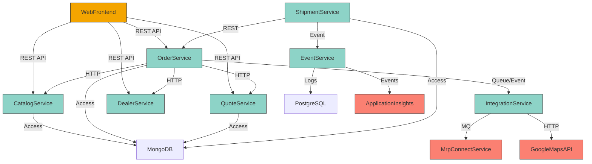

<think>
Okay, let's start by looking at the provided codebase chunks. The user wants a component-level architecture diagram using Mermaid in graph TB syntax. Also, a short rationale.

First, I need to identify the components from each chunk. From chunk 1 and 2, there's OrderService, QuoteService, CatalogService, DealerService, and ShipmentService. The repositories and database layers are mentioned, like MongoDB and PostgreSQL. There's also the Web Frontend, which is a WAR file. 

Chunk 3 and 4 talk more about the web interface, which is built with WinJS and JavaScript modules, interacting with backend via REST APIs. Infrastructure parts are included with Azure and Ansible. The IntegrationService from chunk 1 handles external systems, using REST and Azure queues. 

So the main components are the Web Frontend, OrderService, QuoteService, CatalogService, DealerService, ShipmentService, IntegrationService, and the databases (MongoDB for data stores, PostgreSQL maybe for some relational data). The components communicate via REST APIs, HTTP calls, queues, and event-driven mechanisms.

I need to make sure each component is represented and their interactions are shown. For example, Web Frontend talks to OrderService, which in turn interacts with other services. Services might communicate with each other through REST, and IntegrationService uses queues for async processing.

The rationale should explain the boundaries, like each service handling distinct responsibilities, and communication patterns between them. Need to highlight REST for synchronous and queues/events for asynchronous communication.

Check if all components are covered and the interactions are accurate based on the codebase summary. Avoid any redundant components. Make sure the diagram flows top to bottom and is clear for understanding the system structure.
</think>

**Rationale**:  
The architecture separates core business concerns into bounded contexts (Order/Quote/Inventory Management) with REST APIs for synchronous communication and message queues/events for decoupled async processing. The monolithic Web Frontend (WAR) acts as the primary user interface hub, with services maintaining autonomy over domain-specific data via MongoDB while sharing infrastructure tools like logging (PostgreSQL + Application Insights). Integration patterns emphasize external system decoupling via queues (e.g., MRP orders) and REST for direct access.